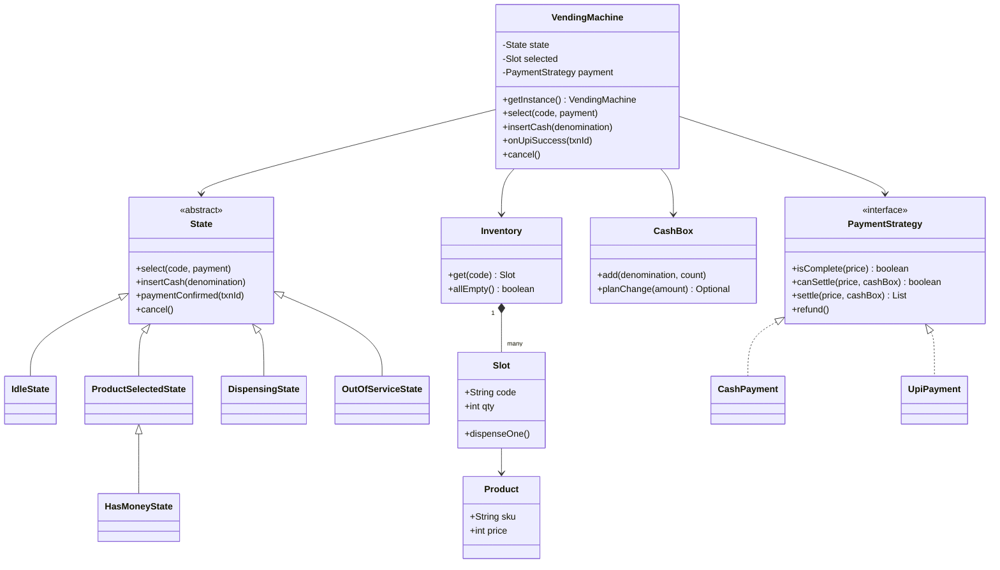

# Vending Machine

Ek vending machine design karo jo product select karwaye, cash (coins/notes) ya UPI se payment le, product dispense kare aur change lautaye. Interviewer check karta hai: **State pattern** sahi lagaya ya `switch` ka jungle, **paisa kabhi gayab na ho** (cancel, change nahi, jam), aur money ko `double` me rakha ya nahi.

## Step 1: Requirements confirm karo

| Tum poochho | Typical jawab | Design pe asar |
|---|---|---|
| Payment kaise? Coins, notes, UPI? | Coins + notes + UPI | `PaymentStrategy`: `CashPayment`, `UpiPayment` |
| Flow kya hai: pehle paisa ya pehle product? | Pehle select, phir pay (UPI ko amount pehle chahiye) | Idle → ProductSelected → HasMoney → Dispensing |
| Change dena hai? Kaunse coins? | Haan, coins se (₹1, 2, 5, 10) | `CashBox` me denomination-wise count, change plan |
| Change nahi hai to? | Sale mat karo, paisa wapas | Dispense se **pehle** change check |
| Cancel kab tak? | Dispense start hone se pehle tak | `Dispensing` state me cancel reject |
| Ek machine ya fleet? | Ek machine, ek process | Singleton (per process); fleet = extension |
| Remote/app se order (kiosk API)? | Shayad follow-up | Ek time pe ek session, `synchronized` entry points |
| Admin: refill, cash nikalna, maintenance? | Haan, basic | `OutOfServiceState`, `refill()` |

**Functional:**
- Product list with price aur stock (slot code jaise `A1`).
- Select → pay (cash incrementally, ya UPI QR) → dispense → change.
- Cancel/refund: escrow me pade coins wahi wapas.
- Out-of-stock product select na ho. Sab khatam → machine `OutOfService`.
- Admin: refill slot, cash box me coins daalo, maintenance mode.

**Out of scope:** card payment ka hardware, multi-item cart, remote inventory dashboard, pricing offers.

## Step 2: Core entities

- `Product`: sku, name, price (rupees me `int`, `double` kabhi nahi).
- `Slot`: code (`A1`), product, quantity. Ek slot me ek product type.
- `Inventory`: code → Slot map. Stock check aur decrement.
- `Denomination`: enum ₹1/2/5/10 coins, ₹20/50/100 notes.
- `CashBox`: har denomination ka count. Change ka plan banata hai bina kuch hilaye.
- `PaymentStrategy`: `CashPayment` (escrow me coins rakhta hai), `UpiPayment` (QR + webhook).
- `State`: `IdleState`, `ProductSelectedState`, `HasMoneyState`, `DispensingState`, `OutOfServiceState`.
- `VendingMachine`: context. Current state, selected slot, current payment. Singleton.

## Step 3: Class diagram



## Step 4: Design patterns kyun

| Pattern | Kahan | Kyun | Alternative |
|---|---|---|---|
| [State](../03-lld/05-behavioral.md) | `IdleState`, `ProductSelectedState`, `HasMoneyState`, `DispensingState`, `OutOfServiceState` | Har button ka matlab state pe depend karta hai. Invalid action apne aap reject. Nayi state = nayi class | `enum` + `switch` har method me: 5 states × 4 actions = 20 branches, ek jagah bug to sab jagah |
| [Strategy](../03-lld/05-behavioral.md) | `PaymentStrategy`: Cash, UPI | Payment mode naya aaye (card, wallet) to state machine nahi badalti | `if (mode == UPI)` har state me |
| [Singleton](../03-lld/03-creational.md) | `VendingMachine.getInstance()` | Ek physical machine = ek controller process. Do objects = ek hi motor/cash box pe do owners | DI se ek instance inject karna (test ke liye better) |
| Escrow (domain idea) | `CashPayment` ka coin list | Cancel pe wahi coins wapas, change ka sawal hi nahi | Coins seedha cash box me daalna: cancel pe change chahiye, fail ho sakta hai |

## Step 5: Code

Model, inventory aur cash box. Paisa `int` rupees me (paise chahiye to `long` paise).

```java
import java.util.*;

enum Denomination {
    COIN_1(1), COIN_2(2), COIN_5(5), COIN_10(10), NOTE_20(20), NOTE_50(50), NOTE_100(100);
    final int value;
    Denomination(int value) { this.value = value; }
}

record Product(String sku, String name, int price) {}

class Slot {
    final String code;
    final Product product;
    private int qty;
    Slot(String code, Product product, int qty) { this.code = code; this.product = product; this.qty = qty; }
    boolean isEmpty() { return qty == 0; }
    void dispenseOne() {
        if (qty == 0) throw new IllegalStateException("Out of stock: " + code);
        qty--;
    }
    void refill(int n) { qty += n; }
}

class Inventory {
    private final Map<String, Slot> slots = new HashMap<>();
    void addSlot(Slot s) { slots.put(s.code, s); }
    Slot get(String code) {
        Slot s = slots.get(code);
        if (s == null) throw new IllegalArgumentException("Invalid code " + code);
        return s;
    }
    boolean allEmpty() { return slots.values().stream().allMatch(Slot::isEmpty); }
}

class CashBox {
    private final EnumMap<Denomination, Integer> counts = new EnumMap<>(Denomination.class);
    void add(Denomination d, int n) { counts.merge(d, n, Integer::sum); }
    void addAll(List<Denomination> ds) { ds.forEach(d -> add(d, 1)); }
    void removeAll(List<Denomination> ds) { ds.forEach(d -> counts.merge(d, -1, Integer::sum)); }

    // Sirf plan: cash box ko touch nahi karta. Empty = itna change nahi de sakte
    Optional<List<Denomination>> planChange(int amount) {
        List<Denomination> out = new ArrayList<>();
        Denomination[] ds = Denomination.values();
        for (int i = ds.length - 1; i >= 0 && amount > 0; i--) {   // bada coin pehle (greedy)
            int use = Math.min(amount / ds[i].value, counts.getOrDefault(ds[i], 0));
            for (int k = 0; k < use; k++) out.add(ds[i]);
            amount -= use * ds[i].value;
        }
        return amount == 0 ? Optional.of(out) : Optional.empty();
    }
}
```

Payment strategies. Cash coins escrow me rehte hain jab tak sale pakki na ho.

```java
interface PaymentStrategy {
    boolean isComplete(int price);
    boolean canSettle(int price, CashBox box);       // change de payenge?
    List<Denomination> settle(int price, CashBox box); // sale pakki, change return
    void refund();
}

class CashPayment implements PaymentStrategy {
    private final List<Denomination> escrow = new ArrayList<>();
    void insert(Denomination d) { escrow.add(d); }
    int paid() { return escrow.stream().mapToInt(d -> d.value).sum(); }
    public boolean isComplete(int price) { return paid() >= price; }
    public boolean canSettle(int price, CashBox box) { return box.planChange(paid() - price).isPresent(); }
    public List<Denomination> settle(int price, CashBox box) {
        List<Denomination> change = box.planChange(paid() - price).orElseThrow();
        box.addAll(escrow);          // escrow ab machine ka paisa
        box.removeAll(change);
        escrow.clear();
        return change;
    }
    public void refund() { System.out.println("Coins wapas: " + escrow); escrow.clear(); }
}

interface UpiGateway { String createQr(int amount); void refund(String txnId); }

class UpiPayment implements PaymentStrategy {
    private final UpiGateway gateway;
    private String txnId;
    private boolean paid;
    UpiPayment(UpiGateway gateway) { this.gateway = gateway; }
    void start(int price) { txnId = gateway.createQr(price); }   // screen pe QR
    boolean confirm(String id) { if (id.equals(txnId)) paid = true; return paid; }
    public boolean isComplete(int price) { return paid; }
    public boolean canSettle(int price, CashBox box) { return true; } // exact amount, change nahi
    public List<Denomination> settle(int price, CashBox box) { return List.of(); }
    public void refund() { if (paid) gateway.refund(txnId); }
}
```

States. Base class har action ko default reject karta hai, har state sirf apne valid actions override karti hai.

```java
abstract class State {
    protected final VendingMachine m;
    State(VendingMachine m) { this.m = m; }
    void select(String code, PaymentStrategy p) { reject("select"); }
    void insertCash(Denomination d) { reject("insertCash"); }
    void paymentConfirmed(String txnId) { reject("paymentConfirmed"); }
    void cancel() { reject("cancel"); }
    private void reject(String op) {
        throw new IllegalStateException(op + " not allowed in " + getClass().getSimpleName());
    }
}

class IdleState extends State {
    IdleState(VendingMachine m) { super(m); }
    @Override void select(String code, PaymentStrategy p) {
        Slot slot = m.inventory.get(code);
        if (slot.isEmpty()) throw new IllegalStateException("Out of stock: " + code);
        m.selected = slot;
        m.payment = p;
        if (p instanceof UpiPayment upi) upi.start(slot.product.price());
        m.setState(m.productSelected);
    }
}

class ProductSelectedState extends State {
    ProductSelectedState(VendingMachine m) { super(m); }
    @Override void insertCash(Denomination d) {
        if (!(m.payment instanceof CashPayment cash)) throw new IllegalStateException("UPI mode me cash nahi");
        cash.insert(d);
        if (cash.isComplete(m.selected.product.price())) m.completeSale();
        else m.setState(m.hasMoney);
    }
    @Override void paymentConfirmed(String txnId) {
        if (m.payment instanceof UpiPayment upi && upi.confirm(txnId)) m.completeSale();
    }
    @Override void cancel() { m.payment.refund(); m.reset(); }
}

class HasMoneyState extends ProductSelectedState {   // escrow me paisa hai: cancel = refund
    HasMoneyState(VendingMachine m) { super(m); }
}

class DispensingState extends State {                // motor chal rahi: sab reject
    DispensingState(VendingMachine m) { super(m); }
}

class OutOfServiceState extends State {              // stock khatam ya maintenance
    OutOfServiceState(VendingMachine m) { super(m); }
}
```

Machine (context + Singleton) aur main flow.

```java
final class VendingMachine {
    private static volatile VendingMachine instance;
    static VendingMachine getInstance() {
        if (instance == null) {
            synchronized (VendingMachine.class) {
                if (instance == null) instance = new VendingMachine();
            }
        }
        return instance;
    }

    final Inventory inventory = new Inventory();
    final CashBox cashBox = new CashBox();
    final State idle = new IdleState(this), productSelected = new ProductSelectedState(this),
            hasMoney = new HasMoneyState(this), dispensing = new DispensingState(this),
            outOfService = new OutOfServiceState(this);
    private State state = idle;
    Slot selected;
    PaymentStrategy payment;

    private VendingMachine() {}

    // Har entry point synchronized: buttons, coin slot aur UPI webhook alag threads se aate hain
    public synchronized void select(String code, PaymentStrategy p) { state.select(code, p); }
    public synchronized void insertCash(Denomination d) { state.insertCash(d); }
    public synchronized void onUpiSuccess(String txnId) { state.paymentConfirmed(txnId); }
    public synchronized void cancel() { state.cancel(); }
    public synchronized void setMaintenance(boolean on) {
        if (on && state != idle) throw new IllegalStateException("Sale chal rahi hai");
        if (on) state = outOfService; else reset();
    }

    void setState(State s) { state = s; }

    void completeSale() {
        int price = selected.product.price();
        if (!payment.canSettle(price, cashBox)) {       // exact change nahi: sale cancel, refund
            System.out.println("Change unavailable, refunding");
            payment.refund();
            reset();
            return;
        }
        state = dispensing;
        selected.dispenseOne();                          // motor; fail ho to refund (Step 6)
        List<Denomination> change = payment.settle(price, cashBox);
        System.out.println("Dispensed " + selected.product.name() + ", change " + change);
        reset();
    }

    void reset() {
        selected = null;
        payment = null;
        state = inventory.allEmpty() ? outOfService : idle;
    }

    public static void main(String[] args) {
        VendingMachine vm = VendingMachine.getInstance();
        vm.inventory.addSlot(new Slot("A1", new Product("COKE", "Coke", 40), 2));
        vm.cashBox.add(Denomination.COIN_10, 5);
        vm.cashBox.add(Denomination.COIN_5, 5);

        vm.select("A1", new CashPayment());
        vm.insertCash(Denomination.NOTE_20);             // 20 < 40, HasMoney
        vm.insertCash(Denomination.NOTE_50);             // 70 >= 40: dispense, change 3 x COIN_10

        UpiGateway fake = new UpiGateway() {
            public String createQr(int amount) { return "TXN-1"; }
            public void refund(String txnId) { System.out.println("UPI refund " + txnId); }
        };
        vm.select("A1", new UpiPayment(fake));
        vm.onUpiSuccess("TXN-1");                        // dispense; stock 0, OutOfService
    }
}
```

## Step 6: Concurrency & edge cases

- **Exact change unavailable:** `canSettle` dispense se pehle check. Fail → escrow refund, sale nahi. Better UX: cash box low ho to screen pe "Exact change only" dikhao aur sirf woh note accept karo jo price se kam ya barabar ho.
- **Greedy change limit:** Indian coins (1, 2, 5, 10) unlimited ho to greedy optimal hai. Limited counts me greedy fail kar sakta hai (6 chahiye, box me {5, 2, 2, 2}: greedy 5 lekar atak gaya, jabki 2+2+2 possible). Fix: chhote amount pe bounded coin-change DP.
- **Escrow:** inserted coins tab tak cash box me nahi jaate jab tak sale pakki na ho. Cancel pe wahi coins wapas, change ka koi risk nahi.
- **Dispense jam:** motor/sensor fail → exception. `settle` se pehle dispense hota hai, isliye refund karo, slot ko faulty mark karo, admin alert. Order important hai: change check → dispense → settle.
- **UPI late webhook:** customer ne cancel kiya ya timeout hua, phir payment success aaya → state `Idle` me `paymentConfirmed` reject hota hai; us case me txnId se auto-refund (idempotent, ek txnId pe ek hi refund).
- **UPI duplicate webhook:** `txnId` match + state check. Doosra webhook `Idle` me aata hai, sale dobara nahi.
- **Timeout:** ProductSelected/HasMoney me 60s koi action nahi → `cancel()` (scheduler thread, wahi synchronized method).
- **Concurrent buyers (kiosk API / app se order):** physical machine ek time pe ek hi sale. Saare entry points `synchronized`, aur `select` sirf `Idle` me allowed, to doosra buyer `IllegalStateException` (HTTP 409 "busy") paata hai. Remote order ke liye session id + TTL lock rakho taaki abandoned session machine ko hamesha block na kare.
- **Money type:** `int` rupees / `long` paise. `double` me 0.1 + 0.2 wali galti.
- **Refill during sale:** admin action `OutOfService`/maintenance me hi allowed.

## Step 7: Extensions

- **Card/wallet:** naya `PaymentStrategy`. States untouched.
- **Fleet of machines (Swiggy/office kiosks):** Singleton hatao, `machineId` se instance. Central server pe inventory sync, low-stock alert (Observer), remote price update.
- **Multi-item cart:** `selected` ko `Cart` banao, change check total pe. Partial dispense fail pe partial refund.
- **Discount/combo:** `PricingStrategy` price nikale, Slot ka fixed price nahi.
- **Audit trail:** har sale ek `Transaction` record (txnId, paid, change, status) → reconciliation, dispute.
- **Hardware abstraction:** `Dispenser`, `CoinAcceptor` interfaces. Real hardware ya simulator inject (testability).

## Step 8: Interview flow (45 min)

| Minute | Kya karo |
|---|---|
| 0–5 | Requirements: payment modes, flow order, change policy, cancel rule |
| 5–10 | Entities + states list, state transition bolke batao (Idle → Selected → HasMoney → Dispensing → Idle) |
| 10–15 | Class diagram: State hierarchy, PaymentStrategy, CashBox |
| 15–35 | Code: State base class, 2–3 states, CashPayment escrow, `completeSale` order |
| 35–42 | Edge cases: no change, jam, late UPI, concurrency |
| 42–45 | Extensions + trade-offs (Singleton vs DI) |

## 2-minute recap

Vending machine State pattern ka textbook case hai: Idle, ProductSelected, HasMoney, Dispensing, OutOfService. Base `State` har action default reject karta hai, har state sirf valid actions override karti hai. Payment `PaymentStrategy` hai (Cash, UPI), isliye naya mode state machine nahi chhedta. Cash escrow me rehta hai, cancel pe wahi coins wapas. Sale ka order fix: pehle change possible hai check, phir dispense, phir settle; change nahi to refund. Paisa `int`/`long` me. Entry points `synchronized` aur select sirf Idle me, to concurrent buyers ko "busy" milta hai. Machine controller Singleton hai, par fleet ke liye `machineId` + DI.

## Checklist

- [ ] Saari states aur unke transitions bina dekhe bata sakta hoon
- [ ] Bata sakta hoon ki State pattern `switch` se better kyun hai is problem me
- [ ] PaymentStrategy se Cash aur UPI dono ka flow code kar sakta hoon
- [ ] Escrow aur cancel/refund ka logic samjha sakta hoon
- [ ] Exact change unavailable case aur greedy ki limitation bata sakta hoon
- [ ] `completeSale` ka sahi order (check → dispense → settle) justify kar sakta hoon
- [ ] Concurrent buyers aur late/duplicate UPI webhook handle karna bata sakta hoon
