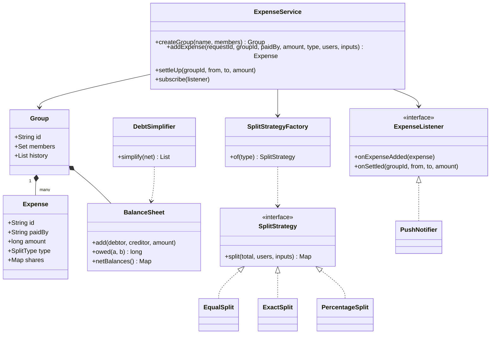

# Splitwise

Ek expense-sharing app design karo: group me kharcha add karo, equal/exact/percentage me baanto, kaun kisko kitna dega dikhao, settle up karo aur debts simplify karo. Interviewer check karta hai: split logic extensible hai ya nahi (**Strategy**), **paisa paise tak sahi** hai (rounding, sum = total), balance ka data structure, aur debt simplification ka algorithm.

## Step 1: Requirements confirm karo

| Tum poochho | Typical jawab | Design pe asar |
|---|---|---|
| Split types kaunse? | Equal, exact, percentage | `SplitStrategy` + `SplitStrategyFactory` |
| Ek expense ka payer ek ya kai? | Ek (multi-payer extension) | `Expense.paidBy` single user |
| Group ke bahar 1:1 expense? | Haan, par group pehle | 1:1 = do members ka implicit group |
| Currency? Rounding? | INR, paise tak exact | Amount `long` paise me, leftover paise deterministic distribute |
| Balance kaise dikhana? | "B owes A ₹300" pairwise + net | `BalanceSheet` pairwise map, net derived |
| Simplify debts chahiye? | Haan, group level | Net balance + do heaps (greedy) |
| Edit/delete expense? | Haan | History immutable, reversal entry |
| Notifications? | Expense add/settle pe | Observer: `ExpenseListener` |

**Functional:**
- Users, groups, members add.
- `addExpense(group, paidBy, amount, splitType, participants, inputs)`.
- Balances: pairwise (kaun kisko) aur net (kitna lena/dena).
- Settle up: A ne B ko paisa diya, record karo.
- Simplify debts: kam se kam transfers ka plan.
- Expense history per group.

**Out of scope:** actual payment (UPI collect link sirf extension), multi-currency, receipts OCR, auth.

## Step 2: Core entities

- `User`: id, name, email.
- `Group`: id, members, expense history, apni `BalanceSheet`.
- `Expense`: immutable record. id, paidBy, amount (paise), type, final shares map.
- `SplitType`: enum EQUAL, EXACT, PERCENTAGE.
- `SplitStrategy`: total + participants + inputs → har user ka share (paise). `EqualSplit`, `ExactSplit`, `PercentageSplit`.
- `SplitStrategyFactory`: type → strategy.
- `BalanceSheet`: `owes[a][b]` = a ko b ko kitna dena hai.
- `ExpenseService`: entry point. Validation, locking, idempotency, listeners ko notify.
- `ExpenseListener`: Observer. Push/email notifier.
- `DebtSimplifier` + `Transfer`: net balances → minimum-ish transfers.

## Step 3: Class diagram



## Step 4: Design patterns kyun

| Pattern | Kahan | Kyun | Alternative |
|---|---|---|---|
| [Strategy](../03-lld/05-behavioral.md) | `SplitStrategy`: Equal, Exact, Percentage | Naya split type (shares/ratio, adjustment) = nayi class. `ExpenseService` nahi badalta | `switch (type)` service ke andar, har naye type pe service edit |
| [Factory](../03-lld/03-creational.md) | `SplitStrategyFactory.of(type)` | Caller sirf enum jaanta hai. Strategies stateless, ek-ek instance reuse | Caller khud `new EqualSplit()`: client concrete classes se bandh jaata hai |
| [Observer](../03-lld/05-behavioral.md) | `ExpenseListener`: push, email, activity feed | Notification channels add/remove karo bina core logic chhede. Lock ke bahar fire | Service ke andar seedha `pushService.send()`: tight coupling, slow channel core ko slow kare |
| Immutable ledger (domain idea) | `Expense` record + history | Edit/delete = reversal entry. Audit aur balance recompute possible | Balance overwrite karna: history kho jaati hai, bug debug nahi hota |

## Step 5: Code

Model. Saari amounts `long` paise me (₹100.50 = 10050).

```java
import java.time.Instant;
import java.util.*;
import java.util.concurrent.ConcurrentHashMap;
import java.util.concurrent.CopyOnWriteArrayList;
import java.util.concurrent.atomic.AtomicLong;

record User(String id, String name, String email) {}

enum SplitType { EQUAL, EXACT, PERCENTAGE }

record Expense(String id, String groupId, String paidBy, long amount, String description,
               SplitType type, Map<String, Long> shares, Instant createdAt) {}

class Group {
    final String id, name;
    final Set<String> members = ConcurrentHashMap.newKeySet();
    final List<Expense> history = new CopyOnWriteArrayList<>();
    final BalanceSheet balances = new BalanceSheet();
    final Map<String, Expense> byRequestId = new HashMap<>();   // idempotency, group lock ke andar
    Group(String id, String name) { this.id = id; this.name = name; }
}
```

Split strategies aur factory. Har strategy ka output sum **exactly** total hona chahiye.

```java
interface SplitStrategy {
    // inputs: EXACT me paise, PERCENTAGE me basis points (12.5% = 1250), EQUAL me ignore
    Map<String, Long> split(long total, List<String> users, Map<String, Long> inputs);
}

class EqualSplit implements SplitStrategy {
    public Map<String, Long> split(long total, List<String> users, Map<String, Long> inputs) {
        long base = total / users.size(), extra = total % users.size();
        Map<String, Long> out = new LinkedHashMap<>();
        for (int i = 0; i < users.size(); i++) out.put(users.get(i), base + (i < extra ? 1 : 0));
        return out;   // ₹100 / 3 = 3334 + 3333 + 3333 paise, sum = 10000
    }
}

class ExactSplit implements SplitStrategy {
    public Map<String, Long> split(long total, List<String> users, Map<String, Long> amounts) {
        Map<String, Long> out = new LinkedHashMap<>();
        long sum = 0;
        for (String u : users) {
            long a = amounts.getOrDefault(u, -1L);
            if (a < 0) throw new IllegalArgumentException("Missing/negative amount for " + u);
            out.put(u, a);
            sum += a;
        }
        if (sum != total) throw new IllegalArgumentException("Splits " + sum + " != total " + total);
        return out;
    }
}

class PercentageSplit implements SplitStrategy {
    public Map<String, Long> split(long total, List<String> users, Map<String, Long> bps) {
        long sumBps = 0;
        for (String u : users) {
            long p = bps.getOrDefault(u, -1L);
            if (p < 0) throw new IllegalArgumentException("Missing/negative percent for " + u);
            sumBps += p;
        }
        if (sumBps != 10_000) throw new IllegalArgumentException("Percentages must sum to 100");
        Map<String, Long> out = new LinkedHashMap<>();
        long assigned = 0;
        for (String u : users) {
            long share = total * bps.get(u) / 10_000;   // floor
            out.put(u, share);
            assigned += share;
        }
        // floor se bache paise (users.size() se kam) pehle users ko 1-1 paisa
        long left = total - assigned;
        for (int i = 0; left > 0; i++, left--) out.merge(users.get(i), 1L, Long::sum);
        return out;
    }
}

final class SplitStrategyFactory {
    private static final SplitStrategy EQUAL = new EqualSplit(), EXACT = new ExactSplit(),
            PERCENT = new PercentageSplit();   // stateless, isliye shared
    static SplitStrategy of(SplitType type) {
        return switch (type) {
            case EQUAL -> EQUAL;
            case EXACT -> EXACT;
            case PERCENTAGE -> PERCENT;
        };
    }
}
```

Balance sheet, observer aur service. Ek group ke saare balance updates group lock ke andar.

```java
class BalanceSheet {
    // owes[a][b] > 0: a ko b ko itna dena hai. Invariant: owes[a][b] == -owes[b][a]
    private final Map<String, Map<String, Long>> owes = new HashMap<>();
    void add(String debtor, String creditor, long amount) {
        if (debtor.equals(creditor) || amount == 0) return;
        owes.computeIfAbsent(debtor, k -> new HashMap<>()).merge(creditor, amount, Long::sum);
        owes.computeIfAbsent(creditor, k -> new HashMap<>()).merge(debtor, -amount, Long::sum);
    }
    long owed(String a, String b) { return owes.getOrDefault(a, Map.of()).getOrDefault(b, 0L); }
    Map<String, Long> netBalances() {   // + = lena hai, - = dena hai
        Map<String, Long> net = new HashMap<>();
        owes.forEach((u, row) -> net.put(u, -row.values().stream().mapToLong(Long::longValue).sum()));
        return net;
    }
}

interface ExpenseListener {
    void onExpenseAdded(Expense e);
    void onSettled(String groupId, String from, String to, long amount);
}

class PushNotifier implements ExpenseListener {
    public void onExpenseAdded(Expense e) { System.out.println("Push: " + e.description() + " " + e.shares()); }
    public void onSettled(String g, String from, String to, long amt) { System.out.println("Push: " + from + " paid " + to + " " + amt); }
}

class ExpenseService {
    private final Map<String, Group> groups = new ConcurrentHashMap<>();
    private final List<ExpenseListener> listeners = new CopyOnWriteArrayList<>();
    private final AtomicLong seq = new AtomicLong();

    Group createGroup(String name, List<String> members) {
        Group g = new Group("G" + seq.incrementAndGet(), name);
        g.members.addAll(members);
        groups.put(g.id, g);
        return g;
    }
    void subscribe(ExpenseListener l) { listeners.add(l); }

    Expense addExpense(String requestId, String groupId, String paidBy, long amount, String desc,
                       SplitType type, List<String> users, Map<String, Long> inputs) {
        Group g = group(groupId);
        if (amount <= 0 || users.isEmpty()) throw new IllegalArgumentException("Invalid expense");
        if (!g.members.contains(paidBy) || !g.members.containsAll(users))
            throw new IllegalArgumentException("Non-member in expense");
        Map<String, Long> shares = SplitStrategyFactory.of(type).split(amount, users, inputs);
        if (shares.values().stream().mapToLong(Long::longValue).sum() != amount)   // safety net
            throw new IllegalStateException("Shares do not add up to total");
        Expense e;
        synchronized (g) {
            Expense dup = g.byRequestId.get(requestId);
            if (dup != null) return dup;                  // double tap / retry: same result
            e = new Expense("E" + seq.incrementAndGet(), groupId, paidBy, amount, desc, type,
                    Map.copyOf(shares), Instant.now());
            shares.forEach((u, s) -> g.balances.add(u, paidBy, s));
            g.history.add(e);
            g.byRequestId.put(requestId, e);
        }
        listeners.forEach(l -> l.onExpenseAdded(e));     // lock ke bahar
        return e;
    }

    void settleUp(String groupId, String from, String to, long amount) {
        Group g = group(groupId);
        synchronized (g) {
            long due = g.balances.owed(from, to);
            if (amount <= 0 || amount > due) throw new IllegalArgumentException("Due is only " + due);
            g.balances.add(from, to, -amount);
        }
        listeners.forEach(l -> l.onSettled(groupId, from, to, amount));
    }

    Map<String, Long> netBalances(String groupId) {
        Group g = group(groupId);
        synchronized (g) { return g.balances.netBalances(); }
    }

    private Group group(String id) {
        Group g = groups.get(id);
        if (g == null) throw new NoSuchElementException("Group " + id);
        return g;
    }
}
```

Debt simplification (greedy, do heaps) aur main.

```java
record Transfer(String from, String to, long amount) {}

class DebtSimplifier {
    static List<Transfer> simplify(Map<String, Long> net) {
        Comparator<Map.Entry<String, Long>> biggestFirst = (a, b) -> Long.compare(b.getValue(), a.getValue());
        PriorityQueue<Map.Entry<String, Long>> creditors = new PriorityQueue<>(biggestFirst);
        PriorityQueue<Map.Entry<String, Long>> debtors = new PriorityQueue<>(biggestFirst);
        net.forEach((u, v) -> {
            if (v > 0) creditors.add(Map.entry(u, v));
            else if (v < 0) debtors.add(Map.entry(u, -v));   // debt positive me store
        });
        List<Transfer> out = new ArrayList<>();
        while (!creditors.isEmpty() && !debtors.isEmpty()) {
            var c = creditors.poll();
            var d = debtors.poll();
            long x = Math.min(c.getValue(), d.getValue());
            out.add(new Transfer(d.getKey(), c.getKey(), x));
            if (c.getValue() > x) creditors.add(Map.entry(c.getKey(), c.getValue() - x));
            if (d.getValue() > x) debtors.add(Map.entry(d.getKey(), d.getValue() - x));
        }
        return out;   // har step me kam se kam ek banda zero: max n-1 transfers
    }

    public static void main(String[] args) {
        ExpenseService svc = new ExpenseService();
        svc.subscribe(new PushNotifier());
        Group goa = svc.createGroup("Goa trip", List.of("aman", "bhavya", "chirag"));

        svc.addExpense("r1", goa.id, "aman", 90_000, "Dinner", SplitType.EQUAL,
                List.of("aman", "bhavya", "chirag"), Map.of());          // B, C dono A ko 300
        svc.addExpense("r2", goa.id, "bhavya", 60_000, "Cab", SplitType.PERCENTAGE,
                List.of("bhavya", "chirag"), Map.of("bhavya", 5_000L, "chirag", 5_000L)); // C, B ko 300
        svc.addExpense("r2", goa.id, "bhavya", 60_000, "Cab", SplitType.PERCENTAGE,
                List.of("bhavya", "chirag"), Map.of("bhavya", 5_000L, "chirag", 5_000L)); // retry: no-op

        Map<String, Long> net = svc.netBalances(goa.id);   // aman +60000, bhavya 0, chirag -60000
        System.out.println(simplify(net));                 // [chirag -> aman 60000]: 3 transfers ki jagah 1
    }
}
```

## Step 6: Concurrency & edge cases

- **Rounding paise:** ₹100 / 3 = 3334 + 3333 + 3333. Leftover paise deterministic order me (participants list ka order) do, random nahi, warna do servers alag balance banayenge. `double` kabhi nahi.
- **Percentage:** basis points (`int`) me lo, `33.33%` jaisa float nahi. Sum exactly 10000. Floor ke baad leftover < participants, 1-1 paisa baanto.
- **Validation:** exact split sum = total, koi negative share nahi, saare participants group members, payer member, amount > 0. Service me final safety check: shares ka sum = amount (naya buggy strategy bhi pakda jaaye).
- **Concurrency on balances:** ek expense kai users ke balance touch karta hai. Group-level lock (`synchronized (g)`) taaki do parallel expenses lost update na karein. Notifications lock ke bahar.
- **DB me:** ek transaction me expense insert + balance rows update. Rows ko sorted userId order me lock karo (`SELECT ... FOR UPDATE`) taaki deadlock na ho, ya optimistic `version` column + retry.
- **Idempotency:** client `requestId` bhejta hai. Double tap / network retry pe same expense return, dobara balance nahi badhta.
- **Settle up:** amount `<= due` check, lock ke andar (check-then-act race). Overpay chahiye to reverse direction me debt ban jaata hai: product decision, interviewer se poochho.
- **Edit/delete expense:** purana expense ka reversal (shares negate) + naya apply, ek hi lock/transaction me. History me dono dikhte hain.
- **User group chhode:** sirf tab jab net balance 0 ho.
- **Simplify debts:** greedy max n-1 transfers deta hai. Exact minimum NP-hard hai (zero-sum subsets dhoondhna), group size 10–20 pe bitmask DP possible, par greedy kaafi hai.

## Step 7: Extensions

- **Naya split type (shares 2:1:1, adjustment):** nayi `SplitStrategy` + enum value + factory me ek line.
- **Multiple payers:** `Expense.paidBy` ko `Map<userId, paid>` banao. Net per user = paid − share, ledger wahi.
- **Multi-currency:** `Money(amount, currency)` value object, expense time ka FX rate store karo, balance per currency.
- **Recurring expense (rent, Netflix):** scheduler jo template se expense create kare (same `addExpense`, requestId = templateId + month).
- **Settle via UPI:** settle up pe UPI collect/intent link. Payment success webhook pe hi `settleUp` (idempotent by txnId).
- **Activity feed / email digest:** naya `ExpenseListener`. Scale pe listeners ko Kafka event se async.
- **Scale:** balances ko expense log se derive karo (event sourcing), materialized balance table cache. Group id pe shard.

## Step 8: Interview flow (45 min)

| Minute | Kya karo |
|---|---|
| 0–5 | Requirements: split types, rounding, simplify chahiye ya nahi, edit/delete |
| 5–10 | Entities, money in paise ka decision pehle hi bolo |
| 10–15 | Class diagram: SplitStrategy + Factory, BalanceSheet, Listener |
| 15–30 | Code: 3 strategies (rounding ke saath), `addExpense`, `BalanceSheet.add` |
| 30–38 | Simplify debts: net balances + do heaps, dry run ek example pe |
| 38–43 | Concurrency (group lock, DB row lock order), idempotency, edit = reversal |
| 43–45 | Extensions: multi-payer, multi-currency |

## 2-minute recap

Splitwise me core teen cheezein: split, balance, simplify. Split `SplitStrategy` (Equal, Exact, Percentage) hai jo `SplitStrategyFactory` se milti hai, aur har strategy ka output exactly total ke barabar hota hai. Paisa `long` paise me, percentage basis points me, leftover paise deterministic order me 1-1. `BalanceSheet` pairwise `owes[a][b]` rakhta hai (anti-symmetric), net usi se derive. Expense immutable hai, edit/delete = reversal. Group-level lock lost updates rokta hai, `requestId` duplicate expense rokta hai, notifications Observer se lock ke bahar. Simplify debts: net balance nikalo, creditors aur debtors ke do max-heaps, sabse bade ko sabse bade se match karo, max n-1 transfers.

## Checklist

- [ ] Equal, exact aur percentage split rounding ke saath code kar sakta hoon
- [ ] Bata sakta hoon ki paisa `long` paise me aur percentage basis points me kyun
- [ ] Strategy + Factory se naya split type add karna dikha sakta hoon
- [ ] Pairwise balance sheet aur net balance ka relation samjha sakta hoon
- [ ] Do heaps wala debt simplification dry run kar sakta hoon aur n-1 bound bata sakta hoon
- [ ] Balance updates ki concurrency (group lock, DB lock order) aur idempotency bata sakta hoon
- [ ] Edit/delete expense ko reversal entry se handle karna samjha sakta hoon
- [ ] Observer se notifications lock ke bahar kyun fire karte hain bata sakta hoon
