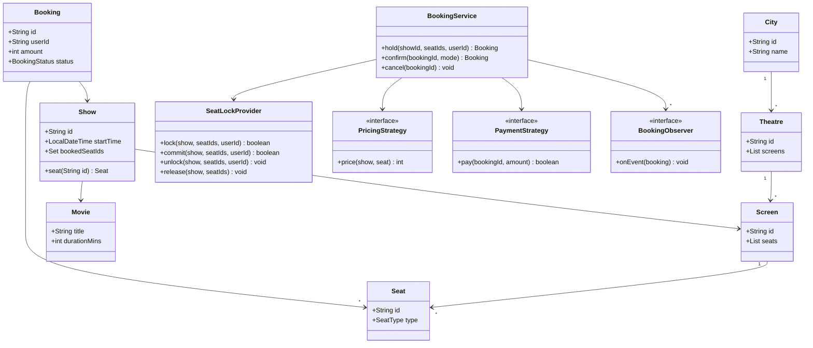

# BookMyShow LLD

**Ek line me:** city → theatre → screen → show → seat ka model banao, seat ko thodi der lock karo, payment ke baad booking confirm karo. Interviewer check karta hai: clean classes, pricing/payment ko pluggable rakhna, aur **ek seat do logon ko na bike** (concurrency).

> Ye LLD hai (classes, objects, locks in one JVM). Distributed version (Redis TTL, DB constraint, virtual queue) ke liye [BookMyShow HLD](../02-questions/t1-05-bookmyshow.md) dekho.

## Step 1: Requirements confirm karo

| Tum poochho | Typical jawab | Design pe asar |
|---|---|---|
| "Multiple cities, theatres, screens?" | Haan | `City → Theatre → Screen → Seat` hierarchy |
| "Seat types aur alag price?" | Silver, Gold, Recliner | `SeatType` enum + `PricingStrategy` |
| "Weekend/prime-time pe price badle?" | Haan, weekend +20% | Strategy ko wrap karke rule add |
| "Seat hold kitni der?" | 10 min | `SeatLock` me `expiresAt`, lazy expiry |
| "Payment modes?" | UPI, Card | `PaymentStrategy` + `PaymentFactory` |
| "Cancellation allowed?" | Haan, seat wapas free | `cancel()` seats release kare + refund |
| "Notification?" | SMS/email on confirm/cancel | Observer |
| "Single process ya distributed?" | Single process, thread-safe | Per-show lock, `ConcurrentHashMap` |

**Functional:**
- Show list karo (movie, city ke hisaab se), seat map dikhao.
- User seats select kare → seats 10 min ke liye lock.
- Payment success → booking CONFIRMED, seats BOOKED.
- Lock expire → seats wapas available, booking EXPIRED.
- Cancel → seats free, refund, notification.

**Out of scope:** search ranking, reviews, food & beverages, coupons, real payment gateway, multi-server deployment.

## Step 2: Core entities

- **City**: id, name. Theatres isme hain.
- **Theatre**: ek city me, kai screens.
- **Screen**: physical audi, fixed seat layout.
- **Seat**: row, col, `SeatType` (SILVER/GOLD/RECLINER). Seat screen ki hai, show ki nahi.
- **Movie**: title, duration.
- **Show**: movie + screen + start time. Booked seats yahin track hote hain (same seat har show me alag status).
- **SeatLock**: kis user ne lock kiya, kab tak (`expiresAt`).
- **Booking**: user, show, seats, amount, status (PENDING/CONFIRMED/CANCELLED/EXPIRED).
- **SeatLockProvider**: seat lock/unlock/commit, per-show thread-safety.
- **BookingService**: hold → confirm → cancel flow ka facade.
- **PricingStrategy / PaymentStrategy / BookingObserver**: pluggable behaviour.

## Step 3: Class diagram



## Step 4: Design patterns kyun

| Pattern | Kahan | Kyun | Alternative |
|---|---|---|---|
| [Strategy](../03-lld/05-behavioral.md) | `PricingStrategy` (seat type, weekend) | Naya pricing rule = nayi class, `BookingService` touch nahi | `if (weekend) ... else if (recliner)` chain, har rule pe edit |
| [Strategy](../03-lld/05-behavioral.md) | `PaymentStrategy` (UPI, Card) | Payment mode runtime pe choose | `switch` har jagah bikhra hua |
| [Factory](../03-lld/03-creational.md) | `PaymentFactory.of(mode)` | Client ko concrete class nahi pata hona chahiye, creation ek jagah | Caller khud `new UpiPayment()` kare |
| [Observer](../03-lld/05-behavioral.md) | `BookingObserver` (SMS, email, analytics) | Booking logic notification se decoupled, naya listener bina edit | `BookingService` me direct `smsService.send()` |
| [Decorator](../03-lld/04-structural.md) (bonus) | `WeekendPricing` wraps base pricing | Rules stack ho jaate hain: weekend + prime-time | Har combination ki alag class |
| [Facade](../03-lld/04-structural.md) | `BookingService` | Controller ko ek simple API, andar lock + price + pay + notify | Controller sab classes ko khud orchestrate kare |

## Step 5: Code

Models aur enums:

```java
import java.time.*;
import java.util.*;
import java.util.concurrent.*;

enum SeatType { SILVER, GOLD, RECLINER }
enum BookingStatus { PENDING, CONFIRMED, CANCELLED, EXPIRED }
enum PaymentMode { UPI, CARD }

record City(String id, String name) {}
record Movie(String id, String title, int durationMins) {}
record Seat(String id, int row, int col, SeatType type) {}
record Screen(String id, List<Seat> seats) {}
record Theatre(String id, City city, List<Screen> screens) {}

class Show {
    final String id;
    final Movie movie;
    final Screen screen;
    final LocalDateTime startTime;
    // sirf SeatLockProvider isse badalta hai (show ke monitor ke andar)
    final Set<String> bookedSeatIds = ConcurrentHashMap.newKeySet();

    Show(String id, Movie movie, Screen screen, LocalDateTime startTime) {
        this.id = id; this.movie = movie; this.screen = screen; this.startTime = startTime;
    }
    Seat seat(String seatId) {
        return screen.seats().stream().filter(s -> s.id().equals(seatId)).findFirst()
                .orElseThrow(() -> new IllegalArgumentException("Seat nahi mili: " + seatId));
    }
}

class Booking {
    final String id = UUID.randomUUID().toString();
    final String userId;
    final Show show;
    final List<Seat> seats;
    final int amount;
    volatile BookingStatus status = BookingStatus.PENDING;
    volatile PaymentMode paidWith;                          // refund isi mode se

    Booking(String userId, Show show, List<Seat> seats, int amount) {
        this.userId = userId; this.show = show; this.seats = seats; this.amount = amount;
    }
    List<String> seatIds() { return seats.stream().map(Seat::id).toList(); }
}
```

Strategy, Factory, Observer:

```java
interface PricingStrategy { int price(Show show, Seat seat); }
class SeatTypePricing implements PricingStrategy {
    private final Map<SeatType, Integer> base =
            Map.of(SeatType.SILVER, 150, SeatType.GOLD, 250, SeatType.RECLINER, 450);
    public int price(Show show, Seat seat) { return base.get(seat.type()); }
}
class WeekendPricing implements PricingStrategy {          // dusri strategy ko wrap karta hai
    private final PricingStrategy inner;
    WeekendPricing(PricingStrategy inner) { this.inner = inner; }
    public int price(Show show, Seat seat) {
        int p = inner.price(show, seat);
        DayOfWeek d = show.startTime.getDayOfWeek();
        return (d == DayOfWeek.SATURDAY || d == DayOfWeek.SUNDAY) ? p + p / 5 : p;  // weekend +20%
    }
}

interface PaymentStrategy {
    boolean pay(String bookingId, int amount);
    default void refund(String bookingId, int amount) { System.out.println("Refund Rs " + amount); }
}
class UpiPayment implements PaymentStrategy {
    public boolean pay(String bookingId, int amount) { System.out.println("UPI Rs " + amount); return true; }
}
class CardPayment implements PaymentStrategy {
    public boolean pay(String bookingId, int amount) { System.out.println("Card Rs " + amount); return true; }
}
class PaymentFactory {
    static PaymentStrategy of(PaymentMode mode) {
        return switch (mode) {
            case UPI -> new UpiPayment();
            case CARD -> new CardPayment();
        };
    }
}

interface BookingObserver { void onEvent(Booking booking); }
class SmsNotifier implements BookingObserver {
    public void onEvent(Booking b) { System.out.println("SMS to " + b.userId + ": booking " + b.status); }
}
```

Seat lock (concurrency ka core):

```java
record SeatLock(String userId, Instant expiresAt) {
    boolean isActive(Instant now) { return now.isBefore(expiresAt); }
}

class SeatLockProvider {
    private final Duration ttl;
    // showId -> (seatId -> lock). Inner map sirf usi show ke monitor ke andar touch hota hai.
    private final Map<String, Map<String, SeatLock>> locks = new ConcurrentHashMap<>();

    SeatLockProvider(Duration ttl) { this.ttl = ttl; }
    private Map<String, SeatLock> of(Show show) { return locks.computeIfAbsent(show.id, k -> new HashMap<>()); }
    // all-or-nothing: saari seats free hon tabhi lock
    boolean lock(Show show, List<String> seatIds, String userId) {
        Map<String, SeatLock> m = of(show);
        synchronized (m) {                                   // per-show lock: alag shows parallel
            Instant now = Instant.now();
            for (String id : seatIds) {
                if (show.bookedSeatIds.contains(id)) return false;
                SeatLock l = m.get(id);
                if (l != null && l.isActive(now) && !l.userId().equals(userId)) return false;
            }
            Instant exp = now.plus(ttl);                     // expired lock = free (lazy expiry)
            for (String id : seatIds) m.put(id, new SeatLock(userId, exp));
            return true;
        }
    }
    // payment ke baad: lock abhi bhi mera hai? to atomically BOOKED bana do
    boolean commit(Show show, List<String> seatIds, String userId) {
        Map<String, SeatLock> m = of(show);
        synchronized (m) {
            Instant now = Instant.now();
            for (String id : seatIds) {
                SeatLock l = m.get(id);
                if (l == null || !l.isActive(now) || !l.userId().equals(userId)) return false;
            }
            for (String id : seatIds) { m.remove(id); show.bookedSeatIds.add(id); }
            return true;
        }
    }
    // PENDING cancel: sirf apne locks hatao (expire hoke seat kisi aur ki ho sakti hai)
    void unlock(Show show, List<String> seatIds, String userId) {
        Map<String, SeatLock> m = of(show);
        synchronized (m) {
            for (String id : seatIds) m.computeIfPresent(id, (k, l) -> l.userId().equals(userId) ? null : l);
        }
    }
    // CONFIRMED cancel: booked seats wapas free
    void release(Show show, List<String> seatIds) {
        Map<String, SeatLock> m = of(show);
        synchronized (m) { seatIds.forEach(show.bookedSeatIds::remove); }
    }
    // background job (ScheduledExecutorService) se: sirf memory saaf, correctness lazy check se
    void purgeExpired() {
        Instant now = Instant.now();
        for (Map<String, SeatLock> m : locks.values()) {
            synchronized (m) { m.values().removeIf(l -> !l.isActive(now)); }
        }
    }
}
```

BookingService aur main flow:

```java
class BookingService {
    private final Map<String, Show> shows = new ConcurrentHashMap<>();
    private final Map<String, Booking> bookings = new ConcurrentHashMap<>();
    private final List<BookingObserver> observers = new CopyOnWriteArrayList<>();
    private final SeatLockProvider lockProvider;
    private final PricingStrategy pricing;

    BookingService(SeatLockProvider lockProvider, PricingStrategy pricing) {
        this.lockProvider = lockProvider; this.pricing = pricing;
    }
    void addShow(Show s) { shows.put(s.id, s); }
    void subscribe(BookingObserver o) { observers.add(o); }
    private void publish(Booking b) { observers.forEach(o -> o.onEvent(b)); }

    Booking hold(String showId, List<String> seatIds, String userId) {
        Show show = Objects.requireNonNull(shows.get(showId), "Show nahi mila");
        List<Seat> seats = seatIds.stream().map(show::seat).toList();   // invalid seat pe pehle hi fail
        if (!lockProvider.lock(show, seatIds, userId))
            throw new IllegalStateException("Seat already taken");
        int amount = seats.stream().mapToInt(s -> pricing.price(show, s)).sum();
        Booking b = new Booking(userId, show, seats, amount);
        bookings.put(b.id, b);
        return b;
    }
    Booking confirm(String bookingId, PaymentMode mode) {
        Booking b = bookings.get(bookingId);
        synchronized (b) {                                   // double-click = ek hi payment
            if (b.status != BookingStatus.PENDING) return b; // idempotent
            if (!lockProvider.lock(b.show, b.seatIds(), b.userId)) { // re-lock = TTL extend
                b.status = BookingStatus.EXPIRED;            // seat kisi aur ne le li, charge nahi kiya
                publish(b); return b;
            }
            PaymentStrategy payment = PaymentFactory.of(mode);
            if (!payment.pay(b.id, b.amount))                // lock rehne do, user retry kare
                throw new IllegalStateException("Payment failed");
            if (!lockProvider.commit(b.show, b.seatIds(), b.userId)) {
                payment.refund(b.id, b.amount);              // payment ke beech lock expire
                b.status = BookingStatus.EXPIRED;
            } else {
                b.paidWith = mode;
                b.status = BookingStatus.CONFIRMED;
            }
        }
        publish(b);
        return b;
    }
    void cancel(String bookingId) {
        Booking b = bookings.get(bookingId);
        synchronized (b) {
            if (b.status == BookingStatus.CONFIRMED) {
                lockProvider.release(b.show, b.seatIds());
                PaymentFactory.of(b.paidWith).refund(b.id, b.amount);
            } else if (b.status == BookingStatus.PENDING) {
                lockProvider.unlock(b.show, b.seatIds(), b.userId);
            } else return;                                   // already CANCELLED/EXPIRED
            b.status = BookingStatus.CANCELLED;
        }
        publish(b);
    }
}

public class BookMyShowDemo {
    public static void main(String[] args) {
        City blr = new City("c1", "Bengaluru");
        Screen audi1 = new Screen("audi1", List.of(new Seat("A1", 1, 1, SeatType.SILVER),
                new Seat("A2", 1, 2, SeatType.SILVER), new Seat("R1", 5, 1, SeatType.RECLINER)));
        Theatre pvr = new Theatre("t1", blr, List.of(audi1));
        Show show = new Show("sh1", new Movie("m1", "Jawan", 165), audi1,
                LocalDateTime.of(2026, 10, 10, 21, 0));      // Saturday

        BookingService svc = new BookingService(new SeatLockProvider(Duration.ofMinutes(10)),
                new WeekendPricing(new SeatTypePricing()));
        svc.addShow(show);
        svc.subscribe(new SmsNotifier());

        Booking rahul = svc.hold("sh1", List.of("A1", "A2"), "rahul");
        System.out.println("Amount: " + rahul.amount);           // 360 (150*2 + 20%)
        try { svc.hold("sh1", List.of("A2"), "priya"); }
        catch (IllegalStateException e) { System.out.println("priya: " + e.getMessage()); } // Seat already taken
        svc.confirm(rahul.id, PaymentMode.UPI);                  // SMS: CONFIRMED
        svc.cancel(rahul.id);                                    // refund + SMS: CANCELLED
        System.out.println(svc.hold("sh1", List.of("A2"), "priya").status); // PENDING, ab mil gayi
    }
}
```

## Step 6: Concurrency & edge cases

- **Do log ek seat:** `lock()` check + put ek hi `synchronized (showMap)` me. Check-then-act atomic, isliye race nahi. Lock **per show** hai, global nahi: Jawan ka rush Pushpa ki booking ko block nahi karta.
- **`ConcurrentHashMap.computeIfAbsent`**: do threads ek saath naye show ka map banayein to bhi ek hi map banega, sab usi pe sync karenge.
- **ReentrantLock alternative:** `Map<String, ReentrantLock>` per show. Fayda: `tryLock(200, ms)` se timeout, aur fairness option. `synchronized` me wait forever hota hai. Interview me dono bolo, ek chuno.
- **Seat-level lock kyun nahi?** Multi-seat booking (A1, A2) me seats ko alag alag lock karoge to deadlock ka risk (user1: A1→A2, user2: A2→A1). Fix: seat ids sort karke lock karo. Per-show lock simple hai aur ek show ka contention chhota hai.
- **Lock expiry:** `expiresAt` lazy check hota hai (`isActive`), isliye cleanup job late chale to bhi correctness safe. `purgeExpired()` sirf memory ke liye (`ScheduledExecutorService` har 30 sec).
- **Payment ke beech lock expire:** `confirm()` pay se pehle `lock()` dobara call karta hai: lock abhi bhi mera/free hai to TTL extend, warna EXPIRED bina charge kiye. Phir bhi pay ke dauraan expire ho jaye to `commit()` fail → refund + EXPIRED.
- **PENDING cancel me galti se kisi aur ki seat free na ho:** `unlock()` sirf wahi locks hatata hai jinka `userId` match kare. `bookedSeatIds` sirf CONFIRMED cancel (`release()`) pe chhuta hai.
- **Double click on Pay:** `synchronized (booking)` + status PENDING check. Doosri call same booking return karti hai, double charge nahi.
- **Payment fail:** lock chhodte nahi, user TTL ke andar retry kar sakta hai.
- **Invalid seat id / show id:** `hold()` lock lene se pehle hi fail, aadhe locks nahi bachte.
- **Observer slow ho (SMS API):** notification lock ke bahar bhejte hain. Production me async executor ya queue.
- **Same user ne seat dobara select ki:** lock refresh ho jaata hai (`userId` match), error nahi.

## Step 7: Extensions

- **"Coupons / offers add karo":** naya `CouponPricing implements PricingStrategy` jo base ko wrap kare. `BookingService` same.
- **"Wallet / Netbanking":** naya `PaymentStrategy` + `PaymentFactory` me ek case.
- **"Email + push bhi bhejo":** naya `BookingObserver`, `subscribe()` karo.
- **"Seat map live dikhao":** `SeatStatus` (AVAILABLE/LOCKED/BOOKED) compute karo `bookedSeatIds` + active locks se. Change pe observer se WebSocket push.
- **"Multiple servers par chalao":** in-memory `SeatLockProvider` ko interface banao, `RedisSeatLockProvider` (`SET NX PX`) + DB unique constraint. Ye [HLD wala design](../02-questions/t1-05-bookmyshow.md) hai.
- **"Partial cancellation (2 me se 1 seat)":** `cancel(bookingId, seatIds)`, amount recompute, sirf un seats ka release.
- **"Dynamic pricing (jitni bhari, utni mehngi)":** `OccupancyPricing` strategy jo `show.bookedSeatIds.size()` dekhe.

## Step 8: Interview flow (45 min)

| Minutes | Kya karo |
|---|---|
| 0–5 | Requirements table: seat types, hold time, payment modes, cancel, single process |
| 5–10 | Entities bolo, City → Theatre → Screen → Seat, Show alag kyun (seat status per show) |
| 10–17 | Class diagram + patterns: Strategy (pricing, payment), Factory, Observer |
| 17–35 | Code: models → `SeatLockProvider.lock/commit` → `BookingService.hold/confirm/cancel` |
| 35–42 | Concurrency: per-show lock, lazy expiry, payment ke beech expiry, double click |
| 42–45 | Extensions: coupons, Redis lock for multi-server |

## 2-minute recap

Hierarchy: City → Theatre → Screen → Seat; Show = Movie + Screen + time, aur booked seats show pe track hote hain kyunki ek seat har show me alag status rakhti hai. Flow: `hold()` seats ko 10 min ke liye lock karta hai (all-or-nothing, per-show `synchronized`, `expiresAt` lazy check), price `PricingStrategy` se (seat type + weekend wrapper), `confirm()` `PaymentFactory` se strategy leke pay karta hai, phir `commit()` atomically check karta hai lock abhi bhi mera hai aur seats BOOKED kar deta hai, warna refund. `cancel()` CONFIRMED pe seats release + refund (same payment mode), PENDING pe sirf apne locks hataata hai. Observers SMS/email bhejte hain. Concurrency: per-show lock (global nahi), `ConcurrentHashMap.computeIfAbsent`, booking pe sync for idempotent confirm, ReentrantLock `tryLock` alternative. Multi-server ke liye lock provider ko Redis se swap karo.

## Checklist

- [ ] City → Theatre → Screen → Seat → Show hierarchy bata sakta hoon, aur booked seats Show pe kyun hain samjha sakta hoon
- [ ] Class diagram 10 min me bana sakta hoon (≤ 12 classes)
- [ ] PricingStrategy (seat type + weekend wrapper) aur PaymentStrategy + PaymentFactory code kar sakta hoon
- [ ] Observer se notifications ko booking logic se alag kar sakta hoon
- [ ] Per-show `synchronized` seat lock all-or-nothing likh sakta hoon aur race kyun nahi hoti bata sakta hoon
- [ ] Lock expiry (lazy check + purge job) aur payment ke beech expiry ka handling bata sakta hoon
- [ ] `synchronized` vs `ReentrantLock` vs seat-level locks (deadlock, sorted order) compare kar sakta hoon
- [ ] Multi-server extension (Redis lock + DB constraint) bol sakta hoon
