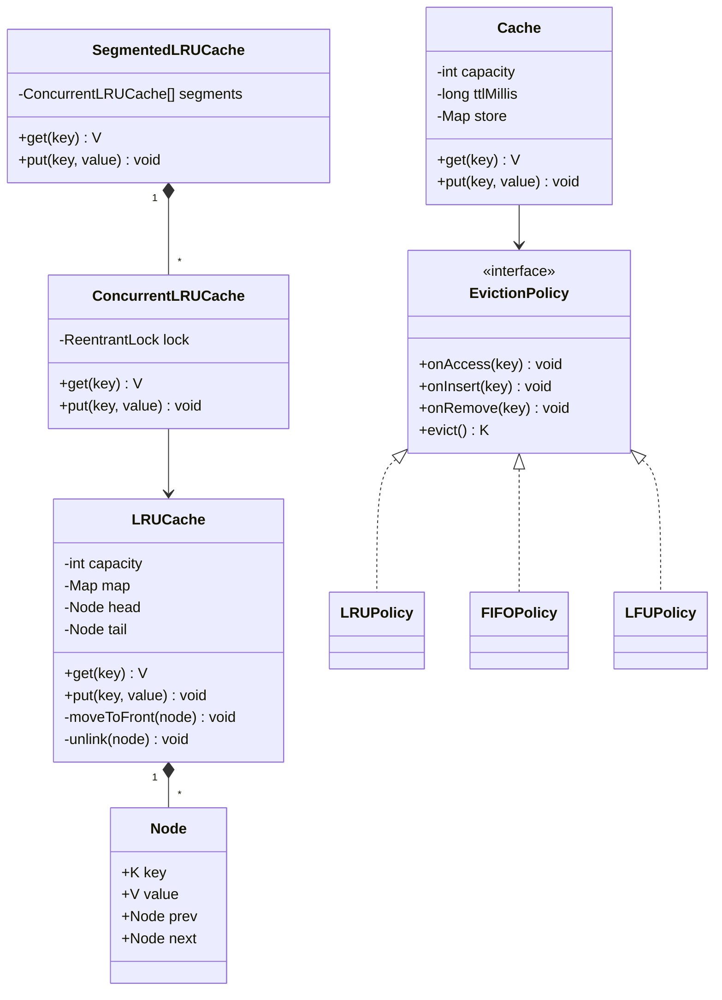

# LRU Cache

**Ek line me:** fixed capacity wala cache jisme `get` aur `put` dono O(1) hon, aur full hone pe **least recently used** key nikle. Interviewer check karta hai: HashMap + doubly linked list scratch se likh pana, pointer bugs na hon, aur follow-ups (thread-safety, TTL, LFU) handle karna.

## Step 1: Requirements confirm karo

| Tum poochho | Typical jawab | Design pe asar |
|---|---|---|
| "Capacity count me hai ya bytes me?" | Count (entries) | `map.size() == capacity` pe evict |
| "`get` bhi recency badhata hai?" | Haan | `get` me bhi node front pe |
| "Existing key pe `put`?" | Value update + recent | Naya node nahi, purana move |
| "Miss pe kya return?" | `null` (ya -1 LeetCode me) | Generic `V`, `null` = miss |
| "Multi-threaded?" | Follow-up me haan | Lock / segments |
| "TTL chahiye?" | Follow-up | Node me `expiresAt`, lazy expiry |
| "Eviction policy badal sakti hai?" | LRU abhi, LFU/FIFO baad me | `EvictionPolicy` Strategy |
| "Library use kar sakte hain?" | Pehle scratch se | `LinkedHashMap` sirf alternative ke roop me |

**Functional:**
- `get(key)`: value do aur key ko most recent banao. O(1).
- `put(key, value)`: insert/update. Full ho to LRU evict. O(1).
- Capacity constructor me fix, `capacity <= 0` reject.

**Out of scope:** distributed cache, persistence, size-in-bytes accounting, write-through to DB.

## Step 2: Core entities

- **Node**: key, value, prev, next. Key isliye rakhte hain taaki evict pe map se bhi hata sakein.
- **Doubly linked list**: recency order. Head ke paas = most recent, tail ke paas = LRU. Sentinel `head`/`tail` se null checks khatam.
- **HashMap<K, Node>**: key se node O(1) me.
- **LRUCache**: upar ke dono ko jodta hai, `get`/`put` expose.
- **EvictionPolicy** (Strategy): LRU/LFU/FIFO plug karne ke liye.
- **Cache**: storage + policy + TTL, generic version.

## Step 3: Class diagram



## Step 4: Design patterns kyun

| Pattern | Kahan | Kyun | Alternative |
|---|---|---|---|
| [Strategy](../03-lld/05-behavioral.md) | `EvictionPolicy` (LRU/LFU/FIFO) | Storage + TTL code same, sirf "kaun nikle" badalta hai | Har policy ka alag cache class, duplicate code |
| Wrapper / [Proxy](../03-lld/04-structural.md) | `ConcurrentLRUCache` wraps `LRUCache` | Thread-safety alag layer, core logic simple | Har method me lock mix karna |
| Composition | Map + list ko LRUCache ke andar rakha | List aur map hamesha sync rahein, bahar se touch na ho | `LinkedList` extend karna (galat abstraction) |

## Step 5: Code

HashMap + doubly linked list, scratch se:

```java
import java.util.HashMap;
import java.util.Map;

public class LRUCache<K, V> {
    // head ke paas = most recent, tail ke paas = least recent
    private static final class Node<K, V> {
        final K key;
        V value;
        Node<K, V> prev, next;
        Node(K key, V value) { this.key = key; this.value = value; }
    }

    private final int capacity;
    private final Map<K, Node<K, V>> map = new HashMap<>();
    private final Node<K, V> head = new Node<>(null, null);   // sentinel
    private final Node<K, V> tail = new Node<>(null, null);   // sentinel

    public LRUCache(int capacity) {
        if (capacity <= 0) throw new IllegalArgumentException("capacity > 0 chahiye");
        this.capacity = capacity;
        head.next = tail;
        tail.prev = head;
    }

    public V get(K key) {
        Node<K, V> node = map.get(key);
        if (node == null) return null;          // miss
        moveToFront(node);                      // hit = ab sabse recent
        return node.value;
    }

    public void put(K key, V value) {
        Node<K, V> node = map.get(key);
        if (node != null) {                     // update + recent banao
            node.value = value;
            moveToFront(node);
            return;
        }
        if (map.size() == capacity) {           // full: tail.prev hi LRU hai
            Node<K, V> lru = tail.prev;
            unlink(lru);
            map.remove(lru.key);                // isliye node me key rakhi
        }
        Node<K, V> fresh = new Node<>(key, value);
        addFirst(fresh);
        map.put(key, fresh);
    }

    public int size() { return map.size(); }

    private void addFirst(Node<K, V> n) {
        n.prev = head;
        n.next = head.next;
        head.next.prev = n;
        head.next = n;
    }

    private void unlink(Node<K, V> n) {
        n.prev.next = n.next;
        n.next.prev = n.prev;
        n.prev = n.next = null;                 // GC help + stale pointer bug pakdo
    }

    private void moveToFront(Node<K, V> n) { unlink(n); addFirst(n); }

    public static void main(String[] args) {
        LRUCache<Integer, String> c = new LRUCache<>(2);
        c.put(1, "one");
        c.put(2, "two");
        c.get(1);                               // order: 1, 2 (2 ab LRU)
        c.put(3, "three");                      // 2 evict
        System.out.println(c.get(2));           // null
        System.out.println(c.get(1));           // one
        System.out.println(c.get(3));           // three
    }
}
```

`LinkedHashMap` alternative (interviewer "library allowed" bole tab):

```java
import java.util.LinkedHashMap;
import java.util.Map;

class LinkedLRU<K, V> extends LinkedHashMap<K, V> {
    private final int capacity;

    LinkedLRU(int capacity) {
        super(16, 0.75f, true);                 // accessOrder = true: get() bhi order badalta hai
        this.capacity = capacity;
    }

    @Override
    protected boolean removeEldestEntry(Map.Entry<K, V> eldest) {
        return size() > capacity;               // har put ke baad call hota hai
    }
}
```

Thread-safe versions:

```java
import java.util.concurrent.locks.ReentrantLock;

class ConcurrentLRUCache<K, V> {
    private final LRUCache<K, V> lru;
    private final ReentrantLock lock = new ReentrantLock();

    ConcurrentLRUCache(int capacity) { lru = new LRUCache<>(capacity); }

    // get() bhi list badalta hai, isliye ReadWriteLock ka read lock yahan galat hoga
    V get(K key) {
        lock.lock();
        try { return lru.get(key); } finally { lock.unlock(); }
    }

    void put(K key, V value) {
        lock.lock();
        try { lru.put(key, value); } finally { lock.unlock(); }
    }
}

// N segments, har ek ka apna lock: contention ~N guna kam, LRU sirf per-segment
class SegmentedLRUCache<K, V> {
    private final ConcurrentLRUCache<K, V>[] segments;

    @SuppressWarnings("unchecked")
    SegmentedLRUCache(int capacity, int segmentCount) {
        segments = new ConcurrentLRUCache[segmentCount];
        int perSegment = Math.max(1, capacity / segmentCount);
        for (int i = 0; i < segmentCount; i++) segments[i] = new ConcurrentLRUCache<>(perSegment);
    }

    private ConcurrentLRUCache<K, V> segmentFor(K key) {
        return segments[Math.floorMod(key.hashCode(), segments.length)];
    }

    V get(K key) { return segmentFor(key).get(key); }
    void put(K key, V value) { segmentFor(key).put(key, value); }
}
```

Strategy se pluggable eviction + TTL:

```java
import java.util.*;

interface EvictionPolicy<K> {
    void onAccess(K key);
    void onInsert(K key);
    void onRemove(K key);
    K evict();                                   // kaunsi key nikle
}

class LRUPolicy<K> implements EvictionPolicy<K> {
    private final LinkedHashSet<K> order = new LinkedHashSet<>();   // pehla = least recent
    public void onAccess(K key) { order.remove(key); order.add(key); }
    public void onInsert(K key) { order.add(key); }
    public void onRemove(K key) { order.remove(key); }
    public K evict() { K k = order.iterator().next(); order.remove(k); return k; }
}

class FIFOPolicy<K> implements EvictionPolicy<K> {
    private final LinkedHashSet<K> order = new LinkedHashSet<>();
    public void onAccess(K key) { }                                  // access se order nahi badalta
    public void onInsert(K key) { order.add(key); }
    public void onRemove(K key) { order.remove(key); }
    public K evict() { K k = order.iterator().next(); order.remove(k); return k; }
}

class Cache<K, V> {
    private record Entry<T>(T value, long expiresAt) {}

    private final int capacity;
    private final long ttlMillis;
    private final Map<K, Entry<V>> store = new HashMap<>();
    private final EvictionPolicy<K> policy;

    Cache(int capacity, long ttlMillis, EvictionPolicy<K> policy) {
        this.capacity = capacity; this.ttlMillis = ttlMillis; this.policy = policy;
    }

    synchronized V get(K key) {
        Entry<V> e = store.get(key);
        if (e == null) return null;
        if (System.currentTimeMillis() > e.expiresAt()) {           // lazy expiry
            store.remove(key);
            policy.onRemove(key);
            return null;
        }
        policy.onAccess(key);
        return e.value();
    }

    synchronized void put(K key, V value) {
        if (store.containsKey(key)) {
            policy.onAccess(key);
        } else {
            if (store.size() == capacity) store.remove(policy.evict());
            policy.onInsert(key);
        }
        store.put(key, new Entry<>(value, System.currentTimeMillis() + ttlMillis));
    }
}
// usage: new Cache<String, String>(1000, 60_000, new LRUPolicy<>())  ya new FIFOPolicy<>()
```

**Complexity:**

| Operation | HashMap + DLL | LinkedHashMap | Cache + LRUPolicy (LinkedHashSet) | Naive (list scan) |
|---|---|---|---|---|
| `get` | O(1) | O(1) | O(1) | O(n) |
| `put` | O(1) | O(1) | O(1) | O(n) |
| evict | O(1) | O(1) | O(1) | O(n) |
| Space | O(capacity) | O(capacity) | O(capacity), do structures | O(capacity) |

## Step 6: Concurrency & edge cases

- **`HashMap` + list thread-safe nahi:** do threads ek saath `moveToFront` karein to pointers toot jaate hain (cycle ya lost node). Ek lock dono structures ko saath guard kare.
- **ReadWriteLock kyun nahi:** LRU me `get` bhi write hai (order badalta hai). Read lock se do readers list corrupt kar denge.
- **`ConcurrentHashMap` akela kaafi nahi:** map safe hai, par map + list ka combined update atomic nahi.
- **Segmenting:** `hash(key) % N` se segment, har segment ka apna lock. Throughput badhta hai, par eviction "global LRU" nahi, per-segment approximate LRU. Hot keys ek segment me aayein to wahan contention.
- **Production:** Caffeine (`Caffeine.newBuilder().maximumSize(..)`) use karo: lock-free reads, buffer me access record karke batch me reorder, W-TinyLFU policy.
- **Edge cases:** capacity 1 (har naya put purana nikale), same key baar baar put (size na badhe), `null` key (HashMap allow karta hai, par `null` value ko miss se alag nahi kar paoge: `Optional` ya `containsKey` do), capacity 0 reject.
- **TTL ke saath:** expired entries capacity ghere rehti hain jab tak koi `get` na kare. Fix: evict se pehle expired entries hatao, ya background sweeper (`ScheduledExecutorService`), ya expiry-sorted `PriorityQueue`.
- **Pointer bug checklist:** `unlink` me pehle neighbours jodo, `addFirst` me `head.next.prev` set karna mat bhoolo, evict me `map.remove(lru.key)`.

## Step 7: Extensions

- **"LFU chahiye":** `key → value`, `key → freq`, `freq → LinkedHashSet<key>` (same freq me LRU order), aur `minFreq`. Access pe key ko `freq` se `freq+1` bucket me le jao; agar `minFreq` bucket khaali hua to `minFreq++`. Naya insert pe `minFreq = 1`. Evict = `minFreq` bucket ka pehla element. Sab O(1). Design me ye bas ek naya `LFUPolicy implements EvictionPolicy` hai.
- **"FIFO / Random":** naya policy class, `Cache` same.
- **"Per-key TTL":** `put(key, value, ttl)`, `Entry` me apna `expiresAt`.
- **"Size in bytes":** `Weigher` interface, `currentWeight` track, jab tak `> maxWeight` evict karte raho.
- **"Eviction pe callback (write-back, metrics)":** `RemovalListener` = Observer.
- **"Distributed":** consistent hashing se keys nodes pe baanto, har node pe local LRU. Redis `maxmemory-policy allkeys-lru` (approximate LRU, sampling). Dekho [Caching](../01-topics/05-caching.md).

## Step 8: Interview flow (45 min)

| Minutes | Kya karo |
|---|---|
| 0–4 | Requirements: capacity unit, get updates recency, miss value, threads |
| 4–8 | Kyun HashMap + DLL: map = O(1) lookup, DLL = O(1) reorder/remove. Diagram bolo: head = MRU, tail = LRU |
| 8–25 | Scratch code: Node, sentinels, `addFirst`, `unlink`, `get`, `put`. Dry run capacity 2 pe |
| 25–30 | Complexity table, edge cases, `LinkedHashMap` alternative |
| 30–38 | Thread-safety: ReentrantLock, kyun ReadWriteLock nahi, segmenting |
| 38–45 | Follow-ups: TTL, EvictionPolicy Strategy, LFU ka structure |

## 2-minute recap

LRU = HashMap<K, Node> + doubly linked list. Map O(1) me node deta hai, list O(1) me node hata/aage la sakti hai. Head ke paas MRU, tail ke paas LRU; sentinel head/tail se null checks khatam. `get`: node mila to front pe le jao. `put`: existing ho to value update + front; naya ho aur full ho to `tail.prev` hatao (node me key rakhi hai taaki map se bhi hate), phir front pe add. Shortcut: `LinkedHashMap(accessOrder=true)` + `removeEldestEntry`. Thread-safety: ek ReentrantLock (get bhi mutate karta hai, isliye read lock nahi), zyada throughput ke liye segments. TTL: entry me `expiresAt`, lazy expiry + sweeper. Policy pluggable: `EvictionPolicy` Strategy (LRU/FIFO/LFU). LFU: freq buckets + `minFreq`, sab O(1).

## Checklist

- [ ] HashMap + doubly linked list LRU scratch se 15 min me bina pointer bug likh sakta hoon
- [ ] Sentinel head/tail kyun aur node me key kyun rakhte hain bata sakta hoon
- [ ] `LinkedHashMap` (accessOrder + removeEldestEntry) wala version likh sakta hoon
- [ ] Thread-safe version bana sakta hoon aur ReadWriteLock kyun galat hai samjha sakta hoon
- [ ] Segmenting ka trade-off (throughput vs global LRU) bata sakta hoon
- [ ] TTL add kar sakta hoon (lazy expiry + sweeper)
- [ ] `EvictionPolicy` Strategy se LRU/FIFO/LFU swap kar sakta hoon aur LFU ka O(1) structure bata sakta hoon
- [ ] Complexity table (get, put, evict, space) bol sakta hoon
