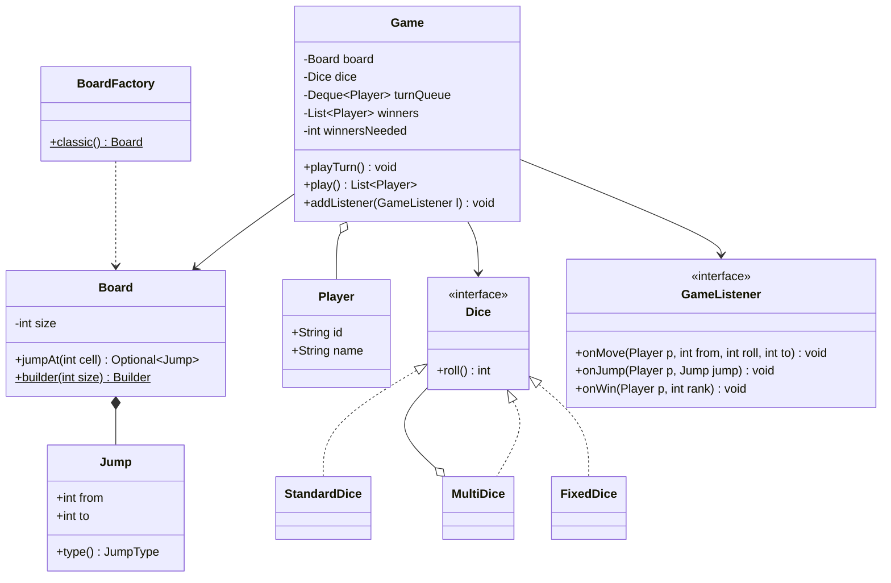

# Snake & Ladder

Ek configurable Snake & Ladder game design karna hai: board, snakes, ladders, players, dice aur turn order. Interviewer check karta hai ki tum entities saaf alag karte ho, dice ko pluggable rakhte ho, board ko validate karte ho, aur game loop ko **testable** banate ho (random dice inject karke).

## Step 1: Requirements confirm karo

| Tum poochho | Typical jawab | Design pe asar |
|---|---|---|
| Board size fixed 100 hai? | Configurable (10x10 default) | `Board` me `size`, hardcode nahi |
| Kitne dice? | Ek default, par 2 bhi ho sakte | `Dice` interface (Strategy), `MultiDice` |
| Kitne players? | 2 se 4+ | `Deque<Player>` se round-robin turn |
| Last cell se aage gaye to? | Move cancel, wahi raho (exact landing) | `playTurn()` me overshoot rule |
| Pehla winner milte hi game khatam? | Default haan, extension: top-k winners | `winnersNeeded` parameter |
| 6 aane pe extra turn? | Abhi nahi, extension ho sakta hai | Turn rule alag rakhna |
| Snake/ladder chain allowed (ladder ka top kisi snake ka head)? | Nahi | Builder me validation |
| UI / network multiplayer? | Nahi, sirf core logic | Events Observer se bahar bhejo |

**Functional:**
- Board banao: size, snakes (head → tail), ladders (bottom → top).
- Players baari-baari dice roll karein, token aage badhe.
- Snake ke head pe neeche, ladder ke bottom pe upar.
- Jo exactly last cell pe pahunche woh jeeta. Game end hone tak winners ki list.
- Game events (move, jump, win) log/UI ko milein.

**Out of scope:** GUI, online multiplayer, persistence, betting.

## Step 2: Core entities

- `Board`: size + jumps ka map. Immutable, Builder se banta hai.
- `Jump`: ek snake ya ladder, `from → to`. `to < from` matlab snake.
- `Player`: id + naam. Position `Game` rakhta hai, player nahi.
- `Dice`: interface, `roll()`. `StandardDice`, `MultiDice`, `CrookedDice`, `FixedDice` (test).
- `Game`: turn queue, positions, winners, listeners. Saara game loop yahin.
- `GameListener`: events sunne wala (console logger, UI, analytics).
- `BoardFactory`: preset boards (classic, aage random) ke liye.

## Step 3: Class diagram



## Step 4: Design patterns kyun

| Pattern | Kahan | Kyun | Alternative |
|---|---|---|---|
| [Strategy](../03-lld/05-behavioral.md) | `Dice` | Normal, crooked, 2-dice, fixed (test) bina `Game` badle swap | `if (diceType == ...)` chain, har naye dice pe `Game` edit |
| [Builder](../03-lld/03-creational.md) | `Board.Builder` | Snakes/ladders ek-ek add karo, `build()` pe validate, phir immutable `Board` | Bada constructor `Board(size, List, List)`, validation bikhar jaata hai |
| [Factory](../03-lld/03-creational.md) | `BoardFactory.classic()` | Preset boards ek jagah, client ko jumps yaad nahi rakhne | Har test/main me board haath se banana |
| [Observer](../03-lld/05-behavioral.md) | `GameListener` | Logging, UI, sound, analytics `Game` ko chhue bina add | `Game` me `System.out.println`, test me output check karna mushkil |
| Dependency injection | `Game(board, dice, ...)` | `FixedDice` inject karke deterministic test | `new Random()` `Game` ke andar, test flaky |

## Step 5: Code

Dice (Strategy) aur Board (Builder + Factory):

```java
import java.util.*;

interface Dice { int roll(); }

final class StandardDice implements Dice {
    private final int faces;
    private final Random random;
    StandardDice(int faces, Random random) { this.faces = faces; this.random = random; }
    public int roll() { return 1 + random.nextInt(faces); }
}

final class MultiDice implements Dice {            // 2 ya zyada dice ka sum
    private final List<Dice> dice;
    MultiDice(List<Dice> dice) { this.dice = List.copyOf(dice); }
    public int roll() { return dice.stream().mapToInt(Dice::roll).sum(); }
}

final class CrookedDice implements Dice {          // sirf even: 2, 4, 6
    private final Random random;
    CrookedDice(Random random) { this.random = random; }
    public int roll() { return 2 * (1 + random.nextInt(3)); }
}

final class FixedDice implements Dice {            // tests ke liye: pehle se tay values
    private final Deque<Integer> values;
    FixedDice(Integer... values) { this.values = new ArrayDeque<>(List.of(values)); }
    public int roll() { return values.removeFirst(); }
}

enum JumpType { SNAKE, LADDER }

record Jump(int from, int to) {
    JumpType type() { return to > from ? JumpType.LADDER : JumpType.SNAKE; }
}

final class Board {
    private final int size;
    private final Map<Integer, Jump> jumps;          // from-cell -> jump
    private Board(int size, Map<Integer, Jump> jumps) { this.size = size; this.jumps = jumps; }

    int size() { return size; }
    Optional<Jump> jumpAt(int cell) { return Optional.ofNullable(jumps.get(cell)); }
    static Builder builder(int size) { return new Builder(size); }

    static final class Builder {
        private final int size;
        private final Map<Integer, Jump> jumps = new HashMap<>();
        private Builder(int size) {
            if (size < 4) throw new IllegalArgumentException("Board bahut chhota");
            this.size = size;
        }
        Builder snake(int head, int tail) {
            if (head <= tail) throw new IllegalArgumentException("Snake ka head tail se upar ho");
            return add(new Jump(head, tail));
        }
        Builder ladder(int bottom, int top) {
            if (bottom >= top) throw new IllegalArgumentException("Ladder upar jaani chahiye");
            return add(new Jump(bottom, top));
        }
        private Builder add(Jump j) {
            if (j.from() <= 1 || j.from() >= size || j.to() < 1 || j.to() > size)
                throw new IllegalArgumentException("Cell board ke bahar ya start/end pe: " + j);
            if (jumps.containsKey(j.from()))
                throw new IllegalArgumentException("Ek cell pe ek hi jump: " + j.from());
            boolean chain = jumps.containsKey(j.to())
                    || jumps.values().stream().anyMatch(x -> x.to() == j.from());
            if (chain) throw new IllegalArgumentException("Jump chain allowed nahi: " + j);
            jumps.put(j.from(), j);
            return this;
        }
        Board build() { return new Board(size, Map.copyOf(jumps)); }
    }
}

final class BoardFactory {
    static Board classic() {
        return Board.builder(100)
                .ladder(4, 14).ladder(9, 31).ladder(28, 84).ladder(71, 91)
                .snake(17, 7).snake(54, 34).snake(87, 24).snake(98, 79)
                .build();
    }
}
```

Players, events (Observer) aur game loop:

```java
record Player(String id, String name) {}

interface GameListener {                            // default no-op: jo chahiye wahi override karo
    default void onMove(Player p, int from, int roll, int to) {}
    default void onJump(Player p, Jump jump) {}
    default void onWin(Player p, int rank) {}
}

final class ConsoleListener implements GameListener {
    public void onMove(Player p, int from, int roll, int to) {
        System.out.printf("%s rolled %d: %d -> %d%n", p.name(), roll, from, to);
    }
    public void onJump(Player p, Jump j) { System.out.println("  " + j.type() + " " + j.from() + " -> " + j.to()); }
    public void onWin(Player p, int rank) { System.out.println(p.name() + " finished #" + rank); }
}

final class Game {
    private final Board board;
    private final Dice dice;
    private final Deque<Player> turnQueue;
    private final Map<Player, Integer> positions = new HashMap<>();
    private final List<Player> winners = new ArrayList<>();
    private final List<GameListener> listeners = new ArrayList<>();
    private final int winnersNeeded;

    Game(Board board, Dice dice, List<Player> players, int winnersNeeded) {
        if (players.size() < 2) throw new IllegalArgumentException("Kam se kam 2 players");
        if (winnersNeeded < 1 || winnersNeeded >= players.size())
            throw new IllegalArgumentException("winnersNeeded 1..players-1 ho");
        this.board = board;
        this.dice = dice;
        this.turnQueue = new ArrayDeque<>(players);
        this.winnersNeeded = winnersNeeded;
        players.forEach(p -> positions.put(p, 0));   // 0 = abhi board pe nahi
    }

    void addListener(GameListener l) { listeners.add(l); }
    boolean isOver() { return winners.size() >= winnersNeeded; }
    int positionOf(Player p) { return positions.get(p); }

    void playTurn() {
        if (isOver()) throw new IllegalStateException("Game khatam ho chuka");
        Player p = turnQueue.pollFirst();
        int from = positions.get(p);
        int roll = dice.roll();
        int landed = from + roll > board.size() ? from : from + roll;   // overshoot: wahi raho
        listeners.forEach(l -> l.onMove(p, from, roll, landed));

        Optional<Jump> jump = board.jumpAt(landed);
        jump.ifPresent(j -> listeners.forEach(l -> l.onJump(p, j)));
        int end = jump.map(Jump::to).orElse(landed);
        positions.put(p, end);

        if (end == board.size()) {
            winners.add(p);
            int rank = winners.size();
            listeners.forEach(l -> l.onWin(p, rank));
        } else {
            turnQueue.addLast(p);                     // round-robin: wapas line me
        }
    }

    List<Player> play() {
        while (!isOver()) playTurn();
        return List.copyOf(winners);
    }
}
```

Usage aur deterministic test (dice inject):

```java
public class SnakeAndLadder {
    public static void main(String[] args) {
        Dice dice = new MultiDice(List.of(new StandardDice(6, new Random()), new StandardDice(6, new Random())));
        Game game = new Game(BoardFactory.classic(), dice,
                List.of(new Player("1", "Asha"), new Player("2", "Ravi"), new Player("3", "Kabir")), 2);
        game.addListener(new ConsoleListener());
        System.out.println("Winners: " + game.play());
    }
}

// JUnit 5: FixedDice se har roll pata hai, isliye result bhi pata hai
class GameTest {
    @org.junit.jupiter.api.Test
    void ladderSnakeAndExactWin() {
        Player a = new Player("a", "A"), b = new Player("b", "B");
        Board board = Board.builder(10).ladder(2, 8).snake(9, 3).build();
        Game game = new Game(board, new FixedDice(1, 4, 1, 5, 2), List.of(a, b), 1);
        // A:0->1, B:0->4, A:1->2 ladder->8, B:4->9 snake->3, A:8->10 win
        org.junit.jupiter.api.Assertions.assertEquals(List.of(a), game.play());
        org.junit.jupiter.api.Assertions.assertEquals(3, game.positionOf(b));
    }
}
```

## Step 6: Concurrency & edge cases

- **Concurrency:** ek game single-threaded hai (turn-based). Online version me har game ka ek owner thread/actor rakho, ya `playTurn()` ko `synchronized` karo. Board immutable hai, isliye kai games ek `Board` share kar sakte hain.
- **Overshoot:** 97 pe ho aur 5 aaya to 102 nahi, 97 hi raho. Rule alag method/strategy me rakho agar "bounce back" variant chahiye.
- **Jump chain:** ladder ka top kisi snake ka head ho to infinite loop ya confusion. Builder me hi reject.
- **Start/end pe jump:** cell 1 ya last cell pe snake ka head nahi. Last cell pe snake ho to koi jeet hi nahi sakta.
- **Snake → ladder cycle:** chain block karne se cycle bhi block ho jaati hai.
- **Invalid config:** `winnersNeeded >= players` ya 1 player, constructor me fail-fast.
- **Game over ke baad `playTurn()`:** `IllegalStateException`, chupke se ignore nahi.
- **Dice range:** `MultiDice` me max roll board size se bada ho sakta hai (chhote board pe). Validate karo ya warn karo.
- **Listener exception:** ek listener crash ho to game na ruke. Production me har listener ko try-catch me wrap karo.

## Step 7: Extensions

- **Crooked dice:** naya `Dice` implementation (`CrookedDice`), `Game` me zero change. Yahi Strategy ka fayda bolo.
- **Multiple winners / ranking:** `winnersNeeded` already hai. Jeetne wala queue se bahar, baaki khelte rehte hain.
- **6 pe extra turn, teen 6 pe turn cancel:** `TurnRule` strategy banao jo batata hai ki player wapas queue ke front me jaaye ya end me. `Game` sirf rule ko call kare.
- **Random board:** `BoardFactory.random(size, snakes, ladders, Random)` jo Builder use kare. Builder ka validation retry ke saath free me milega.
- **Naye cell types (power-up, skip turn, teleport):** `Jump` ko `Cell` interface me generalize karo: `int apply(int pos, Player p)`. Snake/ladder uske implementations.
- **Undo / replay:** har turn ek `Move` record ho (Command). List me rakho to replay aur undo dono.
- **UI / multiplayer:** naya `GameListener` jo WebSocket pe event bheje. Core logic same.
- **Save / resume:** state sirf `positions`, `turnQueue`, `winners` hai. Serialize karo.

## Step 8: Interview flow (45 min)

| Minute | Kya karo |
|---|---|
| 0–5 | Requirements table: board size, dice count, overshoot rule, winners, extra turn |
| 5–10 | Entities bolo, class diagram banao (`Game`, `Board`, `Jump`, `Dice`, `Player`, `GameListener`) |
| 10–15 | Patterns justify karo: Dice = Strategy, Board = Builder, events = Observer |
| 15–32 | Code: `Dice` + `Board.Builder` validation, phir `Game.playTurn()` |
| 32–37 | `FixedDice` se ek test likh ke dikhao, "game loop testable hai" bolo |
| 37–42 | Edge cases: overshoot, chain, invalid config |
| 42–45 | Extensions: crooked dice, multiple winners, extra turn on 6 |

## 2-minute recap

Snake & Ladder me `Board` immutable hai aur Builder se banta hai jo har snake/ladder validate karta hai: range, ek cell pe ek jump, koi chain nahi. Snakes aur ladders ek hi `Jump(from, to)` record hain, direction se type pata chalta hai. `Dice` ek Strategy interface hai, isliye normal, 2-dice, crooked aur test ka `FixedDice` bina `Game` badle swap hote hain. `Game` ek `Deque<Player>` se round-robin chalata hai, positions map me rakhta hai, overshoot pe player wahi rehta hai, aur jo exactly last cell pe pahunche woh winners list me jaata hai. `winnersNeeded` se multiple winners. Events Observer (`GameListener`) se bahar jaate hain, isliye logging/UI core ko nahi chhoote. Dice inject hone se game loop deterministic test hota hai.

## Checklist

- [ ] Requirements me board size, dice count, overshoot rule aur winners count clarify kar sakta hoon.
- [ ] 10 minute me class diagram bana sakta hoon (`Game`, `Board`, `Jump`, `Dice`, `Player`, `GameListener`).
- [ ] Dice ko Strategy kyun banaya aur crooked dice kaise add hoga bata sakta hoon.
- [ ] Board Builder me kaunse validations hain (range, duplicate, chain) likh sakta hoon.
- [ ] `playTurn()` bina dekhe likh sakta hoon: roll, overshoot, jump, win, queue.
- [ ] `FixedDice` inject karke deterministic unit test likh sakta hoon.
- [ ] Multiple winners aur 6 pe extra turn ko design me kaise absorb karenge bata sakta hoon.
