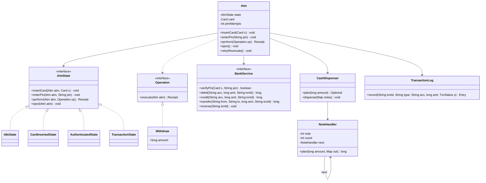

# ATM

ATM machine ka software design karna hai: card + PIN, balance, withdraw, deposit, transfer, aur notes nikalne wala cash dispenser. Interviewer check karta hai ki tum ATM ke states (State pattern) saaf modal karte ho, notes ka breakup Chain of Responsibility se karte ho, aur paise wale edge cases (ATM me cash kam, daily limit, network fail beech me) sahi handle karte ho.

## Step 1: Requirements confirm karo

| Tum poochho | Typical jawab | Design pe asar |
|---|---|---|
| Kaunse operations? | Balance, withdraw, deposit, transfer | Har operation ek `Operation` strategy |
| Notes kaunse? | 2000, 500, 200, 100 | Dispenser chain, amount 100 ka multiple |
| Balance/limit kaun check karta hai? | Bank (core banking), ATM nahi | `BankService` interface, ATM sirf client |
| Galat PIN kitni baar? | 3 baar ke baad card block | `CardInsertedState` me attempts count |
| Daily withdrawal limit? | Haan, jaise 25,000/day | Bank `debit()` me atomic check |
| Ek session me kai transactions? | Haan, card eject tak | `Authenticated` state me wapas aana |
| Network fail ho gaya debit ke baad? | Paisa auto-reverse ho | txnId + idempotent `reverse()` + log |
| Ek ATM pe ek time kitne users? | Ek | ATM methods `synchronized`, concurrency bank side pe |

**Functional:**
- Card daalo, PIN verify, 3 galat PIN pe card block.
- Balance inquiry, withdraw, deposit, transfer.
- Withdraw me notes ka breakup (bade notes pehle), ATM me cash na ho to mana.
- Har transaction ka log (audit + reconciliation).
- Network/hardware fail pe reversal.

**Out of scope:** card reader/keypad drivers, bank ka internal ledger design, UI screens, cardless (UPI) withdrawal.

## Step 2: Core entities

- `Atm`: context. Current state, card, PIN attempts, bank, dispenser, log rakhta hai.
- `AtmState`: interface. `IdleState`, `CardInsertedState`, `AuthenticatedState`, `TransactionState`.
- `Card`: card number + linked account.
- `Operation`: ek transaction type (Strategy). `BalanceInquiry`, `Withdraw`, `Deposit`, `Transfer`.
- `BankService`: bank se baat karne ka interface. PIN verify, debit, credit, transfer, reverse.
- `CashDispenser`: cassettes (note → count). `NoteHandler` ki chain se breakup.
- `NoteHandler`: chain ka ek link, ek denomination sambhalta hai.
- `TransactionLog`: append-only log, har status change ek entry.
- `Receipt`: txnId, type, amount, balance after.

## Step 3: Class diagram



`Deposit`, `Transfer`, `BalanceInquiry` bhi `Operation` implement karte hain (diagram chhota rakhne ke liye nahi dikhaye).

## Step 4: Design patterns kyun

| Pattern | Kahan | Kyun | Alternative |
|---|---|---|---|
| [State](../03-lld/05-behavioral.md) | `Idle → CardInserted → Authenticated → Transaction` | Har state me allowed actions alag. Bina card ke withdraw ya transaction ke beech eject apne aap reject | `Atm` me `enum` + har method me `switch`, naya state aaya to har method edit |
| [Chain of Responsibility](../03-lld/05-behavioral.md) | `NoteHandler` 2000 → 500 → 200 → 100 | Har handler apne notes deta hai, baaki aage. Naya note (50) = naya link | Ek bada loop with hardcoded array. Chal jaata hai, par interviewer CoR expect karta hai |
| [Strategy](../03-lld/05-behavioral.md) | `Operation` (Withdraw, Deposit, Transfer, Balance) | Naya transaction type (mini statement, PIN change) bina state classes badle | `perform(type, ...)` me `switch` |
| Interface / DI | `BankService`, `CashHardware` | Fake bank aur fake hardware se test; real me ISO 8583 / NPCI client | ATM ke andar HTTP calls, test impossible |
| Append-only log | `TransactionLog` | Crash ya timeout ke baad kya hua ye log se pata, reconciliation isi se | Sirf in-memory status, restart pe sab gaya |

Dispenser order bhi Strategy ban sakta hai (greedy "bade notes pehle" vs "100 ke notes bachao"), agar interviewer pooche.

## Step 5: Code

Models, bank interface aur transaction log:

```java
import java.util.*;
import java.util.concurrent.*;

record Card(String number, String accountId) {}
record Receipt(String txnId, String type, long amount, long balanceAfter) {}

class AtmException extends RuntimeException { AtmException(String m) { super(m); } }
class BankException extends RuntimeException { BankException(String m) { super(m); } }       // funds kam, limit cross
class BankTimeoutException extends BankException { BankTimeoutException(String m) { super(m); } } // result pata nahi

interface BankService {
    boolean verifyPin(Card card, String pin);
    void blockCard(Card card);
    long balance(String accountId);
    long debit(String accountId, long amount, String txnId);   // txnId pe idempotent, daily limit yahin check
    long credit(String accountId, long amount, String txnId);
    long transfer(String from, String to, long amount, String txnId);
    void reverse(String txnId);                                 // idempotent; debit hua hi nahi to no-op
}

interface CashHardware { void eject(Map<Integer, Integer> notes); }   // jam pe exception

enum TxnStatus { STARTED, SUCCESS, FAILED, REVERSAL_PENDING, REVERSED }

final class TransactionLog {          // append-only; real me local disk + bank ko sync
    record Entry(String txnId, String type, String accountId, long amount, TxnStatus status, long at) {}
    private final List<Entry> entries = new CopyOnWriteArrayList<>();

    Entry record(String txnId, String type, String acc, long amount, TxnStatus status) {
        Entry e = new Entry(txnId, type, acc, amount, status, System.currentTimeMillis());
        entries.add(e);
        return e;
    }
    List<Entry> history() { return List.copyOf(entries); }
}
```

Cash dispenser (Chain of Responsibility + greedy):

```java
final class NoteHandler {
    private final int note;
    private int count;
    private final NoteHandler next;
    NoteHandler(int note, int count, NoteHandler next) { this.note = note; this.count = count; this.next = next; }

    long plan(long amount, Map<Integer, Integer> out) {        // greedy: jitne fit hon, baaki aage
        int use = (int) Math.min(amount / note, count);
        if (use > 0) out.put(note, use);
        long rest = amount - (long) use * note;
        return (rest == 0 || next == null) ? rest : next.plan(rest, out);
    }
    void take(Map<Integer, Integer> plan) {
        count -= plan.getOrDefault(note, 0);
        if (next != null) next.take(plan);
    }
}

final class CashDispenser {
    private final NoteHandler head;
    private final CashHardware hardware;

    CashDispenser(Map<Integer, Integer> cassettes, CashHardware hardware) {   // note -> count
        NoteHandler h = null;
        for (int note : new TreeMap<>(cassettes).keySet())   // chhote se bade, isliye sabse bada head
            h = new NoteHandler(note, cassettes.get(note), h);
        this.head = h;
        this.hardware = hardware;
    }
    synchronized Optional<Map<Integer, Integer>> plan(long amount) {          // count nahi badalta
        Map<Integer, Integer> out = new LinkedHashMap<>();
        return head != null && head.plan(amount, out) == 0 ? Optional.of(out) : Optional.empty();
    }
    synchronized void dispense(Map<Integer, Integer> notes) {
        hardware.eject(notes);        // pehle notes nikle, tabhi count ghatao
        head.take(notes);
    }
}
```

States aur ATM context:

```java
interface Operation { Receipt execute(Atm atm); }   // Strategy: har transaction type alag class

interface AtmState {
    default void insertCard(Atm atm, Card card) { throw invalid("insertCard"); }
    default void enterPin(Atm atm, String pin) { throw invalid("enterPin"); }
    default Receipt perform(Atm atm, Operation op) { throw invalid("perform"); }
    default void eject(Atm atm) { throw invalid("eject"); }
    private AtmException invalid(String action) {
        return new AtmException(action + " allowed nahi: " + getClass().getSimpleName());
    }
}

final class IdleState implements AtmState {
    public void insertCard(Atm atm, Card card) {
        atm.card = card;
        atm.pinAttempts = 0;
        atm.state = new CardInsertedState();
    }
}

final class CardInsertedState implements AtmState {
    private static final int MAX_PIN_ATTEMPTS = 3;
    public void enterPin(Atm atm, String pin) {
        if (atm.bank.verifyPin(atm.card, pin)) { atm.state = new AuthenticatedState(); return; }
        if (++atm.pinAttempts >= MAX_PIN_ATTEMPTS) {
            atm.bank.blockCard(atm.card);
            atm.reset();                                    // card retain, wapas Idle
            throw new AtmException("3 galat PIN: card blocked");
        }
        throw new AtmException("Galat PIN");
    }
    public void eject(Atm atm) { atm.reset(); }
}

final class AuthenticatedState implements AtmState {
    public Receipt perform(Atm atm, Operation op) {
        atm.state = new TransactionState();               // beech me eject ya dusra txn nahi
        try { return op.execute(atm); }
        finally { atm.state = new AuthenticatedState(); }  // session chalu, agla txn ho sakta hai
    }
    public void eject(Atm atm) { atm.reset(); }
}

final class TransactionState implements AtmState {}     // sab default: reject

final class Atm {
    final BankService bank;
    final CashDispenser dispenser;
    final TransactionLog log;
    final Queue<TransactionLog.Entry> pendingReversals = new ConcurrentLinkedQueue<>();
    AtmState state = new IdleState();
    Card card;
    int pinAttempts;

    Atm(BankService bank, CashDispenser dispenser, TransactionLog log) {
        this.bank = bank; this.dispenser = dispenser; this.log = log;
    }
    synchronized void insertCard(Card c) { state.insertCard(this, c); }
    synchronized void enterPin(String pin) { state.enterPin(this, pin); }
    synchronized Receipt perform(Operation op) { return state.perform(this, op); }
    synchronized void eject() { state.eject(this); }
    void reset() { card = null; pinAttempts = 0; state = new IdleState(); }

    void retryReversals() {                               // scheduler har 30s chalaye
        for (int i = pendingReversals.size(); i > 0; i--) {
            TransactionLog.Entry e = pendingReversals.poll();
            try {
                bank.reverse(e.txnId());                  // idempotent, retry safe
                log.record(e.txnId(), e.type(), e.accountId(), e.amount(), TxnStatus.REVERSED);
            } catch (BankException ex) {
                pendingReversals.add(e);                  // network abhi bhi down, baad me
            }
        }
    }
}
```

Operations (Strategy), withdraw ka poora safe flow:

```java
record BalanceInquiry() implements Operation {
    public Receipt execute(Atm atm) {
        return new Receipt(UUID.randomUUID().toString(), "BALANCE", 0, atm.bank.balance(atm.card.accountId()));
    }
}

record Withdraw(long amount) implements Operation {
    public Receipt execute(Atm atm) {
        if (amount <= 0 || amount % 100 != 0) throw new AtmException("Amount 100 ka multiple ho");
        Map<Integer, Integer> notes = atm.dispenser.plan(amount)          // 1. pehle ATM ka cash check
                .orElseThrow(() -> new AtmException("ATM me itna cash ya sahi notes nahi"));
        String acc = atm.card.accountId(), txnId = UUID.randomUUID().toString();
        atm.log.record(txnId, "WITHDRAW", acc, amount, TxnStatus.STARTED);
        long balance;
        try {
            balance = atm.bank.debit(acc, amount, txnId);                 // 2. balance + daily limit
        } catch (BankTimeoutException e) {                                // debit hua ya nahi, pata nahi
            atm.pendingReversals.add(atm.log.record(txnId, "WITHDRAW", acc, amount, TxnStatus.REVERSAL_PENDING));
            throw new AtmException("Network issue. Paisa kata hai to auto-reverse hoga");
        } catch (BankException e) {
            atm.log.record(txnId, "WITHDRAW", acc, amount, TxnStatus.FAILED);
            throw new AtmException(e.getMessage());
        }
        try {
            atm.dispenser.dispense(notes);                                // 3. tabhi cash do
        } catch (RuntimeException e) {                                    // jam: debit hua, cash nahi
            atm.pendingReversals.add(atm.log.record(txnId, "WITHDRAW", acc, amount, TxnStatus.REVERSAL_PENDING));
            atm.retryReversals();
            throw new AtmException("Cash nahi nikla, paisa wapas ho raha hai");
        }
        atm.log.record(txnId, "WITHDRAW", acc, amount, TxnStatus.SUCCESS);
        return new Receipt(txnId, "WITHDRAW", amount, balance);
    }
}

record Deposit(Map<Integer, Integer> notes) implements Operation {     // notes deposit bin me, dispense me nahi
    public Receipt execute(Atm atm) {
        long amount = notes.entrySet().stream().mapToLong(e -> (long) e.getKey() * e.getValue()).sum();
        String acc = atm.card.accountId(), txnId = UUID.randomUUID().toString();
        atm.log.record(txnId, "DEPOSIT", acc, amount, TxnStatus.STARTED);
        long balance = atm.bank.credit(acc, amount, txnId);            // same txnId se retry safe
        atm.log.record(txnId, "DEPOSIT", acc, amount, TxnStatus.SUCCESS);
        return new Receipt(txnId, "DEPOSIT", amount, balance);
    }
}

record Transfer(String toAccount, long amount) implements Operation {
    public Receipt execute(Atm atm) {
        String acc = atm.card.accountId(), txnId = UUID.randomUUID().toString();
        atm.log.record(txnId, "TRANSFER", acc, amount, TxnStatus.STARTED);
        long balance = atm.bank.transfer(acc, toAccount, amount, txnId); // bank ek DB txn me dono side
        atm.log.record(txnId, "TRANSFER", acc, amount, TxnStatus.SUCCESS);
        return new Receipt(txnId, "TRANSFER", amount, balance);
    }
}

// Usage:
// Atm atm = new Atm(bank, new CashDispenser(Map.of(2000, 10, 500, 40, 200, 50, 100, 100), hw), new TransactionLog());
// atm.insertCard(new Card("4111...", "ACC1")); atm.enterPin("1234");
// atm.perform(new Withdraw(2700));   // 2000x1 + 500x1 + 200x1
// atm.eject();
```

## Step 6: Concurrency & edge cases

- **Ek ATM, ek user:** `Atm` ke public methods `synchronized`. `TransactionState` beech me eject/dusra txn rokta hai.
- **Concurrent account updates:** wahi account do ATM + UPI se ek saath. Lock bank side pe, ATM pe nahi. DB me atomic conditional update:

```java
// Bank side (pseudo): ek statement, race nahi
// UPDATE accounts SET balance = balance - :amt, withdrawn_today = withdrawn_today + :amt
//  WHERE id = :acc AND balance >= :amt AND withdrawn_today + :amt <= :dailyLimit
// rows affected 0 -> insufficient funds ya limit cross

// In-memory version: transfer me lock ordering, deadlock nahi
void transfer(Account a, Account b, long amt) {
    Account first = a.id().compareTo(b.id()) < 0 ? a : b;
    Account second = first == a ? b : a;
    synchronized (first) { synchronized (second) { a.debit(amt); b.credit(amt); } }
}
```

- **Daily limit:** bank pe check, same atomic update me. ATM pe check karoge to do ATMs se limit bypass ho jaayegi.
- **ATM me cash kam:** `plan()` pehle chalta hai, debit se pehle. Cash nahi to bank call hi nahi.
- **Greedy fail ho sakta hai:** 600 chahiye, ATM me 500x1, 200x3, 100x0. Greedy 500 leta hai, 100 bacha, fail. Par 200x3 chal jaata. Fix: greedy fail ho to chhota backtracking/DP (notes kam hain, cheap). Unlimited notes pe greedy hamesha sahi kyunki sab 100 ke multiple hain.
- **Network fail mid-withdrawal:** debit timeout = status unknown. Cash **mat do**. `REVERSAL_PENDING` log karo, same txnId se `reverse()` retry. Bank ka `reverse` idempotent hai, debit hua hi nahi to no-op.
- **Debit hua, note jam:** dispense fail → reversal. Partial dispense (kuch notes nikle) → hardware sensor count batata hai, utne ka hi debit rakho, baaki reverse. Ye reconciliation job ka kaam.
- **ATM crash beech me:** restart pe log scan karo: `STARTED` bina `SUCCESS/FAILED` wale → bank se txnId ka status poochho, zarurat ho to reverse.
- **Idempotency:** har bank call pe ATM ka banaya `txnId`. Retry pe double debit nahi.
- **Galat PIN:** 3 attempts ke baad block. Counter bank side pe bhi ho, warna card nikaal ke dusre ATM pe phir 3 try.
- **Session timeout:** 30s koi input nahi → auto eject, `Idle`. Card bhool gaye to retain.
- **Deposit:** fake/fata note machine reject kare, sirf accepted notes ka credit.

## Step 7: Extensions

- **Naya note (50) ya note band (2000):** chain me ek link add/remove. Baaki code same.
- **Mini statement / PIN change:** naya `Operation`. States aur `Atm` same.
- **Cardless (UPI QR) withdrawal:** `CardInsertedState` ke jagah `QrScannedState`, auth strategy alag (`PinAuth`, `OtpAuth`, `BiometricAuth`).
- **"100 ke notes bachao" policy:** dispenser order ko `DispenseStrategy` bana do, ya backtracking jo 100 kam use kare.
- **Low cash alert:** dispenser pe Observer: count threshold se neeche → bank ops ko alert.
- **Multiple banks (interbank):** `BankService` ke peeche switch (NPCI) client. ATM ka code same.
- **Admin mode (cash refill):** `MaintenanceState`, sirf admin card se. Normal users reject.
- **Fees on 6th withdrawal:** bank side rule. ATM ko sirf receipt me dikhana hai.

## Step 8: Interview flow (45 min)

| Minute | Kya karo |
|---|---|
| 0–5 | Requirements table: operations, notes, PIN attempts, daily limit, kaun check karta hai |
| 5–10 | Entities + state diagram bolo: `Idle → CardInserted → Authenticated → Transaction` |
| 10–15 | Class diagram, patterns: State, CoR (dispenser), Strategy (operations) |
| 15–30 | Code: `AtmState` + states, `NoteHandler` chain, `Withdraw.execute()` |
| 30–38 | Edge cases: cash kam, daily limit atomic, timeout → reversal, txnId idempotency |
| 38–42 | Greedy fail case aur fix |
| 42–45 | Extensions: naya note, cardless, admin mode |

## 2-minute recap

ATM ek State machine hai: `Idle → CardInserted → Authenticated → Transaction → Authenticated`, eject pe `Idle`. Har state sirf apne allowed actions implement karta hai, baaki default se reject. Transactions (`Withdraw`, `Deposit`, `Transfer`, `BalanceInquiry`) `Operation` strategy hain, isliye naya type add karna easy. Cash dispenser 2000 → 500 → 200 → 100 ki Chain of Responsibility hai jo greedy breakup banati hai, pehle sirf plan (count nahi badalta), phir dispense. Balance aur daily limit bank `BankService` me ek atomic update se check hote hain, ATM pe nahi, taaki concurrent ATMs/UPI se race na ho. Withdraw ka order: cash plan → debit (txnId ke saath) → dispense → log. Debit timeout ho to cash nahi dena, `REVERSAL_PENDING` log karke idempotent `reverse(txnId)` retry. Append-only transaction log se crash ke baad recovery aur reconciliation.

## Checklist

- [ ] ATM ke 4 states aur unke transitions diagram ke saath bata sakta hoon.
- [ ] State pattern me invalid action (bina PIN withdraw) kaise reject hota hai code me dikha sakta hoon.
- [ ] `NoteHandler` chain se 2000/500/200/100 ka greedy breakup likh sakta hoon.
- [ ] Greedy kab fail hota hai (limited notes) aur uska fix bata sakta hoon.
- [ ] Withdraw ka safe order (plan → debit → dispense → log) aur kyun, explain kar sakta hoon.
- [ ] Network fail mid-withdrawal pe txnId + idempotent reversal ka flow bata sakta hoon.
- [ ] Daily limit aur concurrent updates bank side pe atomic kyun hone chahiye bata sakta hoon.
- [ ] Naya note, naya operation ya cardless mode design me kaise fit hoga bata sakta hoon.
