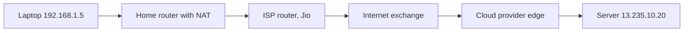
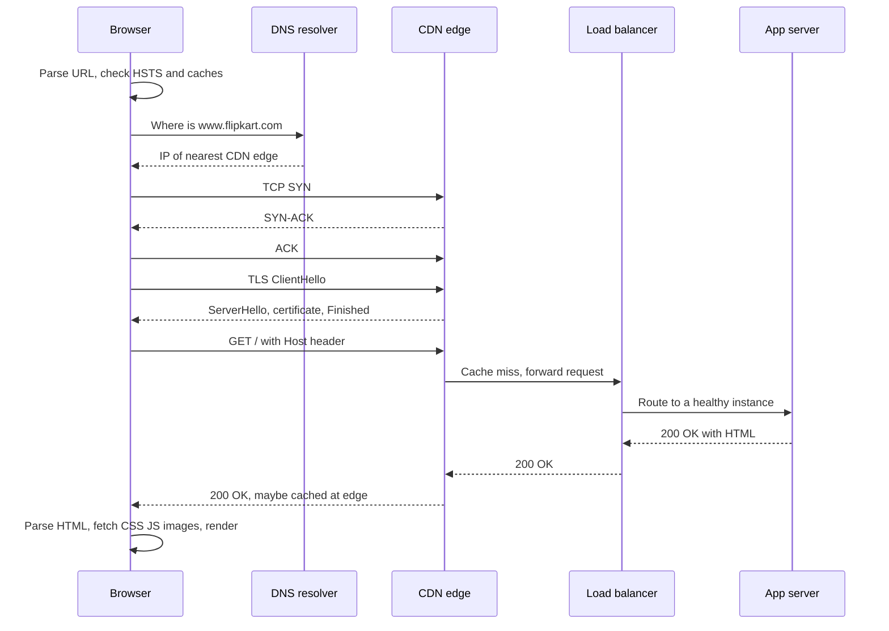
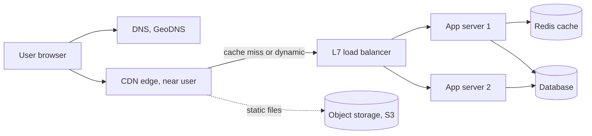

# How the Internet Works

Internet networks ka network hai jo data ke chhote tukde (packets) ek IP address se doosre tak hop by hop pahunchata hai, bina kisi central controller ke. Interviewer "URL type karne pe kya hota hai" isliye poochta hai taaki dekhe tum poora stack chal sakte ho ya nahi: layers, IP aur routing, ports, NAT, DNS, TCP, TLS, HTTP aur browser response ke saath kya karta hai. Is section ke baaki pages (TCP, HTTP, DNS, TLS) isi path ke ek-ek step me zoom karte hain.

## ⭐ Layers: OSI vs TCP/IP

**Ek line me:** networking layers me bata hai; har layer ek problem solve karti hai aur sirf apne theek upar aur neeche wali layer se baat karti hai.

> **Example:** Swiggy order ek parcel jaisa hai. App order likhta hai (application), use tracking number ke saath box me pack kiya jaata hai (transport), uspe delivery address lagta hai (network), aur delivery boy use ek-ek sadak pe le jaata hai (link aur physical).

| OSI layer | TCP/IP layer | Kya karti hai | Protocols / examples | Unit |
|---|---|---|---|---|
| 7 Application | Application | App kya bolna chahta hai | HTTP, HTTPS, DNS, SMTP, FTP, SSH, gRPC, WebSocket | Message |
| 6 Presentation | Application | Encoding, encryption, compression | TLS, JSON, UTF-8, gzip | Message |
| 5 Session | Application | Conversation kholna aur chalu rakhna | TLS sessions, RPC sessions | Message |
| 4 Transport | Transport | Process-to-process delivery, ports, reliability | TCP, UDP, QUIC (UDP pe) | Segment / datagram |
| 3 Network | Internet | Addressing aur networks ke paar routing | IP (v4, v6), ICMP, BGP, OSPF | Packet |
| 2 Data link | Link | Same network pe next hop tak delivery | Ethernet, Wi-Fi (802.11), ARP | Frame |
| 1 Physical | Link | Wire / hawa pe bits | Copper, fibre, radio | Bits |

- **Encapsulation:** neeche jaate hue har layer apna header jodti hai. HTTP data → TCP header (ports, seq) → IP header (src/dst IP) → Ethernet header (MAC addresses). Upar jaate hue har layer apna header hata deti hai.
- OSI 7-layer padhane wala model hai. Asli internet 4-layer **TCP/IP** model pe chalta hai; layers 5–7 bas "application" hain.
- **L4 vs L7 load balancer** seedha isi table se aata hai: L4 sirf IP + port dekhta hai (fast, content nahi samajhta), L7 HTTP padhta hai (path, headers, cookies) aur `/api` aur `/images` ko alag route kar sakta hai.

**Interview tip:** "TLS kis layer me hai?" Transport aur application ke beech. "OSI terms me presentation layer, par practically TCP ke upar ek library" bolna clean jawab hai.

**Common galti:** OSI ke saaton naam ratt lena par ye na bata paana ki router (L3), switch (L2) ya L7 load balancer kis layer pe kaam karta hai.

## ⭐ IP addresses, packets and routing

**Ek line me:** har device ka ek IP address hota hai; data packets me kata jaata hai, har packet me source aur destination IP hota hai, aur routers apni routing table dekh ke har packet ko next hop pe bhejte hain.

- **IPv4:** 32 bits, `142.250.183.4`, ~4.3 billion addresses (kab ke khatam). **IPv6:** 128 bits, `2404:6800:4009:80b::2004`, practically unlimited.
- **CIDR:** `10.0.0.0/16` matlab pehle 16 bits network hain, yaani 65,536 addresses. VPC subnets aur firewall rules me use hota hai.
- **Private ranges** (public internet pe route nahi hote): `10.0.0.0/8`, `172.16.0.0/12`, `192.168.0.0/16`.
- **Packet:** IP header (src IP, dst IP, TTL, protocol) + payload. Ethernet pe typical max size (**MTU**) 1500 bytes, to 2 MB image ~1,400 packets ban jaati hai.
- **Routing:** har router destination IP dekhta hai, apni table me longest matching prefix dhoondhta hai aur packet next hop pe bhej deta hai. Ek hi stream ke packets alag raaston se jaa sakte hain aur out of order pahunch sakte hain.
- **IP best-effort hai:** delivery, order ya no-duplicate ki koi guarantee nahi. Ye sab TCP upar se deta hai.
- **TTL** (hop limit) N hops ke baad packet drop kar deta hai taaki loops hamesha na chalein. `traceroute` isi se har hop list karta hai.
- **BGP** se bade networks (Jio, Airtel jaise ISPs, cloud providers) ek doosre ko batate hain "ye IP ranges main reach kar sakta hoon". Ek galat BGP announcement poori company ko offline kar sakta hai.

**Interview tip:** "Packet apna raasta kaise dhoondhta hai?" Har router ko sirf ek prefix ka next hop pata hai, poora path nahi. Routing local decisions ki ek chain hai.

**Common galti:** bolna ki IP delivery guarantee karta hai. Nahi karta; reliability transport layer ka kaam hai.

## MAC addresses, ARP, switches and routers

**Ek line me:** IP packet ko sahi network tak pahunchata hai; us network ke andar frame ek MAC address (network card ka hardware address) pe deliver hota hai, jo ARP se milta hai.

| Device | Layer | Kya dekhta hai | Kaam |
|---|---|---|---|
| Switch | L2 | MAC address | Ek LAN ke andar frames forward |
| Router | L3 | IP address | Networks ke beech packets forward |
| L4 load balancer | L4 | IP + port | TCP/UDP connections baant-na |
| L7 load balancer / proxy | L7 | HTTP path, headers | Route, TLS terminate, cache |

- **ARP:** "192.168.1.1 kiske paas hai? 192.168.1.5 ko batao". Router apna MAC batata hai, aur laptop internet wale frames us MAC pe bhejta hai.
- MAC addresses har hop pe badalte hain (har link ka apna frame); source aur destination IP end to end same rehte hain (sirf NAT jahan rewrite kare wahan nahi).

## ⭐ Ports and sockets

**Ek line me:** IP address machine chunta hai, port (16-bit number, 0–65535) us machine pe process chunta hai.

| Port | Service |
|---|---|
| 22 | SSH |
| 53 | DNS (UDP, aur bade answers ke liye TCP) |
| 80 | HTTP |
| 443 | HTTPS (aur HTTP/3 UDP 443 pe) |
| 3306 / 5432 | MySQL / PostgreSQL |
| 6379 | Redis |
| 9092 | Kafka |

- TCP connection **4-tuple** se pehchana jaata hai: (src IP, src port, dst IP, dst port). Isiliye server ka ek port 443 ek saath lakhon connections rakh sakta hai.
- Client side ko random **ephemeral port** milta hai (Linux default range 32768–60999).
- **Socket** = us connection ke ek end ka OS handle. Server ek port pe `listen` karta hai aur naye sockets `accept` karta hai.

**Common galti:** sochna ki server 65,535 connections tak limited hai kyunki 65,535 ports hain. Limit per 4-tuple hai, asli limits memory aur file descriptors hain.

## NAT

**Ek line me:** Network Address Translation router pe addresses aur ports rewrite karke private IP wale kai devices ko ek public IP share karne deta hai.

- Tumhara laptop `192.168.1.5:51000` packet bhejta hai. Home router use `49.36.x.x:62001` me rewrite karta hai aur mapping yaad rakhta hai. Reply `62001` pe aata hai aur router use laptop tak forward kar deta hai.
- **Carrier-grade NAT (CGNAT):** mobile ISPs hazaron users ko ek public IP ke peeche rakhte hain. Isiliye IP-based rate limiting poore office ya poore mobile tower ko block kar sakti hai.
- Cloud: private subnets **NAT gateway** se internet tak jaate hain; bahar se koi andar connection nahi khol sakta.
- NAT direct peer-to-peer connections tod deta hai. Video calls iske liye **STUN/TURN** (WebRTC) use karte hain.

**Interview tip:** "Rate limiting sirf per IP kyun nahi?" NAT aur CGNAT ki wajah se kai asli users ek IP share karte hain. User ID ya API key prefer karo, IP fallback rakho. Dekho [Rate limiting](../01-topics/11-rate-limiting.md).

## ⭐ What happens when you type a URL in the browser

**Ek line me:** browser naam ko IP me resolve karta hai (DNS), connection kholta hai (TCP), use secure karta hai (TLS), HTTP request bhejta hai, server (CDN aur load balancer ke peeche) response banata hai, aur browser use parse karke render karta hai.

> **Example:** tumne `https://www.flipkart.com/` type kiya aur Enter dabaya.

Step by step:

1. **URL parse:** scheme `https`, host `www.flipkart.com`, port 443 (default), path `/`. Agar sirf `flipkart.com` likha to browser **HSTS** list dekh ke `https://` laga sakta hai.
2. **Pehle caches:** browser apna HTTP cache dekhta hai (page fresh ho to network ki zarurat hi nahi) aur DNS cache.
3. **DNS:** browser cache → OS cache (`/etc/hosts`) → recursive resolver (ISP ya `8.8.8.8`) → root → `.com` TLD → Flipkart ka authoritative name server. Jawab aksar CDN ka CNAME hota hai, jo tumhare paas wale edge ka IP deta hai. Dekho [DNS](./04-dns.md).
4. **TCP:** port 443 pe 3-way handshake (SYN, SYN-ACK, ACK). Ek round trip (RTT). Dekho [TCP vs UDP](./02-tcp-udp.md).
5. **TLS:** TLS 1.3 handshake, ek aur RTT. Browser certificate chain aur hostname check karta hai, aur dono taraf symmetric keys derive hoti hain. Dekho [TLS](./05-tls.md).
6. **HTTP request:** `GET / HTTP/2` headers ke saath (`Host`, `Cookie`, `Accept-Encoding`, `User-Agent`). Dekho [HTTP](./03-http.md).
7. **CDN edge:** static files (JS, CSS, images) cache se deta hai; dynamic HTML origin pe jaata hai. Dekho [Blob storage & CDN](../01-topics/12-blob-storage-cdn.md).
8. **Load balancer:** TLS terminate karta hai (aksar), healthy app server chunta hai (round robin, least connections), `X-Forwarded-For` jodta hai. Dekho [Scaling basics](../01-topics/01-scaling-basics.md).
9. **App server:** cookie/token se auth, cache (Redis) padhta hai, DB query karta hai, HTML ya JSON banata hai.
10. **Response:** status `200`, headers (`Content-Type`, `Cache-Control`, `Set-Cookie`), compressed body.
11. **Browser render:** HTML parse → DOM, CSS → CSSOM, dono milke render tree → layout → paint → composite. `defer`/`async` ke bina `<script>` parsing rok deta hai. Har ``, `<link>`, `<script>` aur requests bhejta hai (HTTP/2 pe same connection reuse).
12. **Connection khula rehta hai** (keep-alive) agli requests ke liye.

Latency budget (Mumbai user, Mumbai server, ~10 ms RTT): DNS 0–50 ms (cached ho to 0), TCP 1 RTT, TLS 1.3 1 RTT, request/response 1 RTT + server time. HTTP/3 (QUIC) me TCP aur TLS milke 1 RTT; 0-RTT resumption ke saath 0.

**Interview tip:** steps order me bolo, har step ki ek detail ke saath (CDN ka CNAME, SYN/SYN-ACK/ACK, cert chain check, Host header, LB health checks, critical rendering path), phir offer karo ki jis step me chahein deep jaa sakte ho.

**Common galti:** DNS caching aur CDN skip karke browser ko seedha "server" se baat karte dikhana. Real systems me pehla hop lagbhag hamesha CDN edge ya load balancer hota hai.

## ⭐ Where CDN and load balancer sit in the path

| Component | Path me kaam | Layer |
|---|---|---|
| DNS / GeoDNS | Naam ko IP banata hai, har user ko nearest region bhej sakta hai | Application |
| CDN edge | Static (aur kuch dynamic) content users ke paas cache karta hai, DDoS jhelta hai, user ke paas TLS terminate karta hai | L7 |
| Load balancer | Traffic healthy servers me baant-ta hai, TLS termination, health checks | L4 ya L7 |
| API gateway | Auth, rate limiting, microservices tak routing | L7 |
| App server | Business logic | L7 |

- CDN RTT kam karta hai (edge 150 ms ki jagah 5 ms door) aur origin ka load hatata hai. IPL live score pages zyaadatar CDN se serve hote hain.
- Load balancer horizontal scaling aur failover deta hai. Dekho [Scaling basics](../01-topics/01-scaling-basics.md) aur [Blob storage & CDN](../01-topics/12-blob-storage-cdn.md).

**Common galti:** diagram me CDN ko load balancer ke peeche rakhna. CDN edge hai; load balancer tumhare region me tumhare servers ke aage baithta hai.

## Kin system design questions me

- [Scaling basics](../01-topics/01-scaling-basics.md): load balancers, stateless servers
- [Blob storage & CDN](../01-topics/12-blob-storage-cdn.md): static content ki edge caching
- [Rate limiting](../01-topics/11-rate-limiting.md): NAT ke peeche IP-based limits kyun tootti hain
- [Numbers cheatsheet](../01-topics/21-numbers-cheatsheet.md): RTT aur latency numbers
- [URL shortener](../02-questions/t1-01-url-shortener.md) aur [YouTube](../02-questions/t1-07-youtube.md): CDN aur redirect paths

## Checklist

- [ ] OSI aur TCP/IP layers draw karke har layer ke protocols bata sakta hoon
- [ ] IP addressing, CIDR, packets aur hop-by-hop routing samjha sakta hoon
- [ ] Ports, 4-tuple, ephemeral ports aur NAT unhe kaise rewrite karta hai, samjha sakta hoon
- [ ] "URL type karne pe kya hota hai" DNS se render tak bina notes ke bol sakta hoon
- [ ] CDN, load balancer aur API gateway ko request path me sahi jagah rakh sakta hoon
- [ ] Fresh HTTPS page load me kitne round trips lagte hain, estimate kar sakta hoon
