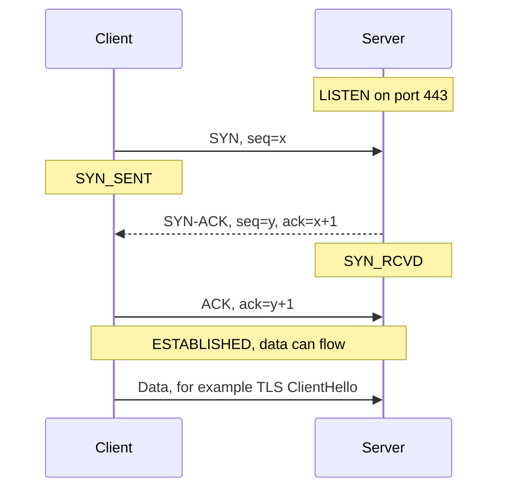
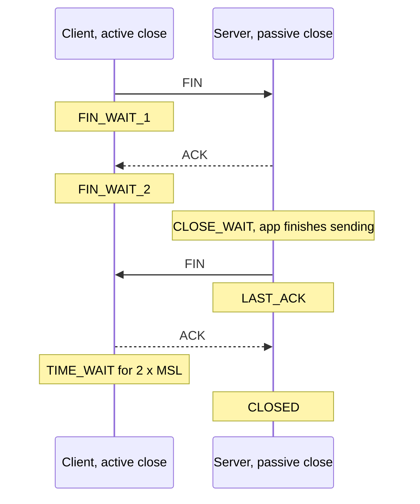

# TCP vs UDP

TCP aur UDP do main transport protocols hain. TCP ek ordered, reliable byte stream deta hai, connection, flow control aur congestion control ke saath. UDP bas independent datagrams bhejta hai, lagbhag zero overhead aur koi guarantee nahi. Interviewer 3-way handshake, TCP reliable kaise rehta hai, flow vs congestion control, TIME_WAIT, head-of-line blocking, aur UDP kab chunoge (DNS, video calls, gaming, QUIC) poochte hain.

## ⭐ TCP 3-way handshake

**Ek line me:** data bhejne se pehle client aur server SYN, SYN-ACK, ACK exchange karte hain taaki starting sequence numbers pe agree karein aur confirm ho ki dono directions kaam kar rahi hain.



- **3 kyun, 2 kyun nahi?** Dono sides ko apna **initial sequence number (ISN)** chunna hai aur uska acknowledgement chahiye. Do messages se sirf ek side ka ISN confirm hota, aur koi purana delayed SYN ghost connection khol sakta tha.
- ISNs random hote hain, isse connection me fake packets inject karna mushkil hota hai.
- Cost: data ke pehle byte se pehle **1 RTT**. Mumbai se US-East ~200 ms RTT, to sirf handshake 200 ms. Isiliye CDN connections user ke paas terminate karte hain.
- SYN me options bhi jaate hain: **MSS** (max segment size), **window scale**, **SACK permitted**, timestamps.
- **SYN flood:** attacker bahut saare SYN bhejta hai aur kabhi ACK nahi karta, server ki half-open queue bhar jaati hai. Bachav: **SYN cookies** (server state apne ISN me encode karta hai aur ACK aane tak kuch store nahi karta).
- **TCP Fast Open** wapas aane wale client ko SYN ke andar data bhejne deta hai, ek RTT bachta hai (practice me kam use hota hai).

**Interview tip:** teen arrows seq aur ack numbers ke saath draw karo. "ack = x+1 kyunki SYN ek sequence number consume karta hai" bolna dikhata hai ki tum sach me samajhte ho.

**Common galti:** bolna ki handshake "encryption keys exchange karta hai". Wo TLS hai, jo TCP ke baad chalta hai.

## ⭐ TCP 4-way close and TIME_WAIT

**Ek line me:** har direction FIN aur ACK se alag band hoti hai, isliye close me aam taur pe chaar segments lagte hain; jo side pehle close karti hai wo connection free karne se pehle 2×MSL tak TIME_WAIT me rehti hai.



- **Chaar kyun?** TCP full duplex hai. Client bolta hai "mera bhejna khatam" (FIN), par server ke paas abhi bhi data bhejne ko ho sakta hai. Isliye server ka ACK aur FIN aksar alag aate hain. Server ke paas kuch bacha na ho to dono combine (FIN-ACK), to teen.
- **TIME_WAIT** (pehle close karne wali side pe) 2×MSL chalta hai (Linux: 60 s). Do wajah: last ACK kho gaya ho to dobara bhejna, aur is 4-tuple ke purane delayed packets mar jaayein taaki same ports wale naye connection ko confuse na karein.
- **Scale pe problem:** jo service har request pe naya outbound connection kholti hai (DB, Redis ya doosri service tak), uske paas hazaron TIME_WAIT sockets jama ho jaate hain aur **ephemeral ports** khatam ho jaate hain. Fix: connection pooling aur keep-alive, hacks nahi.
- **CLOSE_WAIT jama hona** matlab app ko FIN mila par usne kabhi `close()` nahi kiya. Ye tumhare code ka bug hai (leaked connections).
- **RST** abrupt close hai: "ye connection exist nahi karta" ya "abhi abort karo". Receiver pe TIME_WAIT nahi.

**Interview tip:** "API server pe bahut TIME_WAIT sockets, kya karoge?" Connections reuse karo (pooling, upstreams tak keep-alive), jahan ho sake client ko pehle close karne do, aur uske baad hi `net.ipv4.tcp_tw_reuse` socho.

**Common galti:** TIME_WAIT (normal, active closer pe) ko CLOSE_WAIT (tumhari app close karna bhool gayi) se confuse karna.

## TCP header: the fields that matter

| Field | Kyun matter karta hai |
|---|---|
| Source / destination port | Har side pe kaunsa process (4-tuple ka hissa) |
| Sequence number | Is segment ke pehle byte ka offset |
| Acknowledgment number | Doosri side se agla expected byte |
| Flags: SYN, ACK, FIN, RST, PSH | Open, acknowledge, close, abort, app ko push |
| Window | Flow control ke liye receive window (rwnd) |
| Checksum | Corruption pakadta hai |
| Options | MSS, window scale, SACK, timestamps |

- `tcpdump -i any port 443` ya Wireshark ye fields live dikhate hain. `[S]`, `[S.]`, `[.]` handshake hai; `[F.]` FIN, `[R]` RST.

## ⭐ Reliability: sequence numbers, ACKs, retransmission

**Ek line me:** TCP har byte ko number deta hai, receiver jo mila uska acknowledgement bhejta hai, aur sender jiska ACK time pe na aaye use dobara bhejta hai.

- **Sequence number** = stream me byte offset. **ACK number** = "yahan tak sab mil gaya, ab byte N bhejo" (cumulative).
- **Retransmission timeout (RTO):** measured RTT se nikalta hai (smoothed RTT + variance). RTO se pehle ACK nahi → resend aur timeout double (exponential backoff).
- **Fast retransmit:** same number ke 3 duplicate ACKs matlab ek segment missing hai par baad wale pahunch gaye. RTO ka wait kiye bina turant resend.
- **SACK** (selective ACK): receiver exactly batata hai kaunsi ranges uske paas hain, sender sirf holes resend karta hai.
- Har segment me **checksum** corruption pakadta hai. **Reordering:** receiver out-of-order segments buffer karta hai aur app ko bytes sirf order me deta hai.
- Result: app ko ordered, bina gap wala byte stream dikhta hai. Message boundaries **nahi** dikhte. Do `send()` calls ek `recv()` me aa sakti hain, isliye TCP ke upar wale protocols ko length prefix ya delimiter chahiye (HTTP `Content-Length` ya chunked encoding use karta hai).

**Common galti:** sochna ki TCP message boundaries preserve karta hai. Ye byte stream hai.

## ⭐ Flow control vs congestion control

**Ek line me:** flow control **receiver** ko overwhelm hone se bachata hai; congestion control **network** ko overwhelm hone se bachata hai.

| | Flow control | Congestion control |
|---|---|---|
| Kisko bachata hai | Receiver ka buffer | Beech ke routers aur links |
| Signal | Receiver har ACK me **rwnd** (receive window) batata hai | Sender loss ya delay se congestion ka andaaza lagata hai |
| Limit kaun set karta hai | Receiver | Sender ka apna **cwnd** (congestion window) |
| Effective send limit | min(rwnd, cwnd) bytes in flight | min(rwnd, cwnd) bytes in flight |
| Zero case | rwnd = 0 matlab "ruko", sender window probes bhejta hai | Loss matlab cwnd kaato |

Congestion control phases (classic Reno / CUBIC):
1. **Slow start:** cwnd chhota shuru hota hai (Linux: 10 segments, ~14 KB) aur loss ya `ssthresh` tak **har RTT double** hota hai. Naam misleading hai; growth exponential hai.
2. **Congestion avoidance:** `ssthresh` ke upar har RTT ~1 segment badhta hai (additive increase).
3. **Loss pe:** triple dup ACK → cwnd aadha (multiplicative decrease, AIMD). Timeout → wapas slow start.
- **CUBIC** Linux default hai. **BBR** (Google) loss ka wait karne ki jagah bandwidth aur RTT model karta hai; lossy mobile networks pe accha.
- **Bandwidth-delay product:** 100 Mbps link 100 ms RTT pe bharne ke liye ~1.25 MB in flight chahiye. Iske liye window scaling zaroori.

**Interview tip:** "Fast internet pe bhi naye connection pe pehla page load slow kyun?" Slow start: pehla RTT sirf ~14 KB le jaa sakta hai. Isliye critical HTML/CSS chhota rakhna aur warm connections reuse karna matter karta hai.

**Common galti:** "flow control" aur "congestion control" ko synonyms ki tarah use karna.

## ⭐ Head-of-line blocking

**Ek line me:** TCP bytes strictly order me deta hai, isliye ek lost packet apne peeche sab kuch rok deta hai, wo data bhi jo pahunch chuka hai.

- HTTP/1.1: ek connection pe ek time pe ek request, to slow response agli request ko rok deta hai (**application-level HOL**). Browsers iske liye har host pe 6 connections kholte the.
- HTTP/2 ek connection pe multiplexed streams se app-level HOL fix karta hai, par **TCP-level HOL** aur bura ho jaata hai: ek lost packet saari streams rok deta hai.
- **QUIC / HTTP/3** UDP pe chalta hai aur per-stream ordering karta hai, to stream 3 ka loss stream 5 ko nahi rokta. Dekho [HTTP](./03-http.md).

**Common galti:** bolna ki HTTP/2 ne head-of-line blocking poori tarah solve kar di. Usne use neeche TCP me shift kar diya.

## ⭐ UDP and when to use it

**Ek line me:** UDP standalone datagrams bhejta hai: na connection, na handshake, na ordering, na retransmission, na congestion control, bas IP ke upar ports aur checksum.

- Header 8 bytes (TCP 20–60). Message boundaries preserve hote hain: ek `send` = ek datagram.
- Packets kho sakte hain, duplicate ho sakte hain ya reorder ho sakte hain. App ko inme se kuch fix chahiye to khud karega.

| Use case | UDP kyun |
|---|---|
| **DNS** | Ek chhota sawal, ek chhota jawab. 3-way handshake time teen guna kar deta. Timeout pe retry kaafi hai. |
| **Video / voice calls** (WhatsApp calls, Zoom, WebRTC) | Late packet bekaar hai. Retransmit ke wait me atakne se accha ek frame skip karo. |
| **Low latency live streaming** | Wahi wajah; adaptive bitrate loss jhel leta hai. |
| **Online gaming** (BGMI, Valorant) | Latest position second me 30–60 baar bhejo; purani positions ka koi matlab nahi. |
| **QUIC / HTTP/3** | UDP pe user space me apni reliability, encryption aur congestion control banata hai, TCP HOL aur kernel upgrade cycles se bachta hai. |
| **Metrics, logs** (StatsD, syslog) | Fire and forget; kuch samples kho gaye to chalta hai. |
| **DHCP, NTP, SNMP** | Local networks pe simple request/response. |

**Interview tip:** "WhatsApp calls ke liye UDP aur messages ke liye TCP (ya waisa) kyun?" Calls ko latency ki padi hai, 20 ms audio kho gaya to chalta hai. Messages exactly once aur order me pahunchne chahiye.

**Common galti:** "UDP unreliable hai to kisi important cheez ke liye mat use karo". Google aur YouTube ka bada hissa QUIC ke through UDP pe jaata hai. Jahan zarurat ho wahan reliability khud banao.

## ⭐ TCP vs UDP table

| | TCP | UDP |
|---|---|---|
| Connection | Haan, 3-way handshake | Nahi |
| Reliability | ACKs, retransmission | Kuch nahi |
| Ordering | Byte order guaranteed | Nahi |
| Message boundaries | Nahi (byte stream) | Haan (datagrams) |
| Flow / congestion control | Haan | Nahi (app ko khud dhyan rakhna hai) |
| Header size | 20–60 bytes | 8 bytes |
| First byte tak latency | 1 RTT handshake | 0 |
| Broadcast / multicast | Nahi | Haan |
| Examples | HTTP/1.1, HTTP/2, SSH, SMTP, DB connections, Kafka | DNS, VoIP, video calls, games, QUIC, DHCP |

## ⭐ Keep-alive and connection pooling

**Ek line me:** TCP + TLS connection banane me 2 RTT aur CPU lagta hai, isliye har request pe naya kholne ki jagah connections reuse karo.

- **HTTP keep-alive:** HTTP/1.1 connections default se agli request ke liye khule rehte hain (`Connection: keep-alive`). HTTP/2 aur aage jaata hai aur ek connection pe ek saath kai requests bhejta hai.
- **TCP keepalive** (alag cheez): OS idle connection pe chhote probes bhejta hai taaki dead peer pakda jaaye. Linux default 2 ghante; aam taur pe kam kiya jaata hai. Load balancers aur NAT boxes idle connections drop karte hain (AWS ALB 60 s idle timeout), isliye clients ko pools alive rakhne chahiye ya resets handle karne chahiye.
- **Connection pooling:** app DB, Redis ya upstream service tak N connections khule rakhta hai aur har request ko ek udhaar deta hai. Fayde: har request pe handshake nahi, TIME_WAIT jama nahi, DB pe bounded load.
- Postgres har connection ke liye ek process banata hai, to 2,000 app pods × 20 connections use maar dega. Aage **PgBouncer** ya RDS Proxy lagao.
- Pool size: DB ke liye (cores × 2) ke aas paas se shuru karo; bahut bada pool bas queue ko DB ke andar shift karta hai.

```python
# requests: ek Session = ek connection pool, calls me reuse hota hai
import requests
s = requests.Session()  # keep-alive aur pooling
for order_id in order_ids:
    s.get(f"https://api.internal/orders/{order_id}", timeout=2)
```

**Interview tip:** "Downstream service ki latency badh gayi aur hazaron TIME_WAIT sockets dikh rahe hain." Jawab: koi client connections reuse nahi kar raha; pooling / keep-alive lagao aur idle timeouts LB ke timeout se kam rakho.

**Common galti:** har request handler ke andar naya HTTP client ya DB connection banana.

## Kin system design questions me

- [Real-time communication](../01-topics/08-real-time-communication.md): WebSockets ke liye long-lived TCP connections
- [WhatsApp chat](../02-questions/t1-04-whatsapp-chat.md): persistent connections, calls ke liye UDP
- [YouTube](../02-questions/t1-07-youtube.md): streaming, QUIC
- [Scaling basics](../01-topics/01-scaling-basics.md): L4 load balancers, connection limits
- [Numbers cheatsheet](../01-topics/21-numbers-cheatsheet.md): regions ke beech RTTs

## Checklist

- [ ] 3-way handshake seq aur ack numbers ke saath draw karke bata sakta hoon ki teen messages kyun chahiye
- [ ] 4-way close draw karke TIME_WAIT vs CLOSE_WAIT samjha sakta hoon
- [ ] TCP reliable kaise rehta hai samjha sakta hoon: seq numbers, cumulative ACKs, RTO, fast retransmit, SACK
- [ ] Flow control (rwnd) aur congestion control (cwnd, slow start, AIMD) ka fark bata sakta hoon
- [ ] HTTP/1.1 aur HTTP/2 me head-of-line blocking aur QUIC use kaise hatata hai, samjha sakta hoon
- [ ] Diye gaye use case ke liye TCP ya UDP chun ke justify kar sakta hoon
- [ ] Keep-alive aur connection pooling, aur ye kaunsi problems solve karte hain, samjha sakta hoon
