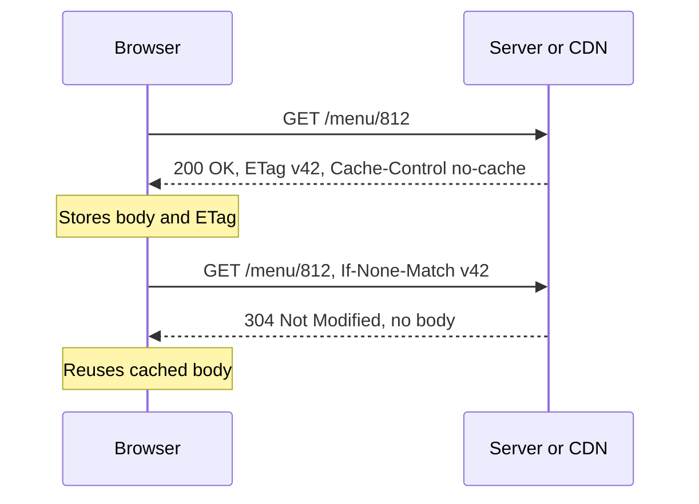

# HTTP, HTTPS & HTTP/2/3

HTTP web ka request/response protocol hai: client method, path, headers aur shayad body bhejta hai; server status code, headers aur body ke saath reply karta hai. HTTPS wahi cheez TLS ke andar hai. Interviewer methods aur idempotency, status codes, caching aur auth headers, cookies vs sessions vs JWT, CORS, aur classic "HTTP/1.1 vs HTTP/2 vs HTTP/3" comparison check karte hain.

## ⭐ Request and response anatomy

**Ek line me:** request = method + path + version + headers + optional body; response = version + status code + headers + optional body.

```http
POST /v1/orders HTTP/1.1
Host: api.swiggy.com
Authorization: Bearer eyJhbGciOi...
Content-Type: application/json
Idempotency-Key: 7f3c-91ab
Content-Length: 58

{"restaurantId": 812, "items": [{"id": 31, "qty": 2}]}
```

```http
HTTP/1.1 201 Created
Location: /v1/orders/99812
Content-Type: application/json
Cache-Control: no-store

{"orderId": 99812, "status": "PLACED"}
```

- HTTP **stateless** hai: har request apne saath sab kuch laati hai (cookie, token). State cookies, tokens ya server-side store me rehti hai.
- HTTP/1.1 text hai; HTTP/2 aur HTTP/3 same semantics binary frames me bhejte hain.

## ⭐ Methods and idempotency

**Ek line me:** **safe** methods server state nahi badalte; **idempotent** methods ek baar call karo ya das baar, end state same rehti hai.

| Method | Use | Safe | Idempotent | Body |
|---|---|---|---|---|
| GET | Resource padho | Haan | Haan | Nahi |
| HEAD | GET jaisa, sirf headers | Haan | Haan | Nahi |
| OPTIONS | Kaunse methods allowed, CORS preflight | Haan | Haan | Nahi |
| POST | Create, ya koi action trigger | Nahi | **Nahi** | Haan |
| PUT | Is URL pe poora resource replace | Nahi | Haan | Haan |
| PATCH | Partial update | Nahi | Guaranteed nahi | Haan |
| DELETE | Hatao | Nahi | Haan | Aam taur pe nahi |

- Idempotency **retries** ki wajah se matter karti hai: network timeout hota hai, clients aur proxies retry karte hain. GET/PUT/DELETE retry safe hai; POST retry do orders bana sakta hai ya do baar paise kaat sakta hai.
- POST ko retry-safe banane ke liye **Idempotency-Key** header: server key → result store karta hai aur repeat pe same result lautata hai. Dekho [Idempotency & retries](../01-topics/10-idempotency-retries.md).
- `PATCH {"op": "increment", "field": "qty"}` idempotent nahi; `PATCH {"qty": 3}` hai.
- Idempotent matlab same **state**, same **response** nahi: doosra DELETE 404 de sakta hai.

**Interview tip:** "PUT vs POST?" PUT ek known URL ko target karke replace karta hai (idempotent), POST server se collection ke andar kuch create karwata hai (idempotent nahi).

**Common galti:** side effect wale actions ke liye GET use karna (`GET /deleteUser?id=5`). Crawlers, prefetchers aur caches use call kar denge.

## ⭐ Status codes

**Ek line me:** pehla digit class batata hai: 2xx success, 3xx redirect, 4xx client ki galti, 5xx server fail.

| Code | Matlab | Kab dikhta hai |
|---|---|---|
| 200 OK | Body ke saath success | Normal GET |
| 201 Created | Resource ban gaya | Order create karne wala POST, `Location` header ke saath |
| 202 Accepted | Accept kiya, baad me process | Async jobs: video upload, report generation |
| 204 No Content | Success, body nahi | DELETE, ya PUT jahan lautane ko kuch nahi |
| 301 Moved Permanently | Permanent redirect, cacheable | http se https, purana domain |
| 302 Found | Temporary redirect | Login redirect, analytics ke liye URL shortener |
| 304 Not Modified | Tumhari cached copy abhi valid hai | `If-None-Match` wala conditional GET |
| 307 / 308 | Temporary / permanent redirect, method aur body same | POST ko safely redirect karna |
| 400 Bad Request | Input kharab | Validation fail |
| 401 Unauthorized | Authenticated nahi (credentials nahi ya galat) | Token missing ya expired |
| 403 Forbidden | Authenticated par allowed nahi | User doosre user ka order dekhne ki koshish kare |
| 404 Not Found | Aisa resource nahi | Galat ID |
| 405 Method Not Allowed | Is path pe method support nahi | Read-only resource pe DELETE |
| 409 Conflict | State conflict | Seat pehle se booked, version mismatch |
| 412 Precondition Failed | `If-Match` ETag match nahi hua | Update pe optimistic locking |
| 422 Unprocessable Entity | Format sahi, matlab galat | Business rule fail |
| 429 Too Many Requests | Rate limited, `Retry-After` ke saath | Dekho [Rate limiting](../01-topics/11-rate-limiting.md) |
| 500 Internal Server Error | Bug ya unhandled exception | |
| 502 Bad Gateway | Proxy/LB ko upstream se kharab response mila | App crash ya connection band |
| 503 Service Unavailable | Overloaded ya maintenance | Load shedding, `Retry-After` ke saath |
| 504 Gateway Timeout | Proxy/LB upstream ka wait karte timeout | App ke peeche slow DB query |

**Interview tip:** "401 vs 403?" 401 = tum kaun ho? (authenticate karo). 403 = pata hai tum kaun ho, aur jawab hai nahi. "502 vs 504?" Upstream ne kachra diya ya connection gira diya vs upstream bahut slow tha.

**Common galti:** body me `{"error": ...}` ke saath `200` lautana. Clients, retries, monitoring aur caches sab status code pe chalte hain.

## ⭐ Important headers

| Header | Direction | Kya karta hai | Example |
|---|---|---|---|
| `Host` | Request | Kaunsi site (kai sites ek IP share karti hain) | `Host: www.zomato.com` |
| `Content-Type` | Dono | Body ka format | `application/json` |
| `Accept-Encoding` / `Content-Encoding` | Dono | Compression | `gzip, br` |
| `Cache-Control` | Response (aur request) | Kaun cache kar sakta hai aur kitni der | `public, max-age=86400` |
| `ETag` | Response | Resource ke version ka fingerprint | `ETag: "v42-a1b2"` |
| `If-None-Match` | Request | "Is ETag se badla ho tabhi bhejo" | same ho to 304 |
| `If-Match` | Request | "Abhi bhi yahi version ho tabhi update karo" | badla ho to 412 |
| `Last-Modified` / `If-Modified-Since` | Dono | Time-based validation | ETag ka purana alternative |
| `Cookie` / `Set-Cookie` | Request / response | Browser state | `Set-Cookie: sid=abc; HttpOnly; Secure; SameSite=Lax` |
| `Authorization` | Request | Credentials | `Bearer <JWT>`, `Basic base64(user:pass)` |
| `Location` | Response | Redirect target ya bana hua resource | `/v1/orders/99812` |
| `Retry-After` | Response | Kab retry karna hai (429, 503) | `Retry-After: 30` |
| `X-Forwarded-For` | Request (proxies jodte hain) | Original client IP | `X-Forwarded-For: 49.36.1.2` |
| `Strict-Transport-Security` | Response | HSTS, hamesha HTTPS | `max-age=31536000` |

**Cache-Control values:**
- `max-age=N`: N seconds tak fresh. `s-maxage`: same par sirf shared caches (CDN) ke liye.
- `public` (CDN cache kar sakta hai) vs `private` (sirf user ka browser, jaise profile page).
- `no-cache`: store kar sakte ho par use se pehle revalidate (ETag) karna hai. `no-store`: kabhi store mat karo (payments, OTP pages).
- `immutable`: kabhi revalidate nahi. Hashed assets jaise `app.3f9a1c.js` ke liye `max-age=31536000` ke saath.



**CORS (Cross-Origin Resource Sharing):**
- Browser `app.paytm.com` ke JavaScript ko `api.paytm.com` ka response padhne se rokta hai jab tak API allow na kare (same-origin policy: scheme + host + port match hone chahiye).
- Server `Access-Control-Allow-Origin: https://app.paytm.com` (aur `-Allow-Methods`, `-Allow-Headers`, `-Allow-Credentials`) se opt in karta hai.
- "Non-simple" requests (PUT/DELETE, JSON body, custom headers) pehle ek **preflight** `OPTIONS` bhejti hain. Use `Access-Control-Max-Age` se cache karo.
- CORS sirf **browser** enforce karta hai. curl aur servers ise ignore karte hain. Ye API security mechanism nahi hai.

**Common galti:** cookies ke saath `Access-Control-Allow-Origin: *`. Browser ye combination reject karta hai; credentials ke saath ek specific allowed origin echo karna padta hai.

## ⭐ Cookies vs sessions vs JWT

**Ek line me:** cookie browser ka store-and-send mechanism hai; session server-side state hai jo ek ID se lookup hoti hai (aam taur pe cookie me); JWT ek signed token hai jo user ke claims khud saath le jaata hai.

| | Server-side session | JWT (stateless token) |
|---|---|---|
| Client ke paas kya | Random session ID (`sid=abc`) | Signed token: header.payload.signature |
| State kahan | Server store (Redis, DB) | Token ke andar |
| Har request pe lookup | Haan, ek Redis GET | Nahi, bas signature verify |
| Logout / revoke | Session delete, turant | Mushkil: expiry ka wait, ya denylist rakho |
| Size | ~32 bytes | Har request pe sau bytes se KBs |
| Scaling | Shared store chahiye (sticky sessions nahi) | Public key wala koi bhi server verify kar sakta hai |
| Kiske liye accha | Web apps, banking, instant revoke | Service-to-service, mobile APIs, short-lived access tokens |

- **Cookie flags:** `HttpOnly` (JS padh nahi sakta, XSS se token chori rokta hai), `Secure` (sirf HTTPS), `SameSite=Lax/Strict` (CSRF protection), `Domain`, `Path`, `Max-Age`.
- **Common pattern:** short-lived JWT access token (15 min) + long-lived refresh token (server-side stored, revocable). Dono ka fayda.
- JWT **signed hai, encrypted nahi** (default me). Koi bhi payload base64-decode kar sakta hai. Usme secrets kabhi mat daalo.
- Web pe tokens `localStorage` ki jagah `HttpOnly` cookies me rakho (XSS localStorage padh sakta hai).

**Interview tip:** "JWT ke saath user ko har jagah se logout kaise karoge?" Access tokens short rakho, DB me refresh token revoke karo, aur urgent cases ke liye Redis me expiry tak token IDs (`jti`) ki chhoti denylist rakho.

**Common galti:** JWT ko sessions se "zyada secure" bolna. Verification ke liye zyada scalable hai, aur revoke karna mushkil.

## ⭐ HTTP/1.1 vs HTTP/2 vs HTTP/3

| | HTTP/1.1 (1997) | HTTP/2 (2015) | HTTP/3 (2022) |
|---|---|---|---|
| Transport | TCP | TCP | **QUIC over UDP** |
| Format | Text | Binary frames | Binary frames |
| Requests per connection | Ek time pe ek (keep-alive connection reuse karta hai) | Kai concurrent **streams** (multiplexing) | Kai independent streams |
| Head-of-line blocking | Haan, HTTP level pe | HTTP level pe fix, **TCP level pe abhi bhi** | Khatam: loss sirf apni stream rokta hai |
| Header compression | Nahi (har baar wahi cookies) | **HPACK** | **QPACK** |
| Server push | Nahi | Haan, par **deprecated** (Chrome ne hata diya); `103 Early Hints` / preload use karo | Use nahi hota |
| Handshake cost (naya) | TCP 1 RTT + TLS 1–2 RTT | 1.1 jaisa | **1 RTT** (transport + TLS 1.3 combined), resume pe 0-RTT |
| Connection migration | Nahi | Nahi | Haan: Wi-Fi se 4G switch pe connection ID bachi rehti hai |
| Browser workarounds | Host pe 6 connections, domain sharding, sprites, bundling | Zarurat nahi (ulta nuksaan) | Zarurat nahi |
| Encryption | Optional | Spec me optional, browsers me zaroori | Hamesha (TLS 1.3 built in) |

- **Multiplexing:** HTTP/2 har request/response ko stream ID wale frames me todta hai aur ek TCP connection pe interleave karta hai.
- **HTTP/3 jeet-ta hai** mobile aur lossy networks pe (chalti train me Jio 4G): TCP HOL nahi, fast setup, network change jhel leta hai.
- Data centres ke andar HTTP/2 (gRPC) abhi bhi norm hai; HTTP/3 sabse zyada edge pe matter karta hai.

**Interview tip:** evolution aise bolo "har version pichle ka bottleneck fix karta hai": 1.1 ne keep-alive se connection-per-request fix kiya, 2 ne multiplexing se one-request-at-a-time fix kiya, 3 ne QUIC pe jaake TCP head-of-line blocking fix ki.

**Common galti:** bolna ki pages fast karne ka tareeka HTTP/2 server push hai. Ye deprecate ho gaya kyunki aksar wahi push karta tha jo pehle se cached tha.

## HTTPS

- HTTPS = TLS ke upar HTTP, port 443 pe. Encryption, integrity aur server authentication deta hai. Details [TLS](./05-tls.md) me.
- Aam taur pe CDN ya load balancer pe terminate hota hai; VPC ke andar traffic plain HTTP ya re-encrypted (mTLS) ho sakta hai.

## REST vs gRPC, WebSockets and SSE (pointers)

- **REST** (HTTP/1.1 ya 2 pe JSON, resource URLs, status codes) public APIs ke liye; **gRPC** (HTTP/2 pe Protobuf, streaming, generated clients) internal service-to-service calls ke liye. Dekho [API design](../01-topics/19-api-design.md).
- **WebSockets** (HTTP `Upgrade` se full-duplex TCP channel) chat aur live games ke liye; **SSE** (`text/event-stream`, sirf server se client) live scores aur LLM token streaming ke liye; **long polling** fallback. Dekho [Real-time communication](../01-topics/08-real-time-communication.md).

## ⭐ curl examples

```bash
# Request aur response headers dikhao (verbose)
curl -v https://www.flipkart.com/ -o /dev/null

# Sirf response headers
curl -I https://www.zomato.com/

# Redirects follow karo (http se https, 301 chain)
curl -L http://paytm.com

# Auth aur idempotency key ke saath JSON POST
curl -X POST https://api.example.com/v1/orders \
  -H "Authorization: Bearer $TOKEN" \
  -H "Content-Type: application/json" \
  -H "Idempotency-Key: 7f3c-91ab" \
  -d '{"restaurantId": 812, "items": [{"id": 31, "qty": 2}]}'

# ETag ke saath conditional GET, 304 expect karo
curl -i -H 'If-None-Match: "v42-a1b2"' https://api.example.com/menu/812

# HTTP/2 ya HTTP/3 force karo
curl --http2 -I https://www.google.com
curl --http3 -I https://www.google.com

# Timing breakdown: DNS, TCP connect, TLS, first byte, total
curl -o /dev/null -s -w "dns=%{time_namelookup} tcp=%{time_connect} tls=%{time_appconnect} ttfb=%{time_starttransfer} total=%{time_total}\n" https://www.swiggy.com/
```

**Interview tip:** `-w` timing line "site slow hai, time kahan jaa raha hai?" ka sabse fast jawab hai. Ye DNS, TCP, TLS aur server time alag kar deti hai.

## Kin system design questions me

- [API design](../01-topics/19-api-design.md): REST, gRPC, pagination, versioning
- [Idempotency & retries](../01-topics/10-idempotency-retries.md): idempotent methods, Idempotency-Key
- [Caching](../01-topics/05-caching.md) aur [Blob storage & CDN](../01-topics/12-blob-storage-cdn.md): Cache-Control, ETag
- [Rate limiting](../01-topics/11-rate-limiting.md): 429 aur Retry-After
- [URL shortener](../02-questions/t1-01-url-shortener.md): 301 vs 302 redirect ka choice
- [Real-time communication](../01-topics/08-real-time-communication.md): WebSockets, SSE, long polling

## Checklist

- [ ] HTTP methods list karke bata sakta hoon kaunse safe aur kaunse idempotent hain, aur retries ke liye ye kyun matter karta hai
- [ ] Common status codes samjha sakta hoon, including 401 vs 403, 301 vs 302, aur 502 vs 503 vs 504
- [ ] Cache-Control, ETag aur 304 conditional request samjha sakta hoon
- [ ] CORS aur preflight request samjha sakta hoon, aur ye sirf browser control kyun hai
- [ ] Server-side sessions aur JWT compare karke sahi cookie flags laga sakta hoon
- [ ] HTTP/1.1, HTTP/2 aur HTTP/3 ko transport, multiplexing, HOL blocking aur header compression pe compare kar sakta hoon
- [ ] curl se headers dekh sakta hoon, redirects follow kar sakta hoon aur request timing tod sakta hoon
