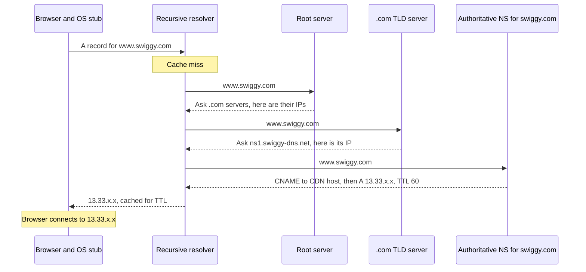

# DNS

DNS (Domain Name System) internet ki distributed, cached phone book hai: `www.swiggy.com` jaise naamon ko IP addresses me badalti hai. Ye hierarchical hai (root → TLD → authoritative), bahut zyada cached hai (har layer pe TTL) aur traffic-steering tool bhi hai (GeoDNS, weighted records, failover). Interviewer resolution flow, record types, TTL aur caching kaise kaam karti hai, DNS load balancing ke liye kaise use hota hai, aur "DNS changes propagate hone me time kyun lagta hai" poochte hain.

## ⭐ The DNS hierarchy and who does what

**Ek line me:** tumhara device recursive resolver se poochta hai, jo root servers se TLD servers aur phir domain ke authoritative server tak tree chalta hai, aur jawab cache kar leta hai.

| Player | Role | Examples |
|---|---|---|
| **Stub resolver** | OS ka chhota client; ek recursive resolver se poochta hai aur cache karta hai | `getaddrinfo()`, systemd-resolved |
| **Recursive resolver** | Tumhari taraf se poora lookup karta hai, bahut cache karta hai | ISP resolver (Jio, Airtel), Google `8.8.8.8`, Cloudflare `1.1.1.1` |
| **Root servers** | Jaante hain har TLD ke servers kahan hain | 13 named roots (a se m), sainkdon anycast instances |
| **TLD servers** | `.com`, `.in`, `.org` ke neeche har domain ke authoritative servers jaante hain | `.com` ke liye Verisign, `.in` ke liye NIXI |
| **Authoritative server** | Domain ke asli records rakhta hai | Route 53, Cloudflare DNS, NS1 |

- Naam ek tree banate hain jo right se left padha jaata hai: `www.swiggy.com.` → root (`.`) → `com` → `swiggy` → `www`.
- **Zone:** tree ka wo hissa jo ek authority manage karti hai. `swiggy.com` zone `api.swiggy.com` ko kisi aur provider ko delegate kar sakta hai.

## ⭐ Resolution flow

**Ek line me:** stub → recursive → root → TLD → authoritative, har step agle ki taraf point karta hai, phir jawab wapas aata hai aur har layer pe cache hota hai.



- **Recursive vs iterative:** stub **recursive** query karta hai ("mujhe final jawab do"). Resolver root/TLD/authoritative ko **iterative** queries karta hai ("batao agla kisse poochun").
- **Referrals:** root aur TLD ko jawab nahi pata; wo agle level ke NS records (plus "glue" A records) lautate hain.
- Practice me resolver ke paas `.com` aur aksar `swiggy.com` ke NS records already cached hote hain, to asli lookup aam taur pe resolver se 0–1 network hop hai.
- Transport: default UDP port 53; jo responses fit na hon (bade records, DNSSEC) aur zone transfers ke liye TCP. Modern privacy options: **DoH** (DNS over HTTPS) aur **DoT** (DNS over TLS).

**Interview tip:** "URL type karne pe kya hota hai" me bolo "browser cache, OS cache, resolver cache, aur sirf miss pe root → TLD → authoritative". Zyaadatar lookups resolver se bahar jaate hi nahi.

**Common galti:** bolna ki browser root servers se baat karta hai. Sirf recursive resolvers karte hain.

## ⭐ Record types

| Type | Kya map karta hai | Example | Notes |
|---|---|---|---|
| **A** | Name → IPv4 | `www.swiggy.com A 13.33.10.20` | Kai A records = simple round robin |
| **AAAA** | Name → IPv6 | `www.swiggy.com AAAA 2600:9000::1` | |
| **CNAME** | Name → doosra name (alias) | `www.swiggy.com CNAME d1x.cloudfront.net` | Zone apex (`swiggy.com` khud) pe allowed nahi; same name pe doosre records ke saath nahi reh sakta |
| **ALIAS / ANAME** | Apex → name, provider resolve karta hai | `swiggy.com ALIAS my-lb.elb.amazonaws.com` | Provider-specific (Route 53 Alias, Cloudflare CNAME flattening) |
| **MX** | Domain → mail servers, priority ke saath | `paytm.com MX 10 mx1.google.com` | Chhota number = preferred |
| **TXT** | Name → free text | SPF, DKIM, DMARC, domain verification | `v=spf1 include:_spf.google.com ~all` |
| **NS** | Zone → uske authoritative name servers | `swiggy.com NS ns-1.awsdns-01.org` | Delegation |
| **SOA** | Zone metadata | Primary NS, serial, negative-cache TTL | Har zone me ek |
| **SRV** | Service → host + port + priority + weight | `_sip._tcp.example.com SRV 10 60 5060 sip1.example.com` | SIP, XMPP, Kubernetes, Consul use karte hain |
| **PTR** | IP → name (reverse DNS) | `20.10.33.13.in-addr.arpa PTR host.example.com` | Mail servers check karte hain |
| **CAA** | Kaunse CAs cert issue kar sakte hain | `swiggy.com CAA 0 issue "amazon.com"` | Dekho [TLS](./05-tls.md) |

**Interview tip:** "Root domain ko load balancer pe CNAME kyun nahi kar sakta?" Apex pe SOA aur NS records hone hi chahiye, aur CNAME doosre records ke saath nahi reh sakta. DNS provider ka ALIAS/flattening feature use karo.

**Common galti:** teen level gehri CNAME chain banana. Cold cache pe har hop ek aur lookup hai.

## ⭐ TTL and caching layers

**Ek line me:** har record ka TTL (seconds) hota hai jo resolvers ko batata hai kitni der cache kar sakte hain; lagbhag har layer pe cache hai.


| Layer | Typical behaviour |
|---|---|
| Application / runtime | JVM successful lookups cache karta hai (security manager set ho to hamesha ke liye; `networkaddress.cache.ttl` set karo), Node default me cache nahi karta |
| Browser | Chrome bade TTL ke bawajood ~1 min cache karta hai |
| OS | systemd-resolved, macOS mDNSResponder; `/etc/hosts` sabko override karta hai |
| Recursive resolver | TTL respect karta hai (kuch min/max clamp karte hain) |
| Authoritative | Source of truth; TTL yahin set karte ho |

- **TTL trade-off:** lamba TTL (1 din) = kam queries, fast, DNS provider me issue ho to bhi chalta hai, par changes slow. Chhota TTL (30–60 s) = fast failover aur migrations, zyada queries aur DNS up rehne pe zyada dependency.
- **Migration se pehle:** TTL kam karo (maan lo 86400 se 60) kam se kam ek purane-TTL period pehle, switch karo, phir wapas badhao.
- Long-lived connections rakhne wale clients (DB pools, gRPC channels) reconnect tak re-resolve nahi karte, TTL kuch bhi ho.

**Common galti:** migration ke din TTL 60 s karna aur expect karna ki sab ek minute me switch ho jaayenge. Resolvers purana record purane TTL tak rakhe rehte hain.

## ⭐ DNS for load balancing, GeoDNS and failover

**Ek line me:** authoritative server har query pe alag jawab de sakta hai (rotating IPs, user location ke hisaab se, weight se, sirf healthy targets), isliye DNS traffic routing ki pehli layer ban jaata hai.

| Technique | Kaise kaam karta hai | Use |
|---|---|---|
| **Round robin** | Kai A records; order rotate hota hai | Rough spreading; health ka pata nahi |
| **Weighted** | 90% answers v1 ko, 10% v2 ko | Canary, dheere dheere region migration |
| **GeoDNS / latency-based** | Jawab resolver ki location (ya EDNS Client Subnet) pe depend | Chennai users ko Mumbai region, US users ko Virginia |
| **Failover** | Health checks; primary down to secondary lautao | Active-passive multi-region DR |
| **Anycast** (DNS record nahi, par related) | Same IP kai jagah se BGP pe announce; network nearest pe route karta hai | DNS providers aur CDNs khud use karte hain (`1.1.1.1`) |

- DNS load balancing **coarse** hai: caching ki wajah se clients TTL seconds tak purane answers use karte rehte hain, aur server load dikhta nahi. Har region ke andar asli load balancers ke saath pair karo. Dekho [Scaling basics](../01-topics/01-scaling-basics.md).
- CDNs DNS bahut use karte hain: tumhara `d1x.cloudfront.net` wala `CNAME` resolver ke paas wale edge me resolve hota hai. Dekho [Blob storage & CDN](../01-topics/12-blob-storage-cdn.md).
- Clusters ke andar **service discovery** bhi DNS hai: Kubernetes har Service ko `orders.default.svc.cluster.local` jaisa naam deta hai, aur SRV records me ports hote hain.

**Interview tip:** "Multi-region design me users ko nearest region pe kaise route karoge?" Region chunne ke liye GeoDNS ya latency-based DNS (Route 53), region ke andar L7 load balancer, aur disaster recovery ke liye health-checked failover records.

**Common galti:** DNS round robin ko akela load balancer maan lena. Ek dead IP ko TTL expire hone aur clients ke retry karne tak apna hissa traffic milta rehta hai.

## ⭐ dig examples

```bash
# Basic A lookup
dig www.swiggy.com

# Sirf jawab
dig +short www.swiggy.com

# Specific record types
dig paytm.com MX +short
dig zomato.com TXT +short
dig flipkart.com NS +short
dig www.google.com AAAA +short

# Kisi specific resolver se poocho
dig @1.1.1.1 www.swiggy.com
dig @8.8.8.8 www.swiggy.com

# Poori chain khud chalo: root, TLD, authoritative
dig +trace www.swiggy.com

# Seedha authoritative server se poocho (caches bypass, asli TTL dekho)
dig @ns-1.awsdns-01.org www.swiggy.com

# Reverse lookup
dig -x 8.8.8.8 +short
```

Output me kya padhna hai:
- `ANSWER SECTION`: records aur **bacha hua TTL** (cache se aaya ho to ghatta jaata hai).
- `status: NOERROR` (mil gaya), `NXDOMAIN` (naam exist nahi karta), `SERVFAIL` (resolver ko jawab nahi mila, aksar DNSSEC ya authoritative down).
- `Query time` aur `SERVER` batate hain kis resolver ne kitni jaldi jawab diya.

## ⭐ Common issues

| Issue | Kya ho raha hai | Fix |
|---|---|---|
| **"Propagation" delay** | Koi push nahi hota; purane answers TTL expire hone tak caches me rehte hain | Changes se kaafi pehle TTL kam karo; `dig @authoritative` se verify karo |
| **Negative caching** | `NXDOMAIN` bhi cache hota hai, SOA minimum / negative TTL tak | Record koi query kare usse pehle banao; SOA negative TTL chhota rakho (60–300 s) |
| **Stale client caches** | JVM ya app caches TTL ignore karte hain; long-lived pools kabhi re-resolve nahi karte | JVM `networkaddress.cache.ttl` set karo, connections periodically recycle karo |
| **DNS provider outage** | Authoritative down matlab caches expire hote hi har jagah naye lookups fail | Do DNS providers (secondary NS), reasonable TTLs |
| **Slow lookups** | Cold cache + lambi CNAME chains | Kam hops, HTML me `dns-prefetch` / `preconnect` hints |
| **Cluster ke andar DNS single point of failure** | CoreDNS overloaded, ndots search domains queries multiply karte hain | Trailing dot wale FQDNs, node-local DNS cache |
| **Hijacking / spoofing** | Cache me fake answers inject | DNSSEC (signed records), resolver tak DoH/DoT |

**Interview tip:** "IP badal diya par kuch users abhi bhi purane server pe aa rahe hain." Resolver, OS, browser aur app layers pe TTL caching samjhao, purana server tab tak zinda rakho jab tak purana TTL poora expire na ho, aur hamesha cache karne wale client runtimes check karo.

**Common galti:** "DNS propagation me 24–48 ghante lagte hain" ko fixed rule ki tarah bolna. Utna hi time lagta hai jitna cached TTL tha, plus galat behave karne wale caches.

## Quick answers

| Sawal | Chhota jawab |
|---|---|
| DNS zyaadatar UDP kyun? | Ek chhoti request aur response; TCP handshake ek RTT jod deta. Bade answers aur zone transfers ke liye TCP. |
| DNS poore internet tak scale kaise karta hai? | Hierarchy (delegation) ownership baant-ti hai, aur TTL wali caching lagbhag saari queries authoritative tak pahunchne se pehle jhel leti hai. |
| Authoritative server down ho to? | TTL expire hone tak cached answers chalte rehte hain, phir lookups fail. Isiliye do providers rakhte hain. |
| CDN nearest edge kaise chunta hai? | Tumhara CNAME CDN ko point karta hai, jiska DNS resolver ke paas wale edge se jawab deta hai (GeoDNS) ya anycast IP use karta hai. |

## Kin system design questions me

- [Scaling basics](../01-topics/01-scaling-basics.md): load balancers ke aage DNS
- [Blob storage & CDN](../01-topics/12-blob-storage-cdn.md): CDN ka CNAME, edge selection
- [Reliability & observability](../01-topics/20-reliability-observability.md): multi-region failover
- [Microservices patterns](../01-topics/23-microservices-patterns.md): service discovery
- [Web crawler](../02-questions/t1-12-web-crawler.md): DNS resolution bottleneck ban jaata hai, isliye cache karo

## Checklist

- [ ] Stub, recursive resolver, root, TLD aur authoritative servers ke roles samjha sakta hoon
- [ ] Resolution flow draw karke bata sakta hoon caching use kahan short-circuit karti hai
- [ ] A, AAAA, CNAME, MX, TXT, NS aur SRV records, aur apex pe CNAME kyun allowed nahi, samjha sakta hoon
- [ ] TTL trade-offs aur migration se pehle TTL safely kam karna samjha sakta hoon
- [ ] DNS-based load balancing, GeoDNS, weighted aur failover records, aur unki limits samjha sakta hoon
- [ ] dig se specific types, specific resolvers query kar sakta hoon aur chain trace kar sakta hoon
- [ ] Propagation delay aur negative caching samjha sakta hoon
