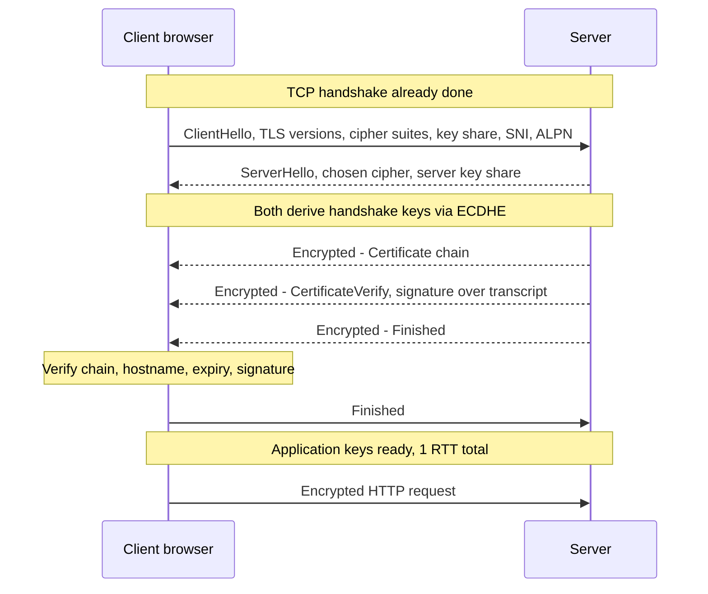
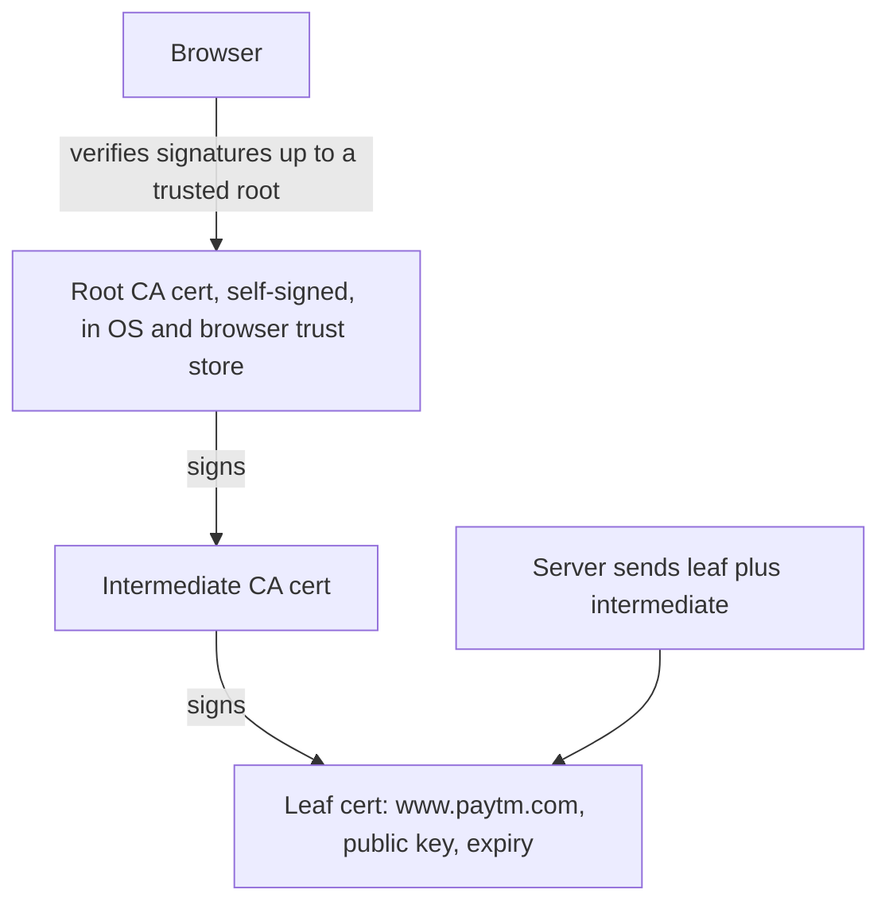
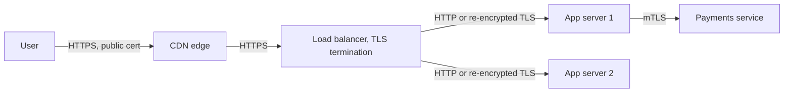

# TLS & Certificates

TLS (Transport Layer Security, SSL ka successor) hi HTTPS me "S" lagata hai. Ye TCP ke upar (ya QUIC ke andar) baithta hai aur teen guarantees deta hai: traffic koi padh nahi sakta, koi chupke se badal nahi sakta, aur tum sach me usi server se baat kar rahe ho jisse sochte ho. Interviewer poochte hain TLS kyun hai, TLS 1.3 handshake kaise kaam karta hai, certificates aur chain of trust, symmetric vs asymmetric crypto, real system me TLS kahan terminate hota hai, aur services ke beech mTLS.

## ⭐ Why TLS: the three guarantees

**Ek line me:** TLS **confidentiality** (encryption), **integrity** (tamper detection) aur **authentication** (server identity ka proof, optionally client ka bhi) deta hai.

> **Example:** airport ke public Wi-Fi pe tumne Paytm app khola. TLS ke bina us Wi-Fi pe koi bhi tumhara token padh sakta hai, request me payee badal sakta hai, ya fake "paytm" server chala sakta hai. TLS teeno rokta hai.

| Guarantee | Kisse bachata hai | Mechanism |
|---|---|---|
| Confidentiality | Eavesdropping (Wi-Fi sniffing, ISP snooping) | Symmetric encryption (AES-GCM, ChaCha20-Poly1305) |
| Integrity | Raaste me modification | Har record pe AEAD authentication tag |
| Authentication | Impersonation, man-in-the-middle | Trusted CA ka signed certificate + handshake pe signature |

- TLS **forward secrecy** bhi deta hai (ephemeral key exchange se): agle saal server ki private key leak ho jaaye, tab bhi aaj ka recorded traffic decrypt nahi hoga.
- Versions: SSL 2/3 aur TLS 1.0/1.1 broken ya deprecated hain. **TLS 1.2** (minimum) aur **TLS 1.3** (preferred) use karo.

**Common galti:** bolna ki HTTPS "chhupata hai tum kaunsi site pe ho". IP aur aam taur pe hostname (SNI) dikhte hain; path, headers aur body encrypted hain.

## ⭐ Symmetric vs asymmetric crypto: who does what

**Ek line me:** asymmetric crypto (slow, public/private key pairs) sirf handshake me authenticate karne aur ek secret pe agree karne ke liye use hota hai; symmetric crypto (fast, ek shared key) saara asli data encrypt karta hai.

| | Asymmetric (public key) | Symmetric |
|---|---|---|
| Keys | Pair: public (sabko do) + private (secret) | Ek shared secret key |
| Speed | Slow (100–1000x slow) | Bahut fast, hardware-accelerated (AES-NI) |
| Algorithms | RSA, ECDSA, Ed25519 (signatures); ECDHE, X25519 (key exchange) | AES-128/256-GCM, ChaCha20-Poly1305 |
| TLS me role | Identity prove karna (cert + signature), shared secret pe agree (ECDHE) | Application data ka har byte encrypt aur authenticate |

- **Key exchange (ECDHE):** dono sides ek public value bhejti hain; har side use apni private value ke saath combine karti hai aur dono ko same secret milta hai, bina secret wire pe gaye. Har connection pe naya pair = forward secrecy.
- **Signatures:** server handshake transcript ko apne certificate ki private key se sign karta hai, isse prove hota hai ki certificate uska hai.
- **Hashing** (SHA-256) signatures, key derivation (HKDF) aur integrity me use hota hai.

**Interview tip:** "Saara data RSA se encrypt kyun nahi karte?" Bahut slow hai aur message size limits hain. Asymmetric ek baar symmetric key set up karne ke liye, phir bulk data ke liye symmetric. Isse hybrid encryption kehte hain.

**Common galti:** bolna "server data ko apni private key se encrypt karta hai". Private keys sign karti hain; data derived symmetric session keys se encrypt hota hai.

## ⭐ TLS 1.3 handshake

**Ek line me:** client pehle message me apne supported ciphers aur key share bhejta hai, server apna key share, certificate aur signature lautata hai, aur ek round trip ke baad dono ke paas same session keys hoti hain.



Step by step:
1. **ClientHello:** supported TLS versions aur cipher suites, ek random value, ek **key share** (X25519 guess karke), **SNI** (`server_name: www.paytm.com`, taaki kai sites wala server sahi cert chune), **ALPN** (`h2`, `http/1.1`).
2. **ServerHello:** cipher chunta hai aur apna key share bhejta hai. Ab dono sides shared secret (ECDHE) compute karke handshake keys derive karti hain. Iske baad sab encrypted.
3. **Certificate + CertificateVerify:** server apni cert chain bhejta hai aur ab tak ke handshake ko apni private key se sign karta hai.
4. **Finished** (dono sides): poore transcript pe MAC, taaki pehle ke messages me koi chhed-chhaad pakdi jaaye.
5. **Data:** secret se derive hui application keys se encrypted.

TLS 1.3 vs 1.2:

| | TLS 1.2 | TLS 1.3 |
|---|---|---|
| Handshake | 2 RTT | **1 RTT** |
| Resumption | Session IDs / tickets, 1 RTT | PSK tickets, **0-RTT** early data possible |
| Key exchange | RSA key transport allowed (forward secrecy nahi) | Sirf ephemeral (EC)DHE, forward secrecy hamesha |
| Ciphers | Bahut saare, weak bhi (CBC, RC4, SHA-1) | Sirf 5 AEAD suites |
| Certificate | Plaintext me jaata hai | Encrypted |

- **0-RTT** resumption pe pehli flight me hi request bhej deta hai, par wo data attacker **replay** kar sakta hai. Sirf idempotent requests (GET) ke liye allow karo, "place order" ke liye kabhi nahi.

**Interview tip:** "Fresh HTTPS connection pe first byte se pehle kitne round trips?" TCP 1 + TLS 1.3 1 + request 1 = first response byte tak 3 RTT (TLS 1.2 ek aur jodta hai). HTTP/3 TCP aur TLS ko ek me merge karta hai.

**Common galti:** TLS 1.2 ka "client pre-master secret ko server ki RSA key se encrypt karta hai" flow aaj ka TLS bata dena. TLS 1.3 ne RSA key transport hata diya.

## ⭐ Certificates and chain of trust

**Ek line me:** certificate ek public key ko domain name se jodta hai aur Certificate Authority (CA) use sign karta hai; browser use trust karta hai agar signatures follow karte hue us root CA tak pahunch sake jo pehle se uske trust store me hai.



Certificate (X.509) me kya hota hai: subject / **SAN** (Subject Alternative Names: `paytm.com`, `*.paytm.com`), public key, issuer, validity period (not before / not after), serial number, CA ka signature.

Client kya check karta hai:
1. Chain: har cert apne upar wale se signed hai, aur end me **trust store ka root**.
2. **Hostname** kisi SAN entry se match (wildcard `*.paytm.com` `www.paytm.com` cover karta hai, `a.b.paytm.com` nahi).
3. Expired nahi, abhi-valid-nahi wala issue nahi (devices pe clock skew asli errors deta hai).
4. **Revoked** nahi (OCSP, OCSP stapling, CRLs; practice me browsers short-lived certs pe zyada bharosa karte hain).
5. Server ne prove kiya ki private key uske paas hai (CertificateVerify signature).

- Root CA private keys offline rakhi jaati hain; roz ki signing **intermediates** karte hain taaki compromise contain ho sake.
- Server ko **intermediate** bhi bhejna padta hai. Intermediate missing = kuch browsers pe chalega (wo cache rakhte hain), Android ya curl pe fail.
- **Domain validation (DV):** CA HTTP file ya DNS TXT record se check karta hai ki domain tumhara hai (ACME protocol). **Let's Encrypt** free 90-day certs automatically deta hai; AWS ACM load balancers ke liye renewal sambhalta hai.
- **CAA DNS record** limit karta hai kaunse CAs tumhare domain ke liye issue kar sakte hain. **Certificate Transparency** logs har issued cert public karte hain taaki mis-issuance pakdi jaaye.
- **Self-signed cert:** internal testing ke liye theek, browsers warn karenge kyunki kisi trusted root ne sign nahi kiya.

**Interview tip:** "Browser ko kaise pata ki server sach me Paytm hai?" Pehle se trusted root tak chain of trust + hostname SAN se match + server ne handshake sign karke private key possession prove kiya.

**Common galti:** certs expire hone dena. Internal service ke expired cert se bade outages hue hain. Renewal automate karo aur expiry se 30 din pehle alert lagao.

## ⭐ HTTPS termination at the load balancer

**Ek line me:** TLS aam taur pe CDN ya load balancer pe decrypt hota hai (TLS termination), aur private network ke andar traffic ya to plain HTTP hota hai ya dobara encrypt hota hai.



| Option | Kaise | Pros | Cons |
|---|---|---|---|
| **LB pe termination** | Cert LB ke paas, aage plain HTTP | Central cert management, LB HTTP padh sakta hai (L7 routing, WAF), app ka CPU bachta hai | VPC ke andar traffic plaintext |
| **Re-encryption** (TLS bridging) | LB decrypt karta hai, phir backends tak naya TLS | L7 features + har jagah encrypted | Zyada CPU, internal certs manage karne padte hain |
| **Passthrough** | L4 LB encrypted bytes aage bhejta hai, app terminate karta hai | End-to-end encryption, LB data nahi dekhta | L7 routing nahi, har app apne certs manage kare |

- User ke paas (CDN edge pe) terminate karne se handshake latency ghatti hai: TLS round trips 150 ms door region ki jagah 5 ms door edge tak jaate hain.
- Termination ke baad client info headers me aage bhejo: `X-Forwarded-For`, `X-Forwarded-Proto: https`.
- Compliance (card data ke liye PCI-DSS, RBI guidelines) aksar network ke andar bhi encryption in transit maangta hai, jo tumhe re-encryption ya mTLS ki taraf le jaata hai.

**Interview tip:** HLD diagram me ek line me bolo "TLS LB pe terminate hota hai, internal traffic service mesh se mTLS hai". Isse dikhta hai ki tumne socha hai.

**Common galti:** TLS termination ke baad app `http://` redirect URLs banata hai kyunki `X-Forwarded-Proto` check nahi karta.

## ⭐ mTLS between services

**Ek line me:** mutual TLS me dono sides certificates dikhati hain, to server bhi verify karta hai ki client kaun hai; zero-trust service-to-service authentication ke liye use hota hai.

- Normal TLS: sirf server identity prove karta hai. mTLS: server `CertificateRequest` bhejta hai, client apna cert bhejta hai aur transcript sign karta hai.
- Har service ko identity cert milta hai (jaise SPIFFE ID `spiffe://swiggy/ns/prod/sa/orders`), **internal CA** se issued, short-lived (ghante), automatically rotate.
- **Service mesh** (Istio, Linkerd) ye sidecar proxies se transparently karta hai: apps localhost se plain HTTP baat karti hain, sidecar mTLS aur policies sambhalta hai ("sirf `checkout` hi `payments` ko call kar sakta hai"). Dekho [Microservices patterns](../01-topics/23-microservices-patterns.md).
- B2B APIs me bhi use hota hai: banks aur payment gateways (UPI partners) aksar client certificates maangte hain.

**Interview tip:** "Internal service calls authenticate kaise karoge?" Service identity ke liye service mesh se mTLS, plus end-user identity ke liye headers me propagate hota token (JWT). Network location ("VPC ke andar hai") authentication nahi hai.

**Common galti:** VPC ke andar se aayi har request pe bharosa karna. Phir ek compromised pod ke paas sab kuch ka access hai.

## HSTS

**Ek line me:** `Strict-Transport-Security` browser ko batata hai "is domain ke liye hamesha sirf HTTPS", jisse wo window band hoti hai jahan pehli `http://` request hijack ho sakti hai.

```http
Strict-Transport-Security: max-age=31536000; includeSubDomains; preload
```

- HSTS ke bina `paytm.com` type karne pe pehli request plain HTTP pe jaati hai aur HTTPS ka 301 milta hai. Network pe baitha attacker wo pehli request intercept kar sakta hai (**SSL stripping**).
- HSTS ke saath browser `max-age` seconds tak andar hi HTTPS me rewrite karta hai aur users ko cert errors click-through nahi karne deta.
- **Preload list:** browsers HSTS domains ki list ke saath aate hain, to bilkul pehli visit bhi HTTPS.
- `includeSubDomains` dhyan se: har subdomain HTTPS support kare, warna wo unreachable ho jaayega.

## ⭐ Common interview questions

| Sawal | Chhota jawab |
|---|---|
| SSL vs TLS? | SSL purana, broken naam hai. Aaj sab TLS 1.2/1.3 hai; "SSL cert" ka matlab bas TLS certificate. |
| TLS kya protect karta hai? | Confidentiality, integrity, authentication. Kis IP se connect kiya wo nahi, aur SNI hostname dikhata hai (ECH ise chhupane ki koshish hai). |
| Symmetric aur asymmetric dono kyun? | Asymmetric authenticate karne aur key pe agree karne ke liye, symmetric kyunki bulk data ke liye fast hai. |
| Forward secrecy kya hai? | Har session pe ephemeral ECDHE keys, to leak hui server private key purana traffic decrypt nahi kar sakti. |
| HTTPS ke against MITM fail kyun hota hai? | Wo domain ke liye trusted CA ka signed valid cert nahi dikha sakta, to browser error dikhata hai. |
| Corporate proxies HTTPS inspect kaise karte hain? | Company laptops pe apna root CA install karte hain aur certs on the fly re-sign karte hain. Isi wajah se banking apps me **certificate pinning** hota hai. |
| SNI kya hai? | ClientHello me hostname, taaki ek IP kai certs serve kar sake (CDNs, shared LBs). |
| TLS ki cost? | Handshake ke liye 1 extra RTT (1.3) aur thoda CPU; AES-NI ke saath bulk encryption sasta. Connections reuse karo aur session resumption use karo. |
| 0-RTT kya hai aur risk? | Resumption pe pehli flight me data bhejna; replay ho sakta hai, isliye sirf idempotent requests ke liye. |
| TLS debug kaise? | `openssl s_client`, `curl -v`, chain, SAN, expiry check karo. |

```bash
# Server jo cert chain, protocol aur cipher negotiate karta hai wo dekho
openssl s_client -connect www.paytm.com:443 -servername www.paytm.com </dev/null

# Leaf cert ki expiry dates aur SANs
openssl s_client -connect www.paytm.com:443 -servername www.paytm.com </dev/null 2>/dev/null \
  | openssl x509 -noout -dates -ext subjectAltName

# curl se handshake details
curl -vI https://www.paytm.com 2>&1 | grep -E "SSL connection|subject|issuer|expire"
```

## Kin system design questions me

- [Scaling basics](../01-topics/01-scaling-basics.md): load balancer pe TLS termination
- [Blob storage & CDN](../01-topics/12-blob-storage-cdn.md): edge pe TLS, signed URLs
- [Microservices patterns](../01-topics/23-microservices-patterns.md): service mesh aur mTLS
- [API design](../01-topics/19-api-design.md): HTTPS pe auth
- [Payment system](../02-questions/t1-11-payment-system.md): encryption in transit, banks ke saath mTLS

## Checklist

- [ ] TLS ki teen guarantees aur HTTPS kya nahi chhupata, samjha sakta hoon
- [ ] TLS me asymmetric aur symmetric crypto kahan aur kyun use hote hain, samjha sakta hoon
- [ ] TLS 1.3 handshake draw karke bata sakta hoon ki TLS 1.2 se kaise alag hai
- [ ] Certificate chain of trust aur browser kya verify karta hai, samjha sakta hoon
- [ ] Load balancer pe TLS termination, re-encryption aur passthrough compare kar sakta hoon
- [ ] Service-to-service auth ke liye mTLS aur service mesh use kaise deta hai, samjha sakta hoon
- [ ] HSTS, forward secrecy aur 0-RTT ka risk samjha sakta hoon
