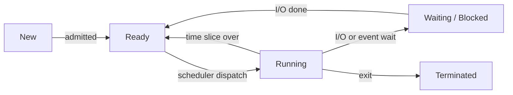
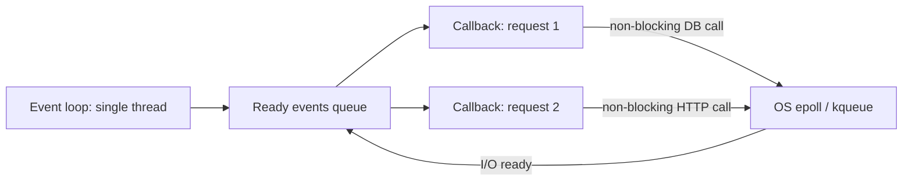

# Processes & Threads

Process ek chalta hua program hai jiska apna address space hai. Thread us process ke andar execution ki ek line hai jo memory share karti hai. "Process vs thread", context switch, IPC, scheduling aur "multithreading ya async?" wale sawal har backend interview me aate hain. Yahan woh sab crisp form me hai.

## ⭐ Process vs thread

**Ek line me:** process = isolated memory + resources ka dabba; thread = us dabbe ke andar chalne wala worker jo heap, code aur open files share karta hai, par apna stack aur registers rakhta hai.

> **Example:** Chrome har tab ko alag process me chalata hai, isliye ek tab crash ho to baaki bache rehte hain. Ek tab ke andar rendering, JS aur network alag threads pe chalte hain jo same memory share karte hain.

| | Process | Thread |
|---|---|---|
| Memory | Apna address space (code, heap, stack) | Heap, code, globals share; sirf stack + registers apne |
| Create cost | Mehenga (page tables, PCB, resources) | Sasta (sirf stack + TCB) |
| Context switch | Mehenga (address space badalta hai, TLB flush) | Sasta (same address space) |
| Isolation | Strong: ek crash dusre ko nahi maarta | Weak: ek thread ka segfault poora process gira deta hai |
| Communication | IPC chahiye (pipe, socket, shared memory) | Seedha shared variables (par locks chahiye) |
| Example | Chrome tabs, Postgres backend per connection | Tomcat request threads, JVM GC threads |

**Interview tip:** "Kab process, kab thread?" Isolation aur crash-safety chahiye (untrusted code, alag services) to process. Fast data sharing aur kam overhead chahiye (ek server me parallel requests) to threads.

**Common galti:** bolna "threads ki memory alag hoti hai". Sirf stack alag hai; heap shared hai, isi liye race conditions hoti hain.

## ⭐ Process states

**Ek line me:** process apni life me New → Ready → Running → Waiting → Terminated states se guzarta hai; scheduler Ready aur Running ke beech switch karata hai.



- **Ready:** CPU milte hi chal sakta hai, ready queue me baitha hai.
- **Running:** abhi CPU pe hai. Ek core pe ek time pe ek hi.
- **Waiting/Blocked:** disk read, network, lock ya sleep ka wait. CPU nahi maangta.
- Running → Ready = **preemption** (timer interrupt). Running → Waiting = khud block hua.

**Interview tip:** Waiting process ko kabhi seedha Running nahi bhejte; I/O complete hone pe woh pehle Ready queue me jaata hai.

**Common galti:** Ready aur Waiting ko same samajhna. Ready ko sirf CPU chahiye; Waiting ko kisi event ka intezaar hai.

## PCB (Process Control Block)

**Ek line me:** PCB kernel ka data structure hai jisme process ki poori "identity card" hoti hai, taaki use rok ke baad me wahi se chalaya ja sake.

PCB me kya hota hai:
- PID, parent PID, state
- Program counter aur CPU registers (context switch pe yahin save)
- Memory info: page table pointer, limits
- Open files table, sockets
- Scheduling info: priority, time used
- Linux me ye `task_struct` hai. Threads ka bhi apna `task_struct` hota hai (Linux thread = memory share karne wala lightweight process).

**Interview tip:** "Context switch me exactly kya save hota hai?" Registers, program counter, stack pointer PCB/TCB me; process switch ho to page table base register (CR3) bhi badalta hai.

## ⭐ Context switch cost

**Ek line me:** context switch = ek thread/process ka state save karke dusre ka load karna; ye pure overhead hai, is dauran koi useful kaam nahi hota.

- **Direct cost:** registers save/restore, kernel mode me jaana, scheduler chalana. Microseconds (~1–5 µs).
- **Indirect cost (asli dard):** CPU cache aur TLB thande ho jaate hain. Naya process alag address space use karta hai to TLB flush; data L1/L2 se nikal jaata hai.
- Thread switch (same process) process switch se sasta hai: address space same, TLB flush nahi.
- 10,000 threads wala server zyada time switching me ganwata hai, kaam me kam. Isi liye thread pools aur event loops.

**Interview tip:** "Zyada threads = zyada throughput?" Nahi. CPU-bound kaam ke liye threads ≈ cores. Uske upar sirf switching aur cache misses badhte hain.

**Common galti:** sirf direct cost gin-na aur cache/TLB pollution bhool jaana.

## User threads vs kernel threads

**Ek line me:** kernel threads ko OS schedule karta hai; user threads ko ek library/runtime user space me schedule karta hai, kernel ko unka pata bhi nahi.

| Model | Matlab | Pro | Con |
|---|---|---|---|
| 1:1 (kernel threads) | Har user thread = ek kernel thread | Sach me multi-core parallel, ek block ho to baaki chalte | Create aur switch mehenga, hazaron tak hi scale |
| N:1 (green threads) | Bahut saare user threads ek kernel thread pe | Bahut sasta | Ek blocking syscall sab rok deta hai, multi-core nahi |
| M:N (hybrid) | M user threads N kernel threads pe | Sasta + parallel | Runtime complex |

**Common galti:** sochna user-level threads automatically multi-core use karte hain. N:1 me ek hi core.

## Threads in Java and Go

**Ek line me:** Java platform thread = 1:1 OS thread; Java 21 virtual threads aur Go goroutines M:N model hain jo lakhon concurrent tasks sasta bana dete hain.

- **Java platform thread:** `new Thread(...)` ek OS thread, ~1 MB stack. Isliye `ExecutorService` thread pool use karte hain.
- **Java virtual threads (Java 21):** JVM inhe thode se carrier OS threads pe chalata hai. Blocking I/O pe virtual thread park ho jaata hai, carrier free. Lakhon bana sakte ho.
- **Go goroutines:** ~2 KB se shuru hone wala growable stack, Go runtime scheduler (G-M-P model) M:N pe chalata hai. Communication channels se.
- Details aur code: [Java Concurrency](../04-java/14-concurrency.md).

```java
// Java 21: 10,000 blocking tasks, sirf kuch OS threads pe
try (var ex = java.util.concurrent.Executors.newVirtualThreadPerTaskExecutor()) {
    for (int i = 0; i < 10_000; i++) {
        int id = i;
        ex.submit(() -> {
            Thread.sleep(100);          // virtual thread park hota hai, OS thread nahi
            return id;
        });
    }
} // close() saare tasks ka wait karta hai
```

**Interview tip:** virtual threads I/O-bound kaam ke liye hain, CPU-bound ke liye nahi. CPU-bound me cores hi limit hain.

## ⭐ IPC: Inter-process communication

**Ek line me:** processes ki memory alag hai, isliye data bhejne ke liye OS ke mechanisms chahiye: pipes, shared memory, message queues, sockets.

| Mechanism | Kaise | Speed | Kab use karo |
|---|---|---|---|
| Pipe / named pipe (FIFO) | Ek taraf likho, dusri taraf padho, byte stream | Medium | Parent-child, shell `ls \| grep` |
| Shared memory | Dono processes same physical pages map karte hain | Sabse fast (no copy) | Bada data, low latency; sync khud karo (semaphore) |
| Message queue | Kernel me structured messages ki queue | Medium | Decoupled, message boundaries chahiye |
| Socket (Unix/TCP) | Byte stream ya datagram, local ya network | Unix socket fast, TCP slower | Alag machines, client-server (Postgres, Docker daemon) |
| Signals | Chhota notification (SIGTERM, SIGKILL) | Fast, par data nahi | Process ko rokna, reload karna |

**Interview tip:** "Sabse fast IPC?" Shared memory, kyunki kernel ke through copy nahi hota. Par synchronization tumhari zimmedari hai.

**Common galti:** shared memory bina lock/semaphore ke use karna, phir race conditions.

## ⭐ CPU scheduling algorithms

**Ek line me:** scheduler decide karta hai Ready queue me se kaun agla CPU lega; goal hai throughput, kam waiting time, fairness aur fast response.

| Algorithm | Kaise | Pro | Con |
|---|---|---|---|
| FCFS | Jo pehle aaya pehle chalega, non-preemptive | Simple, fair order | Convoy effect: ek lamba job sabko rok deta hai |
| SJF / SRTF | Sabse chhota burst pehle (SRTF = preemptive version) | Average waiting time minimum (optimal) | Burst time pehle se pata nahi; lambe jobs starve |
| Round Robin | Har process ko fixed time quantum, phir queue ke end me | Fair, accha response time | Quantum chhota = zyada switches; bada = FCFS jaisa |
| Priority | Highest priority pehle (preemptive ya non) | Important kaam pehle | Starvation; fix = **aging** (wait ke saath priority badhao) |
| MLFQ | Kai queues alag priority/quantum; CPU-heavy neeche girta, I/O-heavy upar rehta | Burst pata kiye bina SJF jaisa behaviour, interactive fast | Tune karna mushkil, gaming possible |

- Linux ka **CFS** (Completely Fair Scheduler) har task ka "virtual runtime" track karta hai aur sabse kam wala chalata hai (red-black tree). Linux 6.6 se EEVDF.
- Metrics: turnaround time = finish − arrival, waiting time = turnaround − burst, response time = first run − arrival.

**Interview tip:** "Round Robin ka quantum kaise chunoge?" Context switch cost se kaafi bada (10–100 ms typical), par itna chhota ki interactive apps snappy lagein.

**Common galti:** SJF ko practical bolna. Burst time pata nahi hota; real OS MLFQ/CFS se approximate karte hain.

## ⭐ fork / exec

**Ek line me:** `fork()` current process ki copy (child) banata hai; `exec()` current process ke andar naya program load kar deta hai. Shell dono milake commands chalata hai.

```c
pid_t pid = fork();            // ab do processes chal rahe hain
if (pid == 0) {
    // child: fork() ne 0 return kiya
    execlp("ls", "ls", "-l", NULL);   // child ki memory "ls" se replace
    _exit(1);                  // exec fail hua tabhi yahan aate hain
} else {
    // parent: fork() ne child ka PID return kiya
    int status;
    waitpid(pid, &status, 0);  // child ko reap karo, warna zombie
}
```

- `fork()` ek baar call, **do baar return**: child me 0, parent me child PID, error pe -1.
- Modern fork **copy-on-write** use karta hai: pages tab tak share hote hain jab tak koi likhe nahi. Isliye fork sasta hai. ([Memory Management](07-memory-management.md))
- `exec` naya process nahi banata; PID wahi rehta hai, code/heap/stack replace hote hain.

**Interview tip:** "Shell `ls` kaise chalata hai?" fork → child me exec("ls") → parent `wait` karta hai.

## Zombie and orphan processes

**Ek line me:** zombie = mar chuka child jiska exit status parent ne abhi tak `wait()` se nahi padha; orphan = zinda child jiska parent pehle mar gaya.

| | Zombie | Orphan |
|---|---|---|
| Kya hua | Child exit hua, parent ne `wait()` nahi kiya | Parent exit hua, child abhi chal raha |
| Resource | Sirf process table entry (PID) | Normal running process |
| Kaun sambhalta | Parent ko `wait()` karna hoga, ya parent ko maaro | `init`/`systemd` (PID 1) adopt karke reap karta hai |
| `ps` me | State `Z`, `<defunct>` | Parent PID 1 dikhega |

**Interview tip:** zombies memory nahi khaate, par PIDs khatam kar sakte hain. Fix: parent me `SIGCHLD` handler jo `waitpid` kare. `kill -9` zombie pe kaam nahi karta, woh pehle se mara hua hai.

**Common galti:** container me PID 1 tumhara app ho aur woh children reap na kare, to zombies jama hote hain. `tini` ya `--init` use karo.

## ⭐ Multiprocessing vs multithreading vs async I/O

**Ek line me:** CPU-bound kaam ke liye multiple processes/threads (cores use karo); bahut saare I/O-bound connections ke liye async event loop (ek thread, non-blocking I/O).



| | Multiprocessing | Multithreading | Async I/O (event loop) |
|---|---|---|---|
| Parallelism | Sach me multi-core | Multi-core (language allow kare to) | Ek core pe concurrency |
| Memory | Har process ki alag, zyada | Shared, kam | Sabse kam |
| Best for | CPU-bound, isolation (Python ML, Nginx workers) | Mixed kaam, shared state (Java servers) | Hazaron idle/slow connections (Node.js, chat, proxies) |
| Risk | IPC overhead | Race conditions, deadlocks | Ek CPU-heavy callback poora loop rok deta hai |

- **Concurrency** = kai kaam ek saath progress kar rahe (interleave). **Parallelism** = kai kaam sach me ek saath alag cores pe.
- Python me GIL ki wajah se CPU-bound ke liye `multiprocessing`, I/O ke liye `asyncio`.
- Nginx/Node: kuch processes (har core ek) × har ek me event loop. Best of both.
- Real-time chat jaise systems ka backbone yahi hai: [Real-time communication](../01-topics/08-real-time-communication.md), [WhatsApp](../02-questions/t1-04-whatsapp-chat.md).

**Interview tip:** "10 lakh WebSocket connections ek server pe?" Thread-per-connection nahi chalega (1 MB stack × 10 lakh). Event loop + epoll, ya virtual threads/goroutines.

**Common galti:** event loop me CPU-heavy kaam (image resize, bada JSON parse) karna. Use worker thread/process pe bhejo.

## Kin system design questions me

- [Scaling basics](../01-topics/01-scaling-basics.md): vertical scaling, threads vs cores
- [Real-time communication](../01-topics/08-real-time-communication.md) aur [WhatsApp chat](../02-questions/t1-04-whatsapp-chat.md): event loop, lakhon connections
- [Job scheduler](../02-questions/t2-18-job-scheduler.md): worker pools, priority scheduling
- [Locks & contention](../01-topics/09-locks-and-contention.md): shared state threads ke beech

## Checklist

- [ ] Process vs thread memory, cost, isolation aur communication pe compare kar sakta hoon
- [ ] Process states draw karke har transition kab hota hai bata sakta hoon
- [ ] Context switch ki direct aur indirect (cache, TLB) cost samjha sakta hoon
- [ ] IPC mechanisms aur sabse fast kaunsa, kyun, bata sakta hoon
- [ ] FCFS, SJF, Round Robin, Priority, MLFQ ke pros/cons aur starvation fix bata sakta hoon
- [ ] fork/exec flow aur zombie vs orphan samjha sakta hoon
- [ ] CPU-bound vs I/O-bound kaam ke liye multiprocessing, multithreading ya async chun sakta hoon
