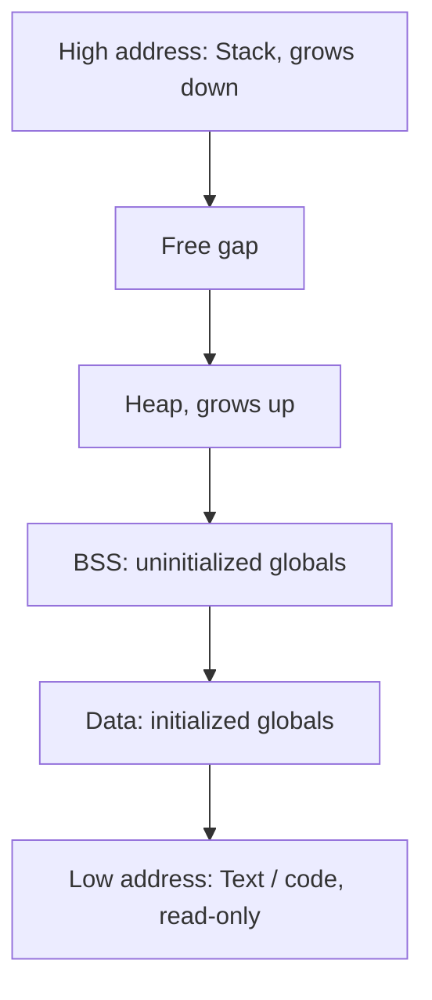
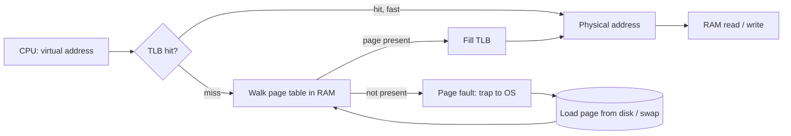

# Memory Management

OS har process ko ek private, bada, continuous memory ka bhram deta hai, jabki asli RAM chhoti hai aur sab processes me bati hui hai. Virtual memory, paging, TLB, page fault aur page replacement interview ke classic sawal hain. Saath me stack vs heap, cache locality aur OOM killer production debugging me kaam aate hain.

## ⭐ Stack vs heap

**Ek line me:** stack = function calls ke local variables, automatic aur fast; heap = runtime pe allocate hone wala data, jo function khatam hone ke baad bhi zinda rehta hai.

| | Stack | Heap |
|---|---|---|
| Kya rakhta hai | Local variables, function args, return address | `new`/`malloc` se bane objects |
| Allocation | Stack pointer khiskao, bahut fast | Allocator free block dhoondhta hai, slower |
| Free kaun karta | Function return pe automatic | Programmer (`free`) ya garbage collector |
| Size | Chhota, fixed per thread (Linux ~8 MB, Java ~1 MB) | Bada, RAM/limit tak |
| Sharing | Har thread ka apna | Saare threads share karte hain |
| Error | Stack overflow (deep recursion) | Memory leak, fragmentation, OOM |

**Interview tip:** "Infinite recursion se kya hota hai?" Har call ek stack frame jodta hai, stack limit cross hote hi stack overflow (Java me `StackOverflowError`).

**Common galti:** bolna "objects stack pe hote hain". Java me objects heap pe hote hain; stack pe sirf primitives aur references (escape analysis kabhi kabhi optimize karta hai).

## ⭐ Virtual memory and why

**Ek line me:** har process virtual addresses use karta hai; MMU (hardware) unhe page table ke through physical RAM addresses me translate karta hai.

Kyun chahiye:
- **Isolation:** process A process B ki memory dekh hi nahi sakta. Same virtual address, alag physical page.
- **Bada address space:** program ko lagta hai 128 TB hai, RAM 16 GB ho tab bhi. Kam use hone wale pages disk (swap) pe.
- **Simple programming:** har process ka layout same (code neeche, stack upar); linker ko physical address ki fikar nahi.
- **Sharing:** shared libraries (libc) RAM me ek baar, sab processes ke page tables usi ko point karte hain.
- **Lazy loading:** page tabhi RAM me aata hai jab touch ho (demand paging).

**Interview tip:** virtual memory sirf "RAM se zyada memory" nahi hai. Main fayda isolation aur protection hai (read-only code, no-execute stack).

## ⭐ Paging: page table, TLB, page fault

**Ek line me:** memory fixed size blocks me bati hai (virtual = pages, physical = frames, typical 4 KB); page table batata hai kaunsa page kis frame me hai, aur TLB is translation ka cache hai.

- **Virtual address = page number + offset.** 4 KB page me neeche ke 12 bits offset, baaki page number.
- **Page table entry:** frame number + bits: present, dirty, accessed, read/write, user/kernel.
- **Multi-level page table:** x86-64 me 4 levels. Single flat table 64-bit pe bahut bada hota; multi-level sirf used parts banata hai.
- **TLB:** CPU ke andar chhota cache (kuch sau/hazaar entries). Hit rate ~99%. Miss pe page table walk (kai memory reads).
- **Page fault:** page RAM me nahi hai. OS disk/swap se laata hai, page table update, instruction dobara chalata hai.
  - **Minor fault:** page RAM me hai par mapping nahi (jaise COW, first touch). Sasta.
  - **Major fault:** disk se padhna. Milliseconds, bahut mehenga.
  - Invalid address ho to page fault → **segmentation fault**, process killed.
- **Huge pages** (2 MB/1 GB): kam TLB entries me zyada memory cover. Databases aur JVM (`-XX:+UseLargePages`) ke liye faydemand.

**Interview tip:** "Page fault hamesha bura hai?" Nahi. Demand paging me har naya page pehli baar minor fault se hi aata hai. Major faults (disk) bure hain.

**Common galti:** page fault ko error samajhna. Ye normal mechanism hai; segfault tab hota hai jab address hi invalid ho.

## Segmentation

**Ek line me:** memory ko logical variable-size segments (code, data, stack) me baantna, har segment ka base + limit.

- Pro: programmer ke view se match karta hai, per-segment protection.
- Con: **external fragmentation** (alag size ke holes). Paging fixed size hone se external fragmentation nahi deta (sirf internal, last page me).
- Modern x86-64 me segmentation lagbhag band (flat model); paging hi asli mechanism hai.

**Interview tip:** "Paging vs segmentation?" Paging = fixed size, no external fragmentation, programmer ko invisible. Segmentation = variable size, logical, external fragmentation.

## ⭐ Page replacement: FIFO, LRU, Optimal

**Ek line me:** RAM full ho aur naya page chahiye to kisi purane page ko nikalna padega; algorithm decide karta hai kaun sa (victim).

| Algorithm | Kaise | Pro | Con |
|---|---|---|---|
| FIFO | Sabse purana load hua page nikalo | Simple | Hot page bhi nikal sakta; **Belady's anomaly** (zyada frames, zyada faults) |
| LRU | Jo sabse lambe time se use nahi hua, use nikalo | Locality pe accha, practical best | Exact LRU mehenga (har access pe update) |
| Optimal (OPT/MIN) | Jo future me sabse der se use hoga, use nikalo | Minimum faults, theoretical best | Future pata nahi; sirf benchmark ke liye |
| Clock / second chance | LRU approx: accessed bit dekho, 1 ho to 0 karke aage | Sasta, LRU ke kareeb | Exact nahi |

Example: frames = 3, references = `7 0 1 2 0 3 0 4`
- FIFO: 7,0,1 (3 faults) → 2 replaces 7 → 0 hit → 3 replaces 0 → 0 replaces 1 → 4 replaces 2. Total **7 faults**.
- LRU: 7,0,1 → 2 replaces 7 → 0 hit → 3 replaces 1 → 0 hit → 4 replaces 2. Total **6 faults**.

- Linux active/inactive lists (LRU approximation) use karta hai.
- Yahi idea application caches me: [LRU Cache LLD](../06-lld-problems/06-lru-cache.md), [Caching](../01-topics/05-caching.md).

**Interview tip:** "Exact LRU OS me kyun nahi?" Har memory access pe timestamp/list update hardware me bahut mehenga. Isliye accessed bit + Clock algorithm.

**Common galti:** Belady's anomaly ko LRU pe lagana. Ye FIFO me hota hai; LRU aur Optimal "stack algorithms" hain, inme nahi hota.

## ⭐ Thrashing

**Ek line me:** processes ka working set RAM me fit nahi hota, to system zyada time pages swap in/out karne me lagata hai aur asli kaam lagbhag ruk jaata hai.

- Lakshan: CPU utilization girta hai, disk I/O 100%, page fault rate aasmaan pe.
- Purane schedulers CPU idle dekh ke aur processes add karte the, jisse thrashing aur badh jaata.
- Fix: processes kam karo (degree of multiprogramming), RAM badhao, **working set model** ya page-fault-frequency control, memory limits (cgroups).
- Production me: Kubernetes pod memory limit ke paas swap/page cache thrash, ya Elasticsearch heap + OS cache ka galat balance.

**Interview tip:** "CPU 10% par server slow?" `vmstat` me `si/so` (swap in/out) aur major faults dekho. Thrashing ho sakta hai.

## Memory-mapped files

**Ek line me:** `mmap()` file ko process ke virtual address space me map kar deta hai; file ko array ki tarah padho/likho, OS page faults ke through data laata hai.

- `read()` me data kernel buffer → user buffer copy hota hai. mmap me copy nahi, page cache seedha map hota hai.
- Use: databases (LMDB, MongoDB ka purana MMAPv1, Kafka index files), shared libraries load karna, processes ke beech shared memory.
- Risk: I/O error SIGBUS ban ke aata hai, aur kab disk pe likha jayega uska control kam (`msync` chahiye). Isliye bahut DBs apna buffer pool rakhte hain.

**Interview tip:** Kafka zero-copy (`sendfile`) aur page cache pe tika hai, mmap aur page cache ka concept wahin pucha jaata hai: [Message queues & Kafka](../01-topics/07-message-queues-kafka.md).

## ⭐ Copy-on-write (COW)

**Ek line me:** do processes same physical page read-only share karte hain; jaise hi koi likhta hai, tabhi us page ki copy banti hai.

- `fork()` ko sasta banata hai: child turant poori memory copy nahi karta. Fork ke baad turant `exec` ho to copy kabhi hoti hi nahi.
- **Redis BGSAVE** isi pe tika hai: fork karke child snapshot disk pe likhta hai, parent writes leta rehta hai. Write-heavy load me bahut pages copy hote hain, memory 2x tak ja sakti hai.
- Filesystems (ZFS, Btrfs) aur Java ka `CopyOnWriteArrayList` same idea use karte hain.

**Interview tip:** "Redis snapshot ke time memory spike kyun?" COW: parent jo pages modify karta hai unki copy banti hai.

## ⭐ CPU cache hierarchy and locality

**Ek line me:** CPU aur RAM ki speed me bada gap hai, isliye beech me L1/L2/L3 caches hain; code tab fast hota hai jab data access pattern locality follow kare.

| Level | Typical size | Latency |
|---|---|---|
| Register | bytes | ~0.3 ns |
| L1 (per core) | 32–64 KB | ~1 ns |
| L2 (per core) | 256 KB – 2 MB | ~4 ns |
| L3 (shared) | 8–64 MB | ~10–20 ns |
| RAM | GBs | ~80–100 ns |
| SSD | TBs | ~100 µs |

- Data **cache lines** (64 bytes) me aata hai.
- **Temporal locality:** abhi use hua data jaldi dobara use hoga (loop variable).
- **Spatial locality:** paas ka data bhi jaldi use hoga (array traversal).
- Array row-wise traverse karna column-wise se kai guna fast ho sakta hai. ArrayList LinkedList se fast kyunki contiguous.
- **False sharing:** do threads alag variables likhte hain jo ek hi cache line me hain; line cores ke beech ping-pong karti hai. Fix: padding (Java `@Contended`).
- Numbers yaad rakhne ke liye: [Numbers cheatsheet](../01-topics/21-numbers-cheatsheet.md).

**Interview tip:** "Big-O same hai, phir bhi array LinkedList se fast kyun?" Cache locality. LinkedList ka har node random jagah, har step pe cache miss.

## OOM killer

**Ek line me:** Linux me memory khatam aur reclaim fail ho to OOM killer ek process (sabse zyada "badness" score wala) ko SIGKILL bhej deta hai.

- Score mostly memory usage pe; `/proc/<pid>/oom_score_adj` se tune (-1000 = kabhi mat maaro).
- Linux **overcommit** karta hai: `malloc` succeed ho jaata hai, asli RAM touch karne pe milti hai. Isliye OOM baad me aata hai.
- Containers me cgroup memory limit cross karo to container OOMKilled (Kubernetes exit code 137).
- Debug: `dmesg | grep -i oom`.

**Common galti:** JVM `-Xmx` container limit ke barabar rakhna. Heap ke alawa metaspace, thread stacks, direct buffers bhi memory lete hain; container OOMKilled ho jaata hai. Heap ~70–75% rakho.

## GC languages pointer

**Ek line me:** Java, Go, Python me programmer free nahi karta; garbage collector unreachable objects dhoondh ke heap memory wapas leta hai.

- OS ke liye JVM bas ek process hai jo bada heap mmap karta hai; uske andar GC apna kaam karta hai.
- Generational GC (young/old), stop-the-world pauses, G1/ZGC: [JVM & Memory](../04-java/11-jvm-memory.md).
- GC languages me bhi leak hota hai: static map me objects jodte raho, kabhi hatao nahi.

## Kin system design questions me

- [Caching](../01-topics/05-caching.md) aur [LRU Cache LLD](../06-lld-problems/06-lru-cache.md): eviction policies wahi LRU/FIFO
- [Message queues & Kafka](../01-topics/07-message-queues-kafka.md): page cache, zero-copy, sequential I/O
- [Distributed KV store](../02-questions/t2-20-distributed-kv-store.md): RAM vs disk, memory limits
- [Numbers cheatsheet](../01-topics/21-numbers-cheatsheet.md): cache, RAM, disk latencies

## Checklist

- [ ] Stack vs heap aur process memory layout samjha sakta hoon
- [ ] Virtual memory kyun chahiye (isolation, sharing, demand paging) bata sakta hoon
- [ ] Address translation draw kar sakta hoon: page table, TLB hit/miss, page fault (minor vs major)
- [ ] FIFO, LRU, Optimal pe page fault count nikaal sakta hoon aur Belady's anomaly bata sakta hoon
- [ ] Thrashing kya hai, kaise pehchaanu aur fix karu bata sakta hoon
- [ ] Copy-on-write aur mmap, aur Redis/Kafka me inka role samjha sakta hoon
- [ ] Cache hierarchy, locality aur false sharing samjha sakta hoon
- [ ] OOM killer aur container me JVM heap sizing ki galti bata sakta hoon
