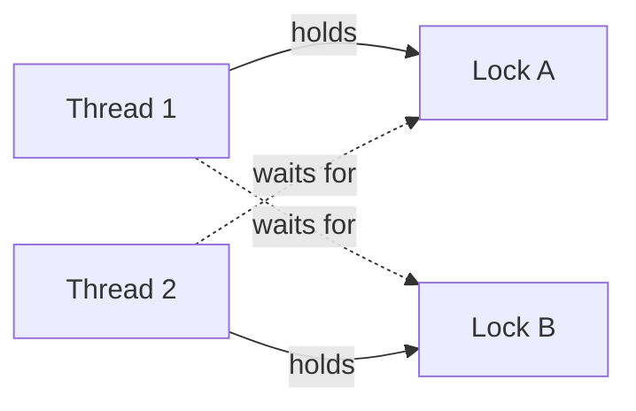

# Synchronization & Deadlocks

Jab kai threads shared data ko chhoote hain to unhe coordinate karna padta hai, warna data corrupt hota hai. Coordinate karne ke tools (mutex, semaphore, monitor) galat use ho to deadlock, livelock ya starvation aata hai. "Mutex vs semaphore", producer-consumer aur "deadlock ki 4 conditions" lagbhag har interview me poochhe jaate hain.

## ⭐ Race condition and critical section

**Ek line me:** race condition tab hoti hai jab result threads ke chalne ke order pe depend kare; critical section code ka woh hissa hai jo shared data chhoota hai aur ek time pe sirf ek thread chalna chahiye.

> **Example:** BookMyShow pe do log ek saath last seat book karte hain. Dono ne "seat free hai" padha, dono ne book kar di. Ek seat, do tickets.

```java
class Counter {
    int count = 0;
    void inc() { count++; }   // atomic nahi: read, add, write teen steps
}
// Thread A: read 5     Thread B: read 5
// Thread A: write 6    Thread B: write 6   -> ek increment gaya
```

Critical section solution ki 3 shartein:
- **Mutual exclusion:** ek time pe ek hi thread andar.
- **Progress:** koi andar nahi hai to wait karne wale me se koi andar jaa sake; bahar wale thread decide na rokein.
- **Bounded waiting:** koi thread hamesha ke liye wait na kare.

**Interview tip:** `count++` ek instruction dikhta hai par read-modify-write hai. Fix: lock, ya atomic (`AtomicInteger`, CAS).

**Common galti:** sirf write ko lock karna aur read ko nahi. Check-then-act (`if (free) book()`) poora ek critical section hai.

## ⭐ Mutex vs semaphore vs monitor vs spinlock

**Ek line me:** mutex = ek owner wala lock; semaphore = counter jo N threads ko andar aane deta hai; monitor = lock + condition variables language level pe; spinlock = lock jo sone ki jagah loop me ghoomta hai.

| | Mutex | Binary semaphore | Counting semaphore | Monitor | Spinlock |
|---|---|---|---|---|---|
| Kya hai | Lock with ownership | Value 0/1 | Value 0..N | Lock + condition variables, language construct | Busy-wait lock |
| Ownership | Haan, jo lock kare wahi unlock | Nahi, koi bhi signal kar sakta | Nahi | Haan (implicit) | Haan |
| Kitne andar | 1 | 1 | N | 1 | 1 |
| Wait kaise | Thread so jaata hai (block) | Block | Block | Block | CPU pe loop |
| Use | Shared data protect karna | Signaling (event hua) | Resource pool (DB connections, rate limit) | Java `synchronized` + `wait/notify` | Kernel, bahut chhote critical sections, multi-core |

- **Mutex vs binary semaphore:** dono me ek hi andar, par mutex ka owner hota hai (sirf lock karne wala unlock kare, priority inheritance ho sakta). Semaphore signaling ke liye hai: thread A `signal`, thread B `wait`.
- **Spinlock** tab accha jab lock sirf kuch nanoseconds ke liye pakda jaye; sone/jaagne ka context switch spin se mehenga. Single core pe spinlock bekaar.
- Java: `synchronized` aur `ReentrantLock` = mutex/monitor, `Semaphore` = counting semaphore. Details: [Java Concurrency](../04-java/14-concurrency.md).

```java
// Counting semaphore: max 10 concurrent DB calls
Semaphore permits = new Semaphore(10);
void query() throws InterruptedException {
    permits.acquire();          // 0 ho to block
    try { db.run(); }
    finally { permits.release(); }
}
```

**Interview tip:** "Mutex aur binary semaphore same hain?" Nahi. Ownership ka farak hai: mutex locking ke liye, semaphore signaling aur counting ke liye.

**Common galti:** `finally` me unlock bhool jaana. Exception aaya to lock kabhi release nahi hoga.

## ⭐ Condition variables

**Ek line me:** condition variable thread ko kisi condition ke sach hone tak sone deta hai, aur lock chhod deta hai taaki dusra thread condition badal sake.

- Operations: `wait()` (lock chhodo + so jao, jaagne pe lock wapas lo), `signal()/notify()` (ek ko jagao), `broadcast()/notifyAll()` (sabko).
- Hamesha **lock ke andar** aur **`while` loop me** wait karo, `if` me nahi. Kyun: **spurious wakeup** ho sakta hai, ya jaagne tak kisi aur ne condition badal di.

```java
synchronized (lock) {
    while (!ready) {    // if nahi, while
        lock.wait();    // lock release, so jao
    }
    // ready true hai, aage badho
}
```

**Common galti:** `if (!ready) wait();` likhna. Spurious wakeup pe thread galat state me aage chala jaata hai.

## ⭐ Producer-consumer (bounded buffer)

**Ek line me:** producers buffer me items daalte hain, consumers nikalte hain; buffer full ho to producer ruke, khali ho to consumer ruke.

> **Example:** Swiggy order service orders queue me daalti hai, delivery assignment workers nikaalte hain. Kafka aur thread pool ki task queue isi pattern pe hain.

Semaphore wala classic solution (pseudo):

```text
empty = Semaphore(N)    // khaali slots
full  = Semaphore(0)    // bhare slots
mutex = Mutex()

producer:                    consumer:
  wait(empty)                  wait(full)
  lock(mutex)                  lock(mutex)
  buffer.add(item)             item = buffer.remove()
  unlock(mutex)                unlock(mutex)
  signal(full)                 signal(empty)
```

Java me condition variables ke saath:

```java
class BoundedBuffer<T> {
    private final Queue<T> q = new ArrayDeque<>();
    private final int cap;
    private final ReentrantLock lock = new ReentrantLock();
    private final Condition notFull = lock.newCondition();
    private final Condition notEmpty = lock.newCondition();

    BoundedBuffer(int cap) { this.cap = cap; }

    void put(T x) throws InterruptedException {
        lock.lock();
        try {
            while (q.size() == cap) notFull.await();
            q.add(x);
            notEmpty.signal();
        } finally { lock.unlock(); }
    }

    T take() throws InterruptedException {
        lock.lock();
        try {
            while (q.isEmpty()) notEmpty.await();
            T x = q.poll();
            notFull.signal();
            return x;
        } finally { lock.unlock(); }
    }
}
```

- Real code me `ArrayBlockingQueue` / `LinkedBlockingQueue` use karo; andar yahi hai.

**Interview tip:** semaphore version me order matter karta hai. Producer pehle `mutex` le aur phir `wait(empty)` kare, to buffer full hone pe woh mutex pakad ke so jayega aur consumer andar nahi aa payega: deadlock.

## Readers-writers problem

**Ek line me:** bahut saare readers ek saath padh sakte hain, par writer ko akele (exclusive) access chahiye.

- **Readers-preference:** koi reader andar hai to naye readers aate rahein; writer starve ho sakta hai.
- **Writers-preference:** writer wait kar raha ho to naye readers ruk jaayein; readers starve ho sakte hain.
- Java: `ReentrantReadWriteLock` (fair mode option), `StampedLock` (optimistic reads).

```java
ReadWriteLock rw = new ReentrantReadWriteLock();
String get(String k) {
    rw.readLock().lock();            // kai readers saath me
    try { return map.get(k); } finally { rw.readLock().unlock(); }
}
void put(String k, String v) {
    rw.writeLock().lock();           // akela writer
    try { map.put(k, v); } finally { rw.writeLock().unlock(); }
}
```

**Interview tip:** read-heavy data (config, product catalog cache) ke liye RW lock. Write zyada ho to simple mutex aksar utna hi fast.

## ⭐ Deadlock: 4 Coffman conditions

**Ek line me:** deadlock = threads ka group jahan har thread kisi aisi cheez ka wait kar raha hai jo group ka hi koi dusra thread pakde hue hai; koi aage nahi badhta.



Deadlock tabhi hota hai jab **chaaron** ek saath sach hon:

| Condition | Matlab | Todne ka tareeka |
|---|---|---|
| Mutual exclusion | Resource ek time pe ek ke paas | Shareable banao (read-only data, lock-free structures) |
| Hold and wait | Ek resource pakad ke dusre ka wait | Saare resources ek saath maango, ya kuch pakda ho to maango hi mat |
| No preemption | Pakda hua resource zabardasti cheena nahi ja sakta | `tryLock` timeout ke saath; fail ho to apne locks chhodo |
| Circular wait | T1 → T2 → ... → T1 wait ka cycle | **Lock ordering**: sab ek global order me locks lein |

```java
// Deadlock: transfer(a, b) aur transfer(b, a) ek saath
void transfer(Account from, Account to, int amt) {
    synchronized (from) {
        synchronized (to) { from.debit(amt); to.credit(amt); }
    }
}
```

**Interview tip:** "Deadlock ki 4 conditions?" naam + ek line har ek ka, aur bolo "practically sabse aasaan circular wait todna hai, lock ordering se".

## Prevention, avoidance, detection, recovery

**Ek line me:** prevention = design se ek condition hata do; avoidance = har request pe check karo ki system safe rahega; detection = hone do, cycle dhoondho; recovery = victim maaro ya rollback.

| Approach | Kaise | Cost | Kahan |
|---|---|---|---|
| Prevention | 4 me se ek condition todo (lock ordering, sab ek saath lo) | Kam concurrency, par simple | Application code |
| Avoidance | Banker's algorithm: request tabhi do jab safe state bani rahe | Max need pehle se pata hona chahiye, mehenga | Theory, kuch embedded systems |
| Detection | Wait-for graph banao, cycle dhoondho | Periodic check | Databases (Postgres, MySQL InnoDB) |
| Recovery | Ek victim abort/rollback, ya resource preempt | Kaam waste | DB transaction abort karke retry |
| Ignore (ostrich) | Kuch mat karo, rare hai | Zero | Zyaadatar general OS |

**Banker's algorithm (brief):** har process apni maximum need batata hai. Request aane pe OS pretend karta hai ki de diya, phir check karta hai kya koi order hai jisme sab processes apni max need paa ke khatam ho sakte hain (**safe state**). Haan to do, nahi to wait karao. Safe state = deadlock pakka nahi; unsafe = deadlock ho sakta hai (zaroori nahi).

- Databases deadlock detect karke ek transaction abort karte hain (`ERROR: deadlock detected`); app ko retry karna chahiye: [Idempotency & retries](../01-topics/10-idempotency-retries.md).

**Common galti:** unsafe state ko deadlock bolna. Unsafe ka matlab sirf "guarantee nahi".

## ⭐ Lock ordering

**Ek line me:** saare threads locks ko hamesha ek fixed global order me lein (jaise account id ke ascending order me); circular wait ho hi nahi sakta.

```java
void transfer(Account a, Account b, int amt) {
    Account first  = a.id < b.id ? a : b;   // hamesha chhota id pehle
    Account second = a.id < b.id ? b : a;
    synchronized (first) {
        synchronized (second) { a.debit(amt); b.credit(amt); }
    }
}
```

- Alternative: `tryLock(timeout)`; dono na mile to jo mila use chhodo, random backoff, retry.
- Lock ke andar slow kaam (network call, DB call) mat karo; locks jitne chhote, deadlock aur contention utna kam.

**Interview tip:** Paytm wallet transfer ya Splitwise settlement me do accounts lock karne hon to "id order me lock" turant bolo.

## Livelock and starvation

**Ek line me:** livelock = threads busy hain aur state badal rahe hain par koi progress nahi; starvation = ek thread ko resource kabhi milta hi nahi kyunki dusre hamesha aage nikal jaate hain.

| | Deadlock | Livelock | Starvation |
|---|---|---|---|
| Threads ki state | Blocked, so rahe | Running, CPU kha rahe | Baaki chal rahe, ek pichhe |
| Progress | Kisi ki nahi | Kisi ki nahi | Baaki ki hai, ek ki nahi |
| Example | Do threads ek dusre ka lock | Gali me do log ek hi side hat-te rehte hain | Low priority thread, readers-preference me writer |
| Fix | Lock ordering, timeout | Random backoff | Fair locks, aging, FIFO queue |

- Java `new ReentrantLock(true)` = fair lock (FIFO), starvation kam par throughput kam.

## Dining philosophers

**Ek line me:** 5 philosophers gol table pe, beech me 5 forks; khaane ke liye dono taraf ke forks chahiye. Sab pehle left fork uthayein to sab right ka wait karenge: deadlock.

Solutions:
- **Resource ordering:** forks ko number do, har philosopher pehle chhota number wala uthaye. Aakhri philosopher ulta order lega, cycle toot gaya.
- **Max 4 ko baithne do** (semaphore(4)): kam se kam ek ko dono forks milenge.
- **Dono ek saath uthao ya koi nahi** (waiter/arbitrator ke through, ya `tryLock` dono pe).
- Sirf "fork na mile to rakh do aur retry" bina random delay ke = livelock.

**Interview tip:** ye problem lock ordering aur hold-and-wait todne ko explain karne ka sabse aasaan tareeka hai.

## Distributed lock pointer

**Ek line me:** mutex sirf ek process ke andar kaam karta hai; kai servers ke beech lock chahiye to Redis, ZooKeeper/etcd ya DB row lock use karte hain.

- Naye masle: lock holder crash ho jaye (TTL/lease chahiye), GC pause me lease expire (fencing token chahiye), network partition.
- Details aur BookMyShow seat locking: [Locks & contention](../01-topics/09-locks-and-contention.md), [BookMyShow](../02-questions/t1-05-bookmyshow.md).

**Common galti:** ek JVM ka `synchronized` multi-instance deployment me use karna. Har instance ka apna lock, protection zero.

## Kin system design questions me

- [Locks & contention](../01-topics/09-locks-and-contention.md): optimistic vs pessimistic, distributed locks
- [BookMyShow](../02-questions/t1-05-bookmyshow.md) aur [Flash sale](../02-questions/t2-15-flash-sale.md): seat/stock pe race condition
- [Payment system](../02-questions/t1-11-payment-system.md): do accounts lock karna, deadlock se bachna
- [Message queues & Kafka](../01-topics/07-message-queues-kafka.md): producer-consumer at system scale

## Checklist

- [ ] Race condition ka example aur critical section ki 3 shartein bata sakta hoon
- [ ] Mutex, semaphore (binary/counting), monitor aur spinlock ka farak aur use bata sakta hoon
- [ ] Condition variable ke saath `while` me wait kyun karte hain samjha sakta hoon
- [ ] Producer-consumer aur readers-writers ka code/pseudo likh sakta hoon
- [ ] Deadlock ki 4 Coffman conditions aur har ek todne ka tareeka bata sakta hoon
- [ ] Prevention, avoidance (Banker's), detection aur recovery compare kar sakta hoon
- [ ] Lock ordering se transfer deadlock fix kar sakta hoon aur livelock/starvation se farak bata sakta hoon
- [ ] Dining philosophers ke solutions aur distributed lock kab chahiye bata sakta hoon
