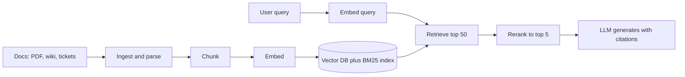

# What is RAG

RAG (Retrieval-Augmented Generation) ka matlab: LLM se answer likhwane se pehle apne documents me se relevant text dhoondho aur prompt me daal do. Model "yaad" se nahi, diye gaye context se jawab deta hai. Interview me poocha jaata hai: RAG kyun, fine-tuning se kaise alag, pipeline ke steps kya hain, aur RAG fail kahan hota hai.

## ⭐ RAG kya hai aur kyun chahiye

**Ek line me:** RAG = search + LLM; pehle relevant chunks retrieve karo, phir LLM ko bolo "sirf is context se answer do".

> **Example:** Company ka HR policy bot. Employee poochta hai "paternity leave kitne din ki hai?". LLM ko tumhari company ki policy pata hi nahi. RAG policy PDF se sahi paragraph nikaal ke prompt me deta hai, LLM usse answer + citation likhta hai.

LLM akele kyun kaafi nahi:
- **Knowledge cutoff:** model training ke baad ka data nahi jaanta.
- **Private data:** tumhare internal docs, tickets, contracts model ne kabhi dekhe hi nahi.
- **Hallucination:** pata na ho to bhi confident answer bana deta hai.
- **Citations nahi:** user verify nahi kar sakta ki answer kahan se aaya.

RAG kya deta hai:
- Fresh data → doc update karo, re-index karo, model retrain nahi.
- Grounded answers → har answer ke saath source (doc, page).
- Access control → user ko sirf wahi chunks milenge jo wo dekh sakta hai.

**Interview tip:** "RAG model ka knowledge nahi badalta, sirf har query pe usko sahi open-book notes deta hai."

**Common galti:** sochna ki RAG se hallucination zero ho jaata hai. Galat chunk retrieve hua to LLM galat answer confidently dega.

## ⭐ RAG vs fine-tuning vs long context

**Ek line me:** RAG = naya *knowledge* dena; fine-tuning = *behaviour/style* sikhana; long context = sab kuch prompt me thoons dena.

| | RAG | Fine-tuning | Long context |
|---|---|---|---|
| Kya sikhata hai | facts, fresh docs | format, tone, task skill | jo bhi prompt me ho |
| Data update | re-index, minutes | retrain, hours-days | har request me bhejo |
| Citations | haan, easy | nahi | possible, mushkil |
| Cost per query | retrieval + chhota prompt | sasta inference | bahut tokens, mehenga |
| Bada corpus (GBs) | haan | nahi | context limit me nahi aata |
| Access control | per-chunk filter | nahi | manually |

- Long context ki dikkat: tokens ka cost aur latency, aur **lost-in-the-middle** (beech ka text model ignore karta hai).
- Fine-tuning facts yaad karane ka reliable tareeka nahi; hallucination phir bhi hota hai.
- Practice me combo: RAG for knowledge + thoda fine-tune for format, ya chhote corpus (kuch docs) pe seedha long context.

**Interview tip:** "Data badalta rehta hai ya private hai to RAG. Model ka output style/format badalna hai to fine-tune. Corpus chhota hai (ek-do docs) to long context hi simple hai."

**Common galti:** "Company docs pe chatbot banana hai, fine-tune kar dete hain" bolna. Docs har hafte badlenge, citations nahi milenge.

## ⭐ Poori pipeline: ingest se generate tak

**Ek line me:** offline me docs ko tod ke embed karke store karo; online me query ke liye relevant chunks nikaalo, rerank karo, LLM ko do.

Offline (indexing):
- **Ingest:** PDF/HTML/Confluence se text nikaalo, OCR, cleaning, tables sambhalo.
- **Chunk:** text ko 300–800 token ke pieces me todo, metadata ke saath. → [Chunking](03-chunking.md)
- **Embed:** har chunk ka vector banao (same model jo query pe chalega). → [Semantic search](02-semantic-search.md)
- **Store:** vector DB (HNSW index) + optional BM25 index. → [Vector databases](../05-db/11-vector.md)

Online (query):
- **Retrieve:** query embed karo, top 20–50 candidates nikaalo (dense ya hybrid). → [Hybrid search](04-hybrid-search.md)
- **Rerank:** cross-encoder se candidates ko precisely re-score, top 3–5 rakho. → [Reranking](05-reranking.md)
- **Generate:** prompt = instructions + chunks + question; "context se bahar mat jao, source cite karo".

**Interview tip:** design round me pipeline ko do hisson me bolo: "indexing path offline/async, query path latency-critical". Ye clarity dikhata hai.

**Common galti:** sirf query path draw karna aur ingestion (parsing, re-indexing, deletes) bhool jaana.

## ⭐ RAG kyun fail hota hai (aur fix kahan hai)

**Ek line me:** zyada tar RAG failures LLM ki wajah se nahi, retrieval ki wajah se hote hain: sahi chunk mila hi nahi, ya mila par galat jagah/aadha mila.

| Failure | Kya hota hai | Fix (page) |
|---|---|---|
| Chunk beech se kata | table/argument aadha, LLM gap bharta hai | [Chunking](03-chunking.md), [PageIndex](06-pageindex.md) |
| Exact term miss | error code, SKU, section no. nahi milta | [Hybrid search](04-hybrid-search.md) |
| Sahi chunk position 4–5 pe | LLM usse kam weight deta hai | [Reranking](05-reranking.md) |
| Query vague ya multi-part | retrieval galat cheez laata hai | [Advanced retrieval](07-advanced-retrieval.md) |
| Multi-page / cross-reference | "pichle page ki table" toot jaati hai | [PageIndex](06-pageindex.md) |
| Kuch naapa hi nahi | change accha hua ya bura, pata nahi | [RAG evaluation](08-rag-evaluation.md) |
| Prod me slow, 429s, timeouts | ingestion blocking, rate limits | [Production RAG API](09-production-rag-api.md) |
| Purana data, leak | stale index, ACL filter missing | [Production RAG API](09-production-rag-api.md) |

- Debug order: pehle dekho **retrieved chunks me answer tha ya nahi**. Nahi tha → retrieval problem. Tha → prompt/generation problem.

**Interview tip:** "Main pehle retrieval aur generation ko alag naapunga: recall@k retrieval ke liye, faithfulness answer ke liye."

**Common galti:** bad answers pe seedha bada LLM ya naya prompt try karna, bina retrieved context dekhe.

## Kahan aur padho

- [Vector databases](../05-db/11-vector.md): embeddings, HNSW, filtering, pgvector. Detail yahan padho.
- [Search: Elasticsearch](../05-db/08-search.md): inverted index aur BM25.
- [RAG lab](/viewinter/agents/labs/rag): browser me PDF-chat RAG chala ke dekho.
- Next: [Semantic search](02-semantic-search.md), [Chunking](03-chunking.md).

## Checklist

- [ ] RAG kya hai aur LLM akele kyun kaafi nahi, samjha sakta hoon
- [ ] RAG vs fine-tuning vs long context kab kaunsa, bata sakta hoon
- [ ] Ingest → chunk → embed → store → retrieve → rerank → generate pipeline draw kar sakta hoon
- [ ] Offline indexing path aur online query path alag kar ke samjha sakta hoon
- [ ] RAG ke main failure modes aur unke fixes bata sakta hoon
- [ ] Bad answer pe retrieval vs generation problem debug kar sakta hoon
