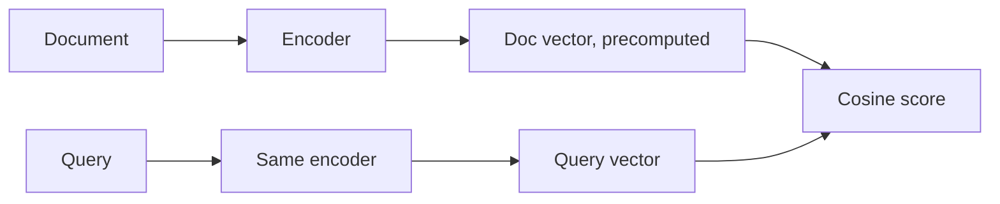

# Semantic Search

Semantic search words nahi, **matlab** match karta hai. Data aur query dono ko embeddings (vectors) me badlo, phir query ke sabse paas wale vectors nikaalo. RAG ka retrieval step yahi hai. Interview me poocha jaata hai: keyword search kab fail hota hai, embeddings kaise kaam karte hain, bi-encoder kya hai, aur embedding model kaise chunoge.

## ⭐ Keyword vs semantic search

**Ek line me:** keyword search (BM25, `LIKE`) same words dhoondhta hai; semantic search same *meaning* dhoondhta hai, chahe words alag hon.

> **Example:** Swiggy support bot pe user likhta hai "khana thanda aaya, paise wapas chahiye". Help doc ka title hai "Refund for cold or spoiled food". Keyword search ko common word hi nahi mila; semantic search dono ko paas rakhta hai.

- **Semantic gap:** DB me data stored hai, par jaise insaan "similar" samajhta hai waise query nahi kar sakte. `WHERE tags LIKE '%smiling person%'` milti-julti photos miss kar deta hai.
- Semantic search kab: meaning/context matter kare ("Golden Brown jaise songs"), synonyms/paraphrase ho, unstructured data ho (text, image, audio).
- Keyword search kab: exact identifiers (`ERR_CONN_RESET`, SKU, order id, section number), naam, jargon.

| | Keyword (BM25) | Semantic (dense vectors) |
|---|---|---|
| Match karta hai | exact tokens | meaning |
| Synonyms | miss | pakad leta hai |
| Error codes, SKUs | strong | weak, blur ho jaate hain |
| Explainable | haan | mushkil |
| Infra | inverted index, CPU | embedding model + vector index |

**Interview tip:** "Dense aur sparse alag-alag tareeke se fail hote hain, isliye production me dono milate hain (hybrid)." → [Hybrid search](04-hybrid-search.md)

**Common galti:** semantic search ko keyword search ka upgrade samajhna. Product codes pe ye keyword se bura karta hai.

## ⭐ Embeddings ka intuition

**Ek line me:** embedding model kisi bhi text/image ko fixed-length number list me badalta hai; matlab me paas wali cheezein vector space me paas aati hain.

- Model ki neeche wali layers basic features pakadti hain (words, edges); upar wali layers abstract matlab ("1980s psychedelic rock vibe").
- Output **fixed length** hota hai: `all-MiniLM-L6-v2` → 384 dims, OpenAI `text-embedding-3-small` → 1536 dims.
- Closeness cosine similarity se naapte hain. Metrics, memory math aur dims ka detail → [Vector databases](../05-db/11-vector.md).
- Modality ke hisaab se model: text → Sentence Transformers/BERT, image+text → CLIP, audio → CLAP/wav2vec.

Do phases:
- **Ingestion:** har item embed karo → vector + metadata (source, date, tags) vector DB me store.
- **Query:** query ko **same model** se embed karo → ANN search → top-K by similarity → optional metadata filter / rerank.

**Interview tip:** "Semantic search meaning ko math me badalta hai, smartly store karta hai, aur neighbours jaldi dhoondhta hai."

**Common galti:** query aur docs ko alag models se embed karna. Dono alag vector spaces me hain, scores bekaar.

## ⭐ Bi-encoder: retrieval itna fast kyun hai

**Ek line me:** bi-encoder query aur document ko **alag-alag** encode karta hai, isliye documents ke vectors pehle se (offline) ban sakte hain; query time pe sirf query encode hoti hai.

- Fayda: crore documents me milliseconds me search (ANN index ke saath).
- Nuksaan: query aur doc ke words kabhi ek saath "dekhe" nahi jaate, sirf gist-to-gist compare. Isliye ranking imprecise.
- Cross-encoder (query + doc ek saath model me) zyada accurate par har candidate pe ek forward pass, isliye sirf top 50 pe chalate hain. → [Reranking](05-reranking.md)
- ANN (HNSW, IVF) kaise kaam karta hai → [Vector databases](../05-db/11-vector.md).

**Interview tip:** "Stage 1 bi-encoder recall ke liye, Stage 2 cross-encoder precision ke liye."

**Common galti:** bi-encoder se top-1 ko hamesha sahi maan lena. Embedding models rank karne ke liye train nahi hote.

## Embedding model kaise chunein

**Ek line me:** apne data aur queries pe eval karke chuno; leaderboard (MTEB) sirf starting point hai.

| Factor | Kya dekhna hai |
|---|---|
| Quality | apne golden set pe recall@k |
| Language | Hindi/Hinglish users → multilingual model (e5, bge-m3) |
| Dimensions | kam dims = kam memory, tez search |
| Max input tokens | chunk size se bada hona chahiye |
| Hosting | API (OpenAI, Cohere) vs self-host (bge, e5, MiniLM) |
| Cost / rate limits | API pe per-token cost, 429s |
| Domain | legal/medical/code ke liye domain model better |

- Chhota local model (`all-MiniLM-L6-v2`) fast aur free; API model aam taur pe better quality.
- Model badla → **poora corpus re-embed** karna padega. `embedding_model` version metadata me rakho.

**Interview tip:** "Main 50–100 real queries ka golden set banaunga aur 2–3 models ka recall@5 compare karunga, phir cost/latency dekh ke chununga."

**Common galti:** sirf leaderboard rank dekh ke model chunna, bina apne domain pe test kiye.

## Kahan aur padho

- [Vector databases](../05-db/11-vector.md): cosine/dot/L2, exact vs ANN, HNSW, pgvector. Detail yahan padho.
- [Search: Elasticsearch](../05-db/08-search.md): BM25 aur inverted index.
- [Hybrid search](04-hybrid-search.md), [Reranking](05-reranking.md).
- [RAG lab](/viewinter/agents/labs/rag): khud semantic retrieval chala ke dekho.

## Checklist

- [ ] Keyword vs semantic search ka fark aur kab kaunsa, bata sakta hoon
- [ ] Embedding kya hai aur ingestion/query ke do phases samjha sakta hoon
- [ ] Bi-encoder fast kyun hai aur imprecise kyun, samjha sakta hoon
- [ ] Same embedding model query aur docs pe kyun zaroori hai, bata sakta hoon
- [ ] Embedding model chunne ke factors aur eval approach bata sakta hoon
