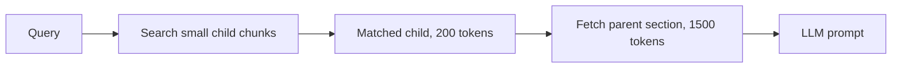

# Chunking

Chunking = documents ko chhote pieces me todna jinko embed karke retrieve kiya jaata hai. RAG ki quality ka bada hissa yahin decide hota hai: chunk galat kata to sahi answer kabhi retrieve hi nahi hoga. Interview me poocha jaata hai: kaunsi strategies hain, chunk size kaise chunoge, overlap kyun, aur parent-child kya hai. Basic pipeline (size range, overlap, metadata, updates) [Vector databases](../05-db/11-vector.md) ke "chunking aur embedding pipeline" section me hai, wahan padho; yahan uske aage ki baat hai.

## ⭐ Chunking strategies

**Ek line me:** fixed-size sabse simple, recursive sabse common default, semantic aur structure-aware zyada smart par mehenge.

> **Example:** Company ki leave policy PDF. Fixed 500 tokens pe kaato to "Maternity leave" ka heading ek chunk me aur uski table agle chunk me chali jaati hai. Structure-aware chunking heading + table ko ek saath rakhta hai.

| Strategy | Kaise todta hai | Kab use karo |
|---|---|---|
| Fixed-size | har N tokens, overlap ke saath | uniform text, quick baseline |
| Recursive | paragraph → line → sentence → word, size limit tak | default for most text |
| Semantic | sentence embeddings me topic badle wahan | lambe mixed-topic docs |
| Structure-aware | headings, sections, tables, code blocks | Markdown, HTML, wiki, PDFs with headings |
| Page-level | ek page = ek unit | reports, contracts, specs → [PageIndex](06-pageindex.md) |

- **Fixed-size:** sasta aur predictable, par sentence/table beech se kaat deta hai.
- **Recursive:** pehle bade separator (`\n\n`) pe todne ki koshish, chunk bada ho to chhote separator pe. Natural boundaries zyada respect hoti hain.
- **Semantic:** consecutive sentences ke embeddings compare karo; similarity achanak gire to wahan split. Ingestion pe extra embedding cost.
- **Structure-aware:** document ka apna structure use karo. Table aur code block kabhi mat kaato.

```python
from langchain_text_splitters import RecursiveCharacterTextSplitter

splitter = RecursiveCharacterTextSplitter(
    chunk_size=2000,          # characters, roughly 500 tokens
    chunk_overlap=200,
    separators=["\n\n", "\n", ". ", " "],
)
chunks = splitter.split_text(policy_text)
```

**Interview tip:** "Recursive splitter se shuru karunga, documents structured hain to headings pe split karunga, aur eval set pe compare karunga."

**Common galti:** sab document types (FAQ, contract, code) pe ek hi fixed-size chunker lagana.

## ⭐ Chunk size aur overlap ka trade-off

**Ek line me:** chhota chunk = precise match par context kam; bada chunk = context poora par embedding blur aur prompt me noise.

| | Chhote chunks (100–300 tokens) | Bade chunks (800–1500 tokens) |
|---|---|---|
| Retrieval precision | high, sharp embedding | kam, kai topics mix |
| Context for LLM | aksar aadha, gap bharta hai | poora argument/table |
| Chunks ki count | zyada, zyada storage | kam |
| Achha for | factoid Q ("leave kitne din?") | "explain", "compare" type Q |

- Common default: roughly **300–800 tokens**, overlap **10–20%** (jaise 512 tokens, 50 overlap).
- **Overlap kyun:** boundary pe pada sentence dono chunks me aa jaata hai, isliye kat ke lost nahi hota. Zyada overlap = duplicate chunks, storage aur cost badhta hai.
- Embedding model ki **max input** se bada chunk mat banao; warna silently truncate ho jaata hai.
- Size guess mat karo: 2–3 sizes pe recall@k naapo. → [RAG evaluation](08-rag-evaluation.md)

**Interview tip:** "Chunk size query type pe depend karta hai: short factual queries ke liye chhota, explanatory ke liye bada. Final number eval se aata hai."

**Common galti:** "bada chunk = zyada context = better" maan lena. Bade chunk ka embedding kai topics ka average ban jaata hai aur retrieve hi nahi hota.

## ⭐ Parent-child (small-to-big) chunking

**Ek line me:** chhote child chunks pe search karo (precise match), par LLM ko unka bada parent chunk/section do (poora context).



- Index me sirf child embeddings; har child ke metadata me `parent_id`.
- Retrieval ke baad `parent_id` se parent text laao; ek parent ke kai children match hon to dedupe karo.
- Variants: **sentence window** (match sentence + aage-peeche ke 2–3 sentences), page-level retrieve with paragraph serving ([PageIndex](06-pageindex.md)).
- Trade-off: prompt me zyada tokens; parent bahut bada ho to cost aur noise badhega.

**Interview tip:** "Precision aur context dono chahiye to chunk size ka compromise nahi, parent-child use karo: search small, serve big."

**Common galti:** parent-child me parents ko bhi embed karke same index me daal dena; phir bade parents results ko pollute karte hain.

## Metadata jo har chunk ke saath ho

**Ek line me:** metadata se filtering, citations aur parent lookup hota hai; basic list ([doc_id, tenant, ACL, updated_at](../05-db/11-vector.md)) vector DB page pe hai.

RAG-specific extras:
- `section_title` / heading path ("HR Policy > Leave > Maternity"): chunk ke text me bhi prepend karo, embedding better banta hai.
- `page_number`: citation "page 14" ke liye.
- `parent_id`, `chunk_index`: parent-child aur neighbouring chunks laane ke liye.
- `content_type`: text / table / code, alag handling ke liye.
- Chhota sa doc-level context ("Ye chunk FY24 annual report ke Risk section se hai") chunk ke aage jodne se retrieval improve hota hai (contextual chunking).

**Interview tip:** "Har chunk ke aage uska heading path jodunga, taaki 'iski limit 10 din hai' jaisa chunk bhi apne topic se match ho."

**Common galti:** chunk ko bina heading ke store karna; "ye" aur "iski" jaise chunks ka koi matlab nahi bachta.

## Kahan aur padho

- [Vector databases: chunking aur embedding pipeline](../05-db/11-vector.md): size range, overlap, metadata, updates, chunk ids. Detail yahan padho.
- [PageIndex](06-pageindex.md): page ko unit banana, tables/cross-references ke liye.
- [Advanced retrieval](07-advanced-retrieval.md): small-to-big aur contextual compression.
- [RAG lab](/viewinter/agents/labs/rag): chunk size badal ke answers compare karo.

## Checklist

- [ ] Fixed, recursive, semantic, structure-aware chunking ka fark bata sakta hoon
- [ ] Chunk size aur overlap ka trade-off samjha sakta hoon
- [ ] Chunk size eval se kaise decide karunga, bata sakta hoon
- [ ] Parent-child (small-to-big) retrieval draw kar sakta hoon
- [ ] Har chunk ke saath kaunsa metadata aur heading context rakhna hai, bata sakta hoon
