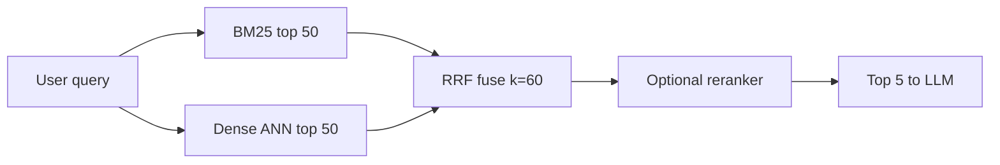

# Hybrid Search

Hybrid search matlab ek hi query ko **dense (vector)** aur **sparse (keyword: BM25/SPLADE)** dono retrievers se chalana, phir dono result lists ko **fuse** karna. Interviewer poochta hai kyunki sirf vector search error codes, SKU, clause numbers jaise exact tokens miss kar deta hai, aur "RRF kya hai, k=60 kyun" ek classic follow-up hai.

Embeddings aur BM25 basics already site pe hain: [Vector databases](../05-db/11-vector.md) aur [Search: Elasticsearch](../05-db/08-search.md). Yahan sirf RAG angle.

## ⭐ Dense vs sparse: dono kyun chahiye

**Ek line me:** dense **meaning** pakadta hai, sparse **exact words** pakadta hai, aur dono alag-alag jagah fail hote hain, isliye saath me best coverage milti hai.

> **Example:** Swiggy ke internal API docs pe bot. Query: "`ERR_CONN_RESET_4XX` ke retry semantics kya hain?" Dense search "connection handling best practices" wale pages laata hai; jis section me exact code likha hai wo **11th rank** pe. BM25 usko #1 pe laata hai. Ulta, "gateway upstream tak nahi pahunch pa raha to kya hota hai?" pe BM25 fail, dense turant sahi page laata hai.

- **Dense** (embeddings, e.g. 768-dim): "car" ≈ "automobile". Synonyms, paraphrase, conceptual questions me strong.
- **Dense ki problem:** identifier ek irreducible token hai; embedding me uski specificity "average out" ho jaati hai. Isko **vocabulary mismatch problem** bolte hain. Bug nahi, design trade-off hai.
- **Sparse** (BM25): inverted index, exact token match. Codes, SKU (`SKU-7821-B`), legal clause (`Section 4(b)(iii)`), version strings, proper nouns me strong.
- **Sparse ki problem:** meaning nahi samajhta. "car reliability" vs "vehicle dependability" match nahi hoga.
- Analogy: dense = wo dost jisne poori kitaab padhi aur section bata deta hai; sparse = kitaab ke peeche ka index, kuch samajhta nahi par har exact occurrence dhoondh leta hai.
- Dono **orthogonal** tareeke se fail hote hain → mixed corpus (prose + identifiers) ke liye hybrid default architecture hai.

**Interview tip:** "Dense aur sparse alag failure modes rakhte hain, isliye main dono parallel chalata hoon aur RRF se fuse karta hoon. Product codes ya error codes wale corpus me dense-only kabhi nahi."

**Common galti:** maan lena ki accha embedding model exact IDs bhi pakad lega. Nahi pakadta, especially naye/internal codes.

## BM25 aur SPLADE, short me

**Ek line me:** BM25 classic keyword scoring hai (TF + IDF + length normalization); SPLADE ek transformer hai jo sparse vector banata hai aur synonyms se **term expansion** bhi karta hai.

- **BM25 ke 3 ingredients:**
  - **TF with saturation:** pehla mention sabse important; 100th mention 10th se zyada kuch nahi deta. `k1 ≈ 1.2–2.0`.
  - **IDF:** rare term = high weight. `ERR_CONN_RESET_4XX` ka IDF bahut high, "the" ka almost zero.
  - **Length normalization:** `b ≈ 0.75`. 50 words me 3 hits > 5,000 words me 3 hits.
- BM25: fast, explainable, GPU nahi chahiye, Elasticsearch ka default.
- **SPLADE:** vocab-size (30k+ dims) sparse vector, zyada-tar zero. Weights **learned** hote hain. "car" pe vehicle, automobile ko bhi weight milta hai.
- Example "HTTP connection timeout": BM25 exact tokens; dense networking delay wale docs; SPLADE exact tokens + `socket`, `TCP`, `503`, `keepalive`.
- **SPLADE ke cons:** query pe transformer inference (roughly 100–300ms); naye out-of-vocabulary codes pe koi learned expansion nahi, wahan BM25 better.
- Production tip: document SPLADE vectors index time pe precompute karo (Qdrant sparse vectors natively support karta hai), query time pe sirf query encode karo.

| | BM25 | SPLADE | Dense |
|---|---|---|---|
| Kya match karta | exact tokens | tokens + learned synonyms | meaning |
| Naye codes/IDs | best | weak (no expansion) | weak |
| Synonyms | nahi | haan (trained terms) | haan |
| Cost | sasta, CPU | transformer inference | embedding + ANN |

## ⭐ Reciprocal Rank Fusion (RRF)

**Ek line me:** scores ko bhool jao, sirf **rank** use karo: `RRF(d) = Σ 1 / (k + rank(d))`, default **k = 60**.

- **Naive approach kyun toot-ta hai:** BM25 score 0–15, cosine 0.6–0.95; distributions alag shape ke, outliers min-max normalization bigaad dete hain. Seedha add karna galat.
- RRF ko normalization nahi chahiye, isliye robust aur tuning-free.
- **Worked example (k=60):** Dense: A1, B2, C3, D4. Sparse: C1, D2, E3, A4.
  - A = 1/61 + 1/64 = 0.0320
  - C = 1/63 + 1/61 = **0.0323**
  - D = 1/64 + 1/62 = 0.0318
  - B = 1/62 = 0.0161, E = 1/63 = 0.0159
  - Final: **C → A → D → B → E**. C dono lists me upar hai, isliye A (sirf dense ka #1) se jeet-ta hai. **Agreement > ek system ka pyaar.**
- **k=60 kyun:** rank ke cliff ko smooth karta hai. Rank 1 = 1/61 ≈ 0.0164, rank 10 = 1/70 ≈ 0.0143. k=0 pe rank 1 = 1.0 aur rank 2 = 0.5, bahut steep. Original RRF paper me 60 empirically accha nikla.
- **Chhota corpus (≈50–300 docs/pages):** k = 10–20 lo. Author ke 80-doc pilot me k=60 ke saath hybrid dense-only se bhi bura tha; k=10 karte hi theek.

```python
def rrf(ranked_lists, k=60):
    scores = {}
    for results in ranked_lists:            # e.g. [bm25_ids, dense_ids]
        for rank, doc_id in enumerate(results, start=1):
            scores[doc_id] = scores.get(doc_id, 0) + 1 / (k + rank)
    return sorted(scores, key=scores.get, reverse=True)
```



**Interview tip:** "RRF sirf rank use karta hai, isliye BM25 aur cosine ke alag scales ka jhanjhat khatam. k=60 default hai; chhote corpus pe main k ko 10–20 tak ghata deta hoon."

**Common galti:** BM25 aur cosine scores ko bina normalization ke add kar dena, ya 100-doc corpus pe bhi blindly k=60 rakhna.

## Weighted fusion aur doosre options

**Ek line me:** jab ek retriever pe zyada bharosa ho, tab weighted fusion; warna **"RRF, always, jab tak data kuch aur na bole."**

- **Linear interpolation:** `score = α·dense + (1−α)·sparse` (normalized scores). Magnitude respect karta hai, par normalization fragile hai aur α tune karna padta hai. Weaviate ka `alpha` yahi hai.
- Outlier bug: ek doc term ko 200 baar repeat kare to min-max baaki sabko 0 ki taraf daba deta hai. RRF immune.
- **Weighted RRF / candidate skew:** jargon-heavy corpus (legal, API docs, logs) me sparse ko zyada candidates do, e.g. sparse top-100, dense top-30. Conversational corpus me ulta.
- **CombSUM / CombMNZ:** normalized scores ka sum (MNZ multi-system docs ko boost karta hai). Practice me RRF inke barabar ya better.
- **Learned fusion:** chhota model (logistic regression) features + scores pe. Hazaron labeled query-relevance pairs ho tab socho.

## ⭐ Kab kya use karein

| Situation | Choice |
|---|---|
| Natural language FAQ, paraphrase heavy | Dense (hybrid optional) |
| Codes, SKU, error IDs, legal clauses | Hybrid, sparse ko zyada weight |
| Mixed prose + identifiers (most company docs) | Hybrid: BM25 + dense + RRF |
| Synonyms chahiye par exact match bhi | SPLADE + dense |
| Chhota corpus (< 300 docs) | Hybrid, RRF k = 10–20 |
| Labeled data hazaron me | Learned fusion try karo |

- Production lessons:
  - BM25 aur dense **parallel** chalao (`asyncio.gather`). Roughly BM25 40–60ms, ANN 80–120ms → parallel ≈ 120ms, sequential ≈ 180ms.
  - **Index sync:** BM25 index aur vector index alag artifacts hain; update/delete dono pe atomically. Stale BM25 = ajeeb bugs. Elasticsearch/OpenSearch dono ek jagah rakh sakta hai.
  - Measure: 50 real queries, Precision@5 aur MRR before/after. Author ka result: **MRR 0.41 (dense) → 0.67 (hybrid)**.
- Hybrid ke baad agla step: [Reranking](05-reranking.md).

**Interview tip:** "Most teams ke liye BM25 + dense + RRF hi destination hai. SPLADE ya learned fusion tabhi jab eval set dikhaye ki gain hai."

**Common galti:** BM25 index ko re-index pipeline me bhool jana, vector updated hai par keyword index purana.

## Kahan aur padho

- [Vector databases](../05-db/11-vector.md): embeddings, ANN, hybrid ka short version. Detail yahan padho.
- [Search: Elasticsearch](../05-db/08-search.md): inverted index aur BM25 scoring.
- [Reranking](05-reranking.md): hybrid ke baad precision kaise badhaayein.
- [RAG lab](/viewinter/agents/labs/rag): browser me PDF-chat RAG chala ke dekho.

## Checklist

- [ ] Dense aur sparse ke alag failure modes example ke saath samjha sakta hoon
- [ ] BM25 ke TF saturation, IDF aur length normalization bata sakta hoon
- [ ] SPLADE BM25 se kaise alag hai aur kab nahi lena, bata sakta hoon
- [ ] RRF formula likh ke chhota example haath se calculate kar sakta hoon
- [ ] k=60 kyun aur chhote corpus pe k kyun ghatayein, samjha sakta hoon
- [ ] RRF vs weighted fusion ka choice justify kar sakta hoon
