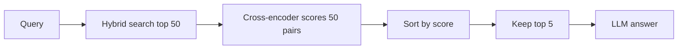

# Reranking

Reranking matlab pehle sasta retriever bahut saare candidates laata hai, phir ek **zyada smart, query-aware model** unko dobara score karke sahi order me lagata hai. Interviewer poochta hai kyunki "bi-encoder vs cross-encoder", "two-stage retrieval" aur "kitne candidates rerank karoge" RAG design ke standard sawaal hain.

## ⭐ Problem: recall theek hai, position 1 galat

**Ek line me:** vector search sahi chunk top-5 me la deta hai, par usko aksar position 3–5 pe rakhta hai; LLM ko position 1 pe sahi cheez chahiye.

> **Example:** HR policy bot. "Notice period me leave encash hoga?" Sahi paragraph top-5 me hai par #4 pe; #1 pe generic "leave policy overview". LLM hedge karta hai ya galat answer deta hai. Chunking, embedding model, prompt badalne se kuch nahi hua; gold chunk ki **position** log karne pe asli problem dikhi.

- Embedding models **rank karne ke liye train nahi** hote, semantic similarity ke liye hote hain. ANN **recall** ke liye optimized hai, precision ke liye nahi.
- Har document query ko jaane bina independently encode hua, isliye cosine ek "blunt instrument" hai. Top-20 ka order kaafi had tak noise hai.
- Analogy: jaal sahi machhli pakad leta hai, par kaun pehle aayi, wo random hai.
- Asli metric: **precision at position 1**, sirf recall@k nahi.

**Interview tip:** "Retrieval recall ke liye hai, reranking precision ke liye. Main gold chunk ki rank log karta hoon taaki pata chale problem retrieval ki hai ya ranking ki."

**Common galti:** bi-encoder (embedding search) se precise ranking expect karna.

## ⭐ Two-stage: retrieve → rerank → truncate → generate

**Ek line me:** Stage 1 me wide net (N = 50) daalo recall ke liye, Stage 2 me cross-encoder se ruthlessly top K = 3–7 chuno.



- **N (candidates):** typical **50**; 100 se upar rarely help karta hai, sirf latency badhti hai.
- **K (LLM ko):** **3–7**. Default ratio **N=50 → K=5 (10:1)**.
- **N >> K zaroori:** N=10, K=5 me reranker ke paas reshuffle karne ki jagah hi nahi. Minimum N = 30–50.
- Stage 1 ideally hybrid (dense + BM25 + RRF), dekho [Hybrid Search](04-hybrid-search.md).
- Context ko reranked order me assemble karo; best chunk upar (LLM "lost in the middle" me beech wala ignore karta hai).
- **Debug:** NDCG@5 low hai? Gold answer top-50 me hi nahi → retrieval problem. Top-50 me hai par neeche score → reranker problem.

**Interview tip:** "Main top 50 retrieve karta hoon, cross-encoder se rerank karke top 5 LLM ko deta hoon. N bada recall ke liye, K chhota precision aur token cost ke liye."

**Common galti:** top-5 ko rerank karke top-3 lena. Itne kam candidates me reranker kuch khaas nahi badal sakta.

## ⭐ Bi-encoder vs cross-encoder

**Ek line me:** bi-encoder query aur doc ko **alag** encode karta hai (fast, precompute ho sakta), cross-encoder dono ko **saath** ek model me daalta hai (slow, par bahut accurate).

| | Bi-encoder | Cross-encoder |
|---|---|---|
| Input | query, doc alag-alag | `[CLS] query [SEP] doc [SEP]` ek saath |
| Interaction | sirf vectors ka cosine | har token cross-attention |
| Doc precompute? | haan, offline | nahi, har query pe |
| Scale | millions docs, ms me | sirf ~50–100 candidates |
| Use | Stage 1 retrieval | Stage 2 reranking |

- Cross-encoder output: ek relevance score (typically [CLS] pe sigmoid), cosine se zyada calibrated.
- Example: "65+ diabetic patients me metformin ke side effects" ko wo exact clinical context wale doc se term-level pe match kar leta hai; bi-encoder sirf "gist" compare karta hai.
- Cross-encoder har jagah kyun nahi: **O(N) forward passes per query**. 10M docs pe minutes lagenge. Isliye dono complement karte hain.

```python
from sentence_transformers import CrossEncoder

model = CrossEncoder("cross-encoder/ms-marco-MiniLM-L-6-v2", max_length=512)

def rerank(query, candidates, top_k=5):
    pairs = [(query, c["text"]) for c in candidates]   # original user query!
    scores = model.predict(pairs, batch_size=32)
    for c, s in zip(candidates, scores):
        c["rerank_score"] = float(s)
    return sorted(candidates, key=lambda c: c["rerank_score"], reverse=True)[:top_k]
```

**Interview tip:** "Bi-encoder scale deta hai, cross-encoder precision. Ek dusre ke replacement nahi, pipeline ke do stages hain."

**Common galti:** bolna ki cross-encoder se poore corpus pe search karenge.

## Options: open-source, Cohere Rerank, FlashRank, LLM

**Ek line me:** FlashRank se shuru karo (sasta, fast), quality ceiling chahiye to cross-encoder ya Cohere, aur LLM reranking sirf high-stakes cases me.

| Option | Latency (N=50, roughly) | Kab |
|---|---|---|
| MiniLM cross-encoder, CPU | 100–250ms | self-host, no API cost |
| Same, GPU | < 50ms | GPU already hai |
| FlashRank (quantized, CPU) | 15–30ms | tight SLA, CPU-only infra |
| Cohere Rerank API | 150–400ms + network | no ops, early stage |
| LLM listwise (RankGPT) | 2–5 s | medical/legal, offline batch |

- **Open-source:** `ms-marco-MiniLM-L-6-v2` (fast default), `bge-reranker-v2-m3` (multilingual, heavier, Hindi/regional docs ke liye socho), `ms-marco-electra-base` (better par 3–4x slow). Offline/air-gapped chal jaata hai.
- **Cohere Rerank:** query + doc strings bhejo, ordered scores wapas. Gotchas: doc length limit → truncation; p99 spikes under load; per-call cost millions queries/day pe badhta hai. **Local fallback + circuit breaker** rakho.
- **FlashRank:** chhote quantized models, CPU pe ~20ms. Roughly 85–90% cross-encoder quality. TinyBERT 2x fast par complex queries pe kaafi weak; benchmark karo.
- **LLM reranking (RankGPT):** passages do, LLM order output kare. Highest ceiling, par roughly $0.01–0.03/query aur seconds ki latency. Default nahi.

## Kab reranking worth nahi + common mistakes

- **Skip karo jab:** corpus chhota hai aur answer already #1 pe aata hai; latency budget itna tight ki 20ms bhi zyada (autocomplete); reranker ka domain alag (MS MARCO web data vs legal/medical/code) aur tumhare eval pe fayda nahi dikha.
- Hybrid ke baad reranking ka extra gain dense-only baseline ke comparison me kam hota hai. Author ne kahin **NDCG@5 me ~12–18 points** dekhe, kahin 200ms ke badle sirf 2 points.
- **Mistakes:**
  - Reranker ko rewritten/HyDE query dena. Hamesha **original user query** do.
  - 512-token **silent truncation**: lambe chunk ka relevant second half reranker dekhta hi nahi. Explicitly truncate karo aur log karo.
  - Bina eval ke decide karna: 50–100 (query, expected doc) pairs banao, NDCG@5 / MRR before-after.
- Cost/latency side ke liye [Caching](../01-topics/05-caching.md) aur [Reliability & observability](../01-topics/20-reliability-observability.md) bhi dekho.

**Interview tip:** "FlashRank se start, NDCG@5 before/after measure, phir decide ki Cohere ki quality chahiye ya FlashRank ki speed. Sub-200ms SLA pe short queries pe rerank skip bhi kar sakte hain."

**Common galti:** reranker ko free lunch maan lena; latency p95 pe uska asar check na karna.

## Kahan aur padho

- [Hybrid Search](04-hybrid-search.md): Stage 1 ke liye BM25 + dense + RRF.
- [Vector databases](../05-db/11-vector.md): bi-encoder embeddings aur ANN. Detail yahan padho.
- [Caching](../01-topics/05-caching.md): repeated queries ke rerank results cache karna.
- [RAG lab](/viewinter/agents/labs/rag): browser me RAG chala ke dekho.

## Checklist

- [ ] Two-stage retrieval (recall phir precision) samjha sakta hoon
- [ ] Bi-encoder vs cross-encoder ka difference aur trade-off bata sakta hoon
- [ ] N=50 → K=5 jaise numbers justify kar sakta hoon
- [ ] Cross-encoder, Cohere, FlashRank, LLM reranker me choose kar sakta hoon latency ke hisaab se
- [ ] Bata sakta hoon kab reranking skip karni chahiye
- [ ] Reranking ka impact NDCG@5 / MRR se measure kar sakta hoon
