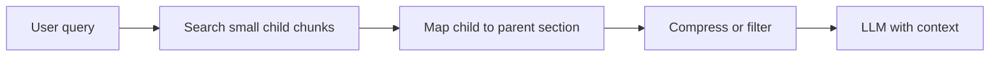

# Advanced Retrieval

Basic RAG = query embed karo, top-k chunks lo, LLM ko do. Real users ke messy questions pe ye toot jaata hai. Advanced retrieval techniques query ko sudhaarti hain, sahi size ka context laati hain, aur LLM ko context sahi tarike se dikhati hain. Interviewer poochta hai: "Retrieval quality kaise improve karoge, embedding model badle bina?"

## ⭐ Query side: rewriting, multi-query, HyDE

**Ek line me:** user ka question jaisa hai waisa search mat karo; pehle use search-friendly banao.

> **Example:** Swiggy support bot pe user likhta hai "kal wala order abhi tak nahi aaya, paisa wapas?" Is raw text se "refund policy for undelivered orders" wala chunk miss ho sakta hai.

- **Query rewriting:** LLM se query ko clean, standalone search query banwao. Chat me "aur uska?" jaise follow-up ko history se poora karo (`"aur uska?" → "Premium plan ka refund rule"`).
- **Multi-query:** LLM 3–5 alag phrasings banata hai, har ek se retrieve karo, results ko [RRF](04-hybrid-search.md) se merge karo. Recall badhta hai, cost 3–5x retrieval calls.
- **Query decomposition:** complex question ko sub-questions me todo ("Q3 vs Q4 revenue compare karo" → do alag lookups).
- **HyDE (Hypothetical Document Embeddings):** LLM pehle ek *fake answer* likhta hai, us answer ko embed karke search karo. Answer jaisa text, question se zyada, real answer chunks ke paas hota hai.
- **Step-back prompting:** specific question se ek general question banao ("Section 80C ki limit 2023 me?" → "80C ke rules kya hain?").

| Technique | Kab use karo | Cost |
|---|---|---|
| Rewriting | Chat follow-ups, messy queries | 1 chhoti LLM call |
| Multi-query | Recall kam, query ambiguous | 3–5x retrieval |
| HyDE | Short query, long technical docs | 1 LLM call, hallucinated text risk |
| Decomposition | Multi-hop, comparison questions | N retrievals |

**Interview tip:** "Sabse sasta win query rewriting hai, especially chat me. Multi-query aur HyDE tab laata hoon jab eval me recall@k kam dikhe."
**Common galti:** HyDE har query pe lagana. Agar LLM domain nahi jaanta to fake answer galat direction me search le jaata hai, aur latency bhi badhti hai.

## ⭐ Chunk side: parent-child (small-to-big) aur contextual compression

**Ek line me:** chhote chunks se *search* karo (precise match), par LLM ko bada parent chunk *do* (poora context).

- **Parent-child / small-to-big:** 100–200 token child chunks embed karo, har child ke saath `parent_id` store karo. Match child pe, LLM ko 1000–2000 token parent milta hai. Chunk size dilemma ka seedha solution ([Chunking](03-chunking.md)).
- **Sentence window:** match hue sentence ke aage-peeche ke N sentences add karo. Same idea, chhota scale.
- **Contextual compression:** retrieve ke baad irrelevant sentences hata do (LLM ya chhote model se extract). Tokens kam, noise kam.
- **Contextual retrieval:** indexing ke time har chunk ke aage 1–2 line context jodo ("Ye chunk HDFC ke 2024 annual report ke risk section se hai"). Akele chunk ka matlab clear hota hai.
- Structure wale long docs ke liye tree-based approach: [PageIndex](06-pageindex.md).

**Interview tip:** "Precision ke liye chhota chunk, comprehension ke liye bada context, parent-child dono deta hai."
**Common galti:** parent bahut bada rakhna; 5 parents x 3000 tokens = context window bhar gaya, cost aur lost-in-the-middle dono.

## Agentic RAG aur GraphRAG (short)

- **Agentic RAG:** LLM khud decide karta hai retrieve karna hai ya nahi, kaunsa tool/index, aur result kam pade to dobara search. Loop: `plan → retrieve → check → retrieve again → answer`.
- Fayda: multi-hop questions, multiple sources (docs + SQL + API). Nuksaan: latency 2–5x, unpredictable cost, debug mushkil.
- **Self-RAG / Corrective RAG:** retrieved chunks ko grade karo; kharab hon to query rewrite ya web search fallback.
- **GraphRAG:** docs se entities aur relations nikaal ke knowledge graph banao, community summaries banao. "Is poore dataset ke main themes kya hain?" jaise global questions me achha, jahan top-k chunks kaafi nahi.
- GraphRAG ka cost: indexing me bahut LLM calls, graph update karna mehenga. Default choice nahi.

**Interview tip:** "Pehle simple pipeline + eval. Agentic tab, jab questions sach me multi-step hon."

## ⭐ Context dena: lost-in-the-middle aur citations

**Ek line me:** LLM context ke beech wali info ko sabse kam dhyan deta hai, isliye order aur quantity dono matter karte hain.

- **Lost in the middle:** research me dikha ki models start aur end ki info best use karte hain, middle wali miss karte hain. Zyada chunks bharna = answer kharab ho sakta hai.
- Fix: [Reranking](05-reranking.md) karke top 3–5 hi bhejo; sabse relevant ko shuru (ya end) me rakho.
- **Citations:** har chunk ko id do (`[1] hr-policy.pdf p.12`), prompt me bolo "har claim ke baad source id likho". UI me clickable source dikhao.
- Citation verify karo: jo id quote hui wo sach me context me thi ya nahi. Trust aur debugging dono ke liye zaroori.
- Prompt me bolo: "Context me answer nahi hai to 'pata nahi' bolo." Ye hallucination ka sabse sasta guard hai.

**Interview tip:** "Top-k bada karna free nahi hai: cost, latency aur lost-in-the-middle. Main 50 retrieve, rerank karke 5 bhejta hoon, citations ke saath."
**Common galti:** 20 chunks LLM ko dump karna, ye soch ke ki "zyada context = better answer".

## Kahan aur padho

- [Vector databases](../05-db/11-vector.md): embeddings, ANN, metadata filter. Detail yahan padho.
- [Hybrid Search](04-hybrid-search.md): RRF, multi-query merge ke liye.
- [Reranking](05-reranking.md): retrieve-then-rerank pattern.
- [PageIndex](06-pageindex.md): structured long docs ke liye tree retrieval.
- [RAG lab](/viewinter/agents/labs/rag): browser me PDF-chat RAG chala ke dekho.

## Checklist

- [ ] Query rewriting, multi-query aur HyDE ka fark aur trade-off samjha sakta hoon
- [ ] Parent-child (small-to-big) retrieval draw kar sakta hoon
- [ ] Contextual compression aur contextual retrieval me fark bata sakta hoon
- [ ] Agentic RAG aur GraphRAG kab worth hai, bata sakta hoon
- [ ] Lost-in-the-middle aur iska fix samjha sakta hoon
- [ ] Citations kaise add aur verify karte hain, bata sakta hoon
