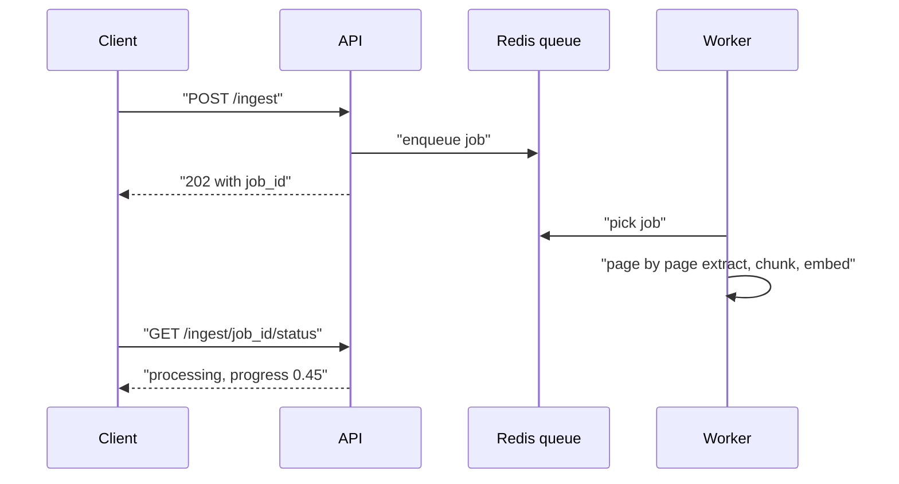

# Production RAG API

Localhost demo aur production me bahut fark hai: 400-page PDF upload 60s pe timeout, aadha-indexed document, teen users aate hi embedding API ke 429, aur scanned PDF se worker chupchaap OOM. Ye page batata hai ki RAG ko "demo dressed up as a product" se asli service kaise banate hain. Interviewer yahi backend sense check karta hai.

## ⭐ Async ingestion queue

**Ek line me:** upload request me kabhi ingest mat karo; job queue me daalo aur turant `202 Accepted` + `job_id` lauta do.

> **Example:** legal-tech app pe 200-page PDF + OCR = 3–4 min (dense scans pe 10+ min). Nginx/ALB 60s, Cloudflare 100s pe request kaat dete hain.

- `POST /ingest` → `{job_id, status: "queued"}` 100ms ke andar. `GET /ingest/{id}/status` → progress, pages processed. Optional webhook on done.
- Queue options: **Celery + Redis** (battle-tested, heavy), **ARQ** (light, async), **Dramatiq** (beech me), **BullMQ** (Node).
- **Partial failure:** page 47 ka OCR fail → poora job fail mat karo. Per-page status rakho, baaki 199 pages queryable rahein.
- Queue me PDF bytes mat bhejo; file path ya S3 reference bhejo (Redis message size aur memory).
- Job idempotent rakho: client retry kare to duplicate job conflicting state na likhe ([Idempotency](../01-topics/10-idempotency-retries.md)).

**Interview tip:** "Koi bhi timeout ek saath normal requests aur 10-min ingestion dono ko serve nahi kar sakta, isliye async job + status endpoint."
**Common galti:** sync ingestion; client disconnect, retry, aur do jobs vector DB me partial chunks likh dete hain.

## ⭐ Streaming with SSE

**Ek line me:** retrieval + rerank me hi ~0.5–1.3s lag jaata hai, isliye progress events aur tokens stream karo taaki screen blank na dikhe.

- Event order: `progress(retrieving)` → `progress(reranking)` → `context` (sources) → `progress(generating)` → `token`... → `done` / `error`.
- **SSE vs WebSocket:** RAG one-way hai (server → client). SSE HTTP-native hai, proxies/CDN se pass hota hai, browser `EventSource` auto-reconnect. WebSocket sirf bidirectional zaroorat pe ([Real-time communication](../01-topics/08-real-time-communication.md)).
- **Buffering killer:** Nginx `proxy_buffering off;` + header `X-Accel-Buffering: no`, warna saare tokens end me ek saath aate hain.
- Har chunk pe `request.is_disconnected()` check karo; user chala gaya to generation roko, warna tokens ka paisa bekaar.
- LLM client ka default timeout (httpx 5s) stream ke liye chhota hai; lamba set karo.

**Interview tip:** "User ke liye time-to-first-token sabse important number hai, total time nahi."

## Rate limits, batching aur embedding cache

- 200 pages ≈ 800 chunks; ek call per chunk = 429s. Fix: **batch** (~8000 tokens/batch), **semaphore** se concurrency cap (jaise 10), **exponential backoff + jitter** on 429. Jitter retry storm rokta hai. Detail: [Rate limiting](../01-topics/11-rate-limiting.md).
- Last fallback: local embedding model (jaise `all-MiniLM-L6-v2`), quality thodi kam par rate limit zero. Dhyaan: alag model ke vectors same index me mix nahi karne.
- **Large PDFs:** PyMuPDF file size ka 2–5x memory leta hai. Page-by-page generator se padho (memory ~1–2 pages), scanned page (< 50 chars text) ko OCR pe bhejo, size upfront validate karo.
- **Embedding cache:** notes me ~28% chunks duplicate the (disclaimers, boilerplate). Key = `SHA-256(normalize(text) | model_name | model_version)`; model badla to cache apne aap invalid.
- Do layer: in-process LRU (sub-ms) → Redis (2–5ms). Vectors raw float32 bytes me (~6KB vs ~30KB JSON for 1536 dims).

## ⭐ Caching, guardrails aur access control

**Ek line me:** answer cache se cost bachao, prompt injection se bachao, aur user ko sirf wahi chunks dikhao jo use dekhne ka haq hai.

- **Exact cache:** normalized query + filters + index version → answer. Sasta, par hit rate kam.
- **Semantic cache:** query embedding ke paas (cosine > ~0.95) koi purani query mili to uska answer do. FAQ-type traffic me badi bachat; threshold galat to galat answer. Cache key me tenant/user role zaroor ho ([Caching](../01-topics/05-caching.md)).
- **Prompt injection:** retrieved docs me bhi likha ho sakta hai "ignore previous instructions". Context ko data ki tarah mark karo (delimiters), system prompt me rules, output pe checks, tools ko least privilege.
- **Guardrails:** input pe PII/abuse filter, output pe "context me support hai?" check, off-topic pe polite refusal.
- **Access control / multi-tenancy:** har chunk pe `tenant_id`, `acl_groups` metadata; retrieval me **pre-filter** lagao, LLM ke baad nahi. Bade tenants ke liye alag namespace/index ([metadata filter](../05-db/11-vector.md)).
- **Freshness / re-indexing:** doc update → purane chunks delete + naye upsert (doc_id se). Content hash se sirf badle hue chunks re-embed karo. Embedding model badla → poora re-index naye index me, phir alias switch (blue-green).

**Interview tip:** "Permission check retrieval ke andar filter hai; LLM ko kabhi woh chunk mile hi nahi jo user nahi dekh sakta."
**Common galti:** sab tenants ka data ek index me bina filter ke, aur "LLM ko bol denge ki mat dikhana" pe bharosa.

## Cost, latency budget aur observability

| Stage | Rough latency |
|---|---|
| Query embed + retrieval | 100–350 ms |
| Cross-encoder rerank | 200–500 ms |
| LLM first token | 0.5–1.5 s |

- Har request pe log karo: `retrieval_ms`, `rerank_ms`, `llm_ttft_ms`, `total_ms`, chunks retrieved/after rerank, cache hit, input/output tokens, `request_id`.
- Ingestion: pages/sec per worker, cache hit rate, **queue depth**, worker OOM restarts.
- **Alert:** rate-limit errors > 5%, queue depth > 100, OOM kills. **Track weekly:** cache hit rate, avg retrieval latency, token cost per query.
- Cost levers: kam chunks LLM ko, chhota model simple queries pe, semantic cache, embedding cache.
- **Deploy:** API aur workers alag containers. API HTTP load pe scale, workers queue depth pe (KEDA). Worker memory limit ~2GB, OOM pe orchestrator restart kare. Graceful shutdown: SIGTERM pe naye jobs band, chal rahe khatam.
- Notes ka priority order: async ingestion → streaming → rate limits → memory → caching (optimization, last).

## Kahan aur padho

- [Caching](../01-topics/05-caching.md), [Rate limiting](../01-topics/11-rate-limiting.md), [Reliability and observability](../01-topics/20-reliability-observability.md)
- [Message queues](../01-topics/07-message-queues-kafka.md): ingestion queue ke liye.
- [Vector databases](../05-db/11-vector.md): namespaces, metadata pre-filter. Detail yahan padho.
- [Hybrid Search](04-hybrid-search.md), [Reranking](05-reranking.md): query pipeline ke stages.
- [RAG lab](/viewinter/agents/labs/rag)

## Checklist

- [ ] Async ingestion (202 + job_id + status) aur partial failure handling samjha sakta hoon
- [ ] SSE streaming events, SSE vs WebSocket aur buffering issue bata sakta hoon
- [ ] Rate limit ke liye batching, semaphore, backoff + jitter samjha sakta hoon
- [ ] Embedding cache key aur semantic cache ka risk bata sakta hoon
- [ ] Multi-tenant access control pre-filter aur prompt injection defence samjha sakta hoon
- [ ] Latency budget aur kaunse metrics pe alert lagana hai, bata sakta hoon
