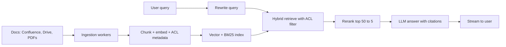

# RAG Interview Q&A

Ye page revision ke liye hai: ek common HLD question ("company docs pe RAG chatbot design karo") short steps me, aur phir rapid-fire Q&A. Har answer 2–3 line ka hai, jaisa interview me bolna chahiye. Detail ke liye linked pages dekho.

## ⭐ Design: RAG chatbot over company docs

**Ek line me:** do pipelines: offline ingestion (docs → chunks → index) aur online query (query → retrieve → rerank → LLM with citations), plus permissions aur eval.

> **Example:** 5,000 employees wali company, Confluence + Google Drive + HR PDFs. "Mera notice period kitna hai?" ka sahi, cited answer chahiye, aur intern ko salary bands wali doc nahi dikhni chahiye.

1. **Requirements:** kitne docs/users, freshness (minutes ya din?), latency (first token < ~2s), permissions, languages.
2. **Ingestion:** connectors + webhooks for changes → async queue → parse (OCR for scans) → structure-aware chunking ~300–800 tokens → embed (with cache) → upsert with `doc_id, tenant, acl_groups, updated_at`. ([Production RAG API](09-production-rag-api.md))
3. **Index:** vector (HNSW) + BM25, ya ek DB jo dono kare. Chhote scale pe pgvector kaafi ([Vector databases](../05-db/11-vector.md)).
4. **Query:** rewrite (chat history) → hybrid retrieve top-50 with ACL pre-filter → [rerank](05-reranking.md) to 5 → prompt "sirf context se, citations do, nahi pata to bolo".
5. **Serve:** SSE streaming, semantic cache per tenant, rate limit per user.
6. **Eval and monitor:** golden set (recall@k, nDCG, faithfulness), thumbs up/down, latency/cost dashboards ([RAG Evaluation](08-rag-evaluation.md)).
7. **Scale/trade-offs:** workers queue depth pe scale, re-index blue-green, agentic sirf multi-hop ke liye.

**Interview tip:** permissions aur eval khud se bolo; zyada candidates inko bhool jaate hain, aur yahi senior signal hai.
**Common galti:** seedha "LangChain + Pinecone" bolke khatam karna, bina ingestion, ACL ya eval ke.

## ⭐ Rapid-fire: fundamentals

**Q1. RAG vs fine-tuning vs long context?**
RAG = fresh, private knowledge + citations, data update sasta. Fine-tuning = style/format/behaviour sikhana, facts ke liye weak aur update mehenga. Long context = chhota corpus pe simple, par har query pe cost/latency aur lost-in-the-middle. Aksar RAG + thoda prompt engineering kaafi.

**Q2. RAG hone ke baad bhi LLM hallucinate kyun karta hai?**
Retrieval galat/aadha context laaya, context me conflict, ya model apni training knowledge pe chala gaya. Fix: better retrieval + rerank, "nahi pata to bolo" prompt, citations, faithfulness eval.

**Q3. Chunk size kaise choose karoge?**
Doc type aur query type pe: FAQ ke liye chhota, policy/legal ke liye bada with overlap. Typical 300–800 tokens, 10–20% overlap. Final decision golden set pe recall@k se. ([Chunking](03-chunking.md))

**Q4. Hybrid search kab?**
Jab queries me exact terms hon: error codes, SKU, names, acronyms. Dense inhe miss karta hai, BM25 pakadta hai; RRF se merge. ([Hybrid Search](04-hybrid-search.md))

**Q5. Reranker kab lagaoge, kab nahi?**
Jab right chunk top-50 me hai par top-5 me nahi. Skip karo jab corpus chhota, latency budget bahut tight, ya eval me gain negligible. Rerank 30–50 candidates, 5 nahi.

**Q6. Bi-encoder vs cross-encoder?**
Bi-encoder query aur doc alag embed karta hai, fast, pre-computable (retrieval). Cross-encoder dono saath padhta hai, accurate par slow (sirf rerank).

**Q7. Embedding model badalna ho to?**
Purane aur naye vectors compare nahi ho sakte. Naye index me poora re-embed, eval, phir alias switch. Cache key me model version.

## ⭐ Rapid-fire: production and design

**Q8. Multi-tenant permissions kaise?**
Har chunk pe tenant/ACL metadata, retrieval me pre-filter; bade tenants ke liye alag namespace. LLM ke prompt pe bharosa nahi.

**Q9. Docs update hote rehte hain, freshness?**
Change webhooks/CDC → doc_id se purane chunks delete + naye upsert, content hash se sirf badle chunks re-embed. `updated_at` metadata se recency boost.

**Q10. Latency kaise kam karoge?**
Stream tokens (TTFT matter karta hai), semantic cache, chhota rerank model, kam chunks LLM ko, retrieval aur history-rewrite parallel jahan ho sake.

**Q11. Cost kaise kam karoge?**
Embedding cache (boilerplate dedupe), semantic answer cache, kam context tokens, simple queries chhote model pe, batch embeddings.

**Q12. Prompt injection via documents?**
Retrieved text ko untrusted data maano: delimiters, system rules, output checks, tools least privilege, sensitive actions pe human confirm.

**Q13. Quality kaise naapoge?**
Golden set: retrieval pe recall@k/nDCG, generation pe faithfulness/answer relevance (RAGAS, LLM-as-judge), production me thumbs + A/B. ([RAG Evaluation](08-rag-evaluation.md))

**Q14. Vector DB kab zaroori nahi?**
Kuch hazaar chunks: pgvector ya in-memory kaafi. Bahut chhota corpus: poora long context me daal do. ([Vector databases](../05-db/11-vector.md))

**Q15. Agentic RAG ya GraphRAG kab?**
Agentic: multi-hop, multiple sources, retry chahiye. GraphRAG: "poore dataset ke themes" jaise global questions. Dono mehenge, simple pipeline + eval ke baad. ([Advanced Retrieval](07-advanced-retrieval.md))

## Kahan aur padho

- [What is RAG](01-what-is-rag.md), [Semantic Search](02-semantic-search.md), [Chunking](03-chunking.md)
- [Hybrid Search](04-hybrid-search.md), [Reranking](05-reranking.md), [PageIndex](06-pageindex.md)
- [Advanced Retrieval](07-advanced-retrieval.md), [RAG Evaluation](08-rag-evaluation.md), [Production RAG API](09-production-rag-api.md)
- [RAG lab](/viewinter/agents/labs/rag): khud chala ke dekho.

## Checklist

- [ ] Company-docs RAG chatbot ka HLD 7 steps me draw aur explain kar sakta hoon
- [ ] RAG vs fine-tuning vs long context ka fark 30 second me bata sakta hoon
- [ ] Hallucination ke reasons aur fixes bata sakta hoon
- [ ] Chunk size, hybrid aur rerank ke decisions justify kar sakta hoon
- [ ] Permissions, freshness, latency aur cost ke answers de sakta hoon
- [ ] Quality kaise naapoge, ye metrics ke naam ke saath bata sakta hoon
